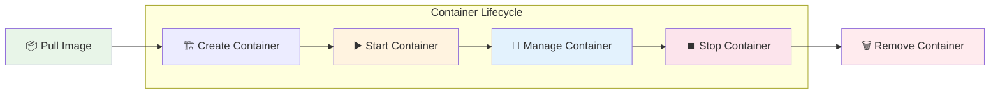
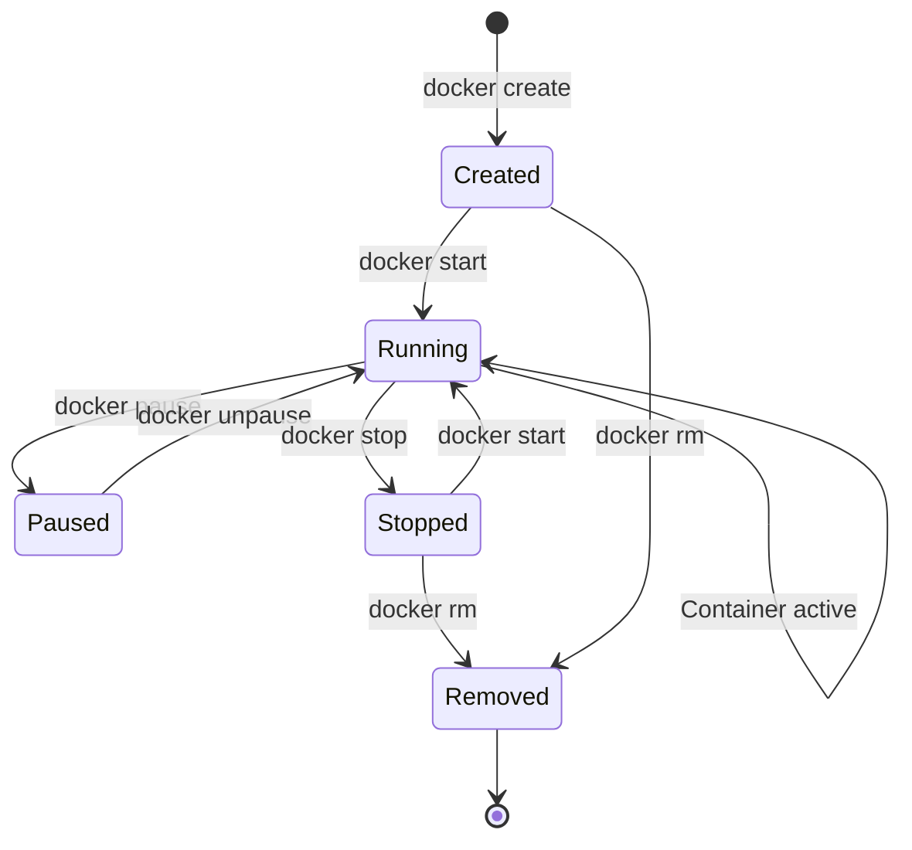
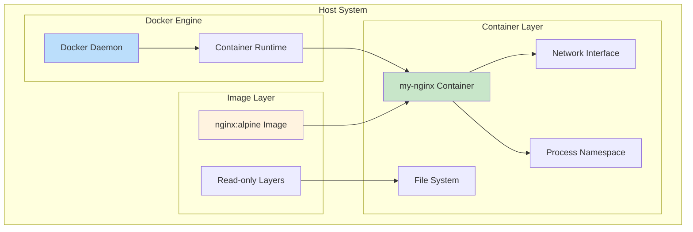

# 🐳 Creating and Using Container

> **Master Docker container creation, management, and lifecycle with animated workflow**

## 📁 Project Files
- `docker basic.ipynb` - Interactive container commands tutorial 📝

---

## 🚀 Container Workflow



## 🎬 Animated Container Process

### Step 1: 📦 Pull Base Image
```bash
docker pull nginx:alpine
```

```
📦 Pulling nginx:alpine image...

⬇️  Downloading layers:
██████████ c6a83fedfae6: Pull complete
██████████ 087a57faf949: Pull complete  
██████████ 5d71636fb824: Pull complete
██████████ 0c015e7e5c27: Pull complete

✅ Image 'nginx:alpine' pulled successfully!
```

### Step 2: 🏗️ Create Container
```bash
docker create --name my-nginx -p 8080:80 nginx:alpine
```

```
🏗️ Creating Container...

┌─────────────────────────────────────┐
│  📦 Container: my-nginx             │
│  🖼️  Image: nginx:alpine            │
│  🌐 Port: 8080 → 80                 │
│  📊 Status: Created                 │
└─────────────────────────────────────┘

✅ Container created successfully!
```

### Step 3: ▶️ Start Container
```bash
docker start my-nginx
```

```
▶️  Starting Container...

🔄 Container Startup Process:
    📂 Mounting volumes...
    🌐 Binding ports...
    🚀 Starting nginx service...
    
✅ Container 'my-nginx' is now running!
🌐 Access: http://localhost:8080
```

### Step 4: 🔍 Monitor Container
```bash
docker ps
docker logs my-nginx
docker stats my-nginx
```

```
📊 Container Status:
┌──────────────┬──────────┬─────────────┬──────────┐
│ CONTAINER ID │ IMAGE    │ STATUS      │ PORTS    │
├──────────────┼──────────┼─────────────┼──────────┤
│ a1b2c3d4e5f6 │ nginx    │ Up 2 mins   │ 8080:80  │
└──────────────┴──────────┴─────────────┴──────────┘

📝 Container Logs:
    🌐 nginx: ready for connections
    ✅ Server started on port 80
    
📈 Resource Usage:
    💾 Memory: 12.5MB / 2GB
    🖥️  CPU: 0.02%
    🌐 Network: 1.2kB / 856B
```

### Step 5: 🔧 Container Management
```bash
# Execute commands inside container
docker exec -it my-nginx sh

# Copy files to/from container
docker cp index.html my-nginx:/usr/share/nginx/html/

# Inspect container details
docker inspect my-nginx
```

```
🔧 Container Management:

📂 File Operations:
    ✅ index.html → /usr/share/nginx/html/
    📁 Files copied successfully
    
🔍 Container Inspection:
    📦 Name: my-nginx
    🆔 ID: a1b2c3d4e5f6
    🌐 IP: 172.17.0.2
    📊 State: running
```

### Step 6: ⏹️ Stop and Remove
```bash
docker stop my-nginx
docker rm my-nginx
```

```
⏹️  Stopping Container...
    🛑 Sending SIGTERM signal...
    ⏱️  Graceful shutdown (10s timeout)
    ✅ Container stopped
    
🗑️  Removing Container...
    🧹 Cleaning up resources...
    ✅ Container removed
```

## 🔄 Container Lifecycle States



## 🏗️ Container Architecture



## 🎯 Interactive Container Commands

### Basic Container Operations
```bash
# Create and run in one command
docker run -d --name web-server -p 8080:80 nginx:alpine

# Run with environment variables
docker run -d -e ENV=production --name app nginx:alpine

# Run with volume mounting
docker run -d -v /host/path:/container/path nginx:alpine

# Run with resource limits
docker run -d --memory=512m --cpus=0.5 nginx:alpine
```

### Container Networking
```bash
# Create custom network
docker network create my-network

# Run container in custom network
docker run -d --network my-network --name web nginx:alpine

# Connect running container to network
docker network connect my-network existing-container
```

### Container Debugging
```bash
# View container processes
docker top my-nginx

# Stream container logs
docker logs -f my-nginx

# Execute interactive shell
docker exec -it my-nginx /bin/sh

# Copy files between host and container
docker cp my-nginx:/etc/nginx/nginx.conf ./nginx.conf
```

## 📊 Container Management Dashboard

```
🐳 Container Overview:

┌─────────────────────────────────────────────────────────┐
│  📊 Active Containers: 3                               │
│  💾 Total Memory Usage: 156MB                          │
│  🖥️  Average CPU Usage: 2.1%                           │
│  🌐 Network Traffic: ↑ 2.3MB ↓ 1.8MB                   │
└─────────────────────────────────────────────────────────┘

Container Status:
[████████████████████] my-nginx     (Running)
[████████████████████] web-app      (Running)  
[██████████░░░░░░░░░░] db-server     (Starting)

✅ All containers healthy
🔄 Auto-restart enabled
🛡️  Security policies active
```

## 🎓 Container Mastery Progress

```
Learning Progress: [████████████████████] 100%

✅ Image pulling and management
✅ Container creation and configuration
✅ Container lifecycle management
✅ Port mapping and networking
✅ Volume mounting and data persistence
✅ Environment variables and configuration
✅ Container monitoring and debugging
✅ Resource management and limits
```

## 🔑 Key Container Concepts
- 🏗️ **Container vs Image**: Containers are running instances of images
- 🌐 **Port Mapping**: `-p host:container` exposes container ports
- 📂 **Volume Mounting**: `-v host:container` persists data
- 🔧 **Interactive Mode**: `-it` enables terminal interaction
- 🔄 **Detached Mode**: `-d` runs containers in background
- 🏷️ **Container Naming**: `--name` assigns custom names
- 🌐 **Networking**: Custom networks for container communication
- 📊 **Resource Limits**: Control CPU, memory, and other resources