```mermaid
flowchart LR
    A[📦 Pull Image] --> B[🏗️ Create Container]
    B --> C[▶️ Start Container]
    C --> D[🔧 Manage Container]
    D --> E[⏹️ Stop Container]
    E --> F[🗑️ Remove Container]
    
    subgraph "Container Lifecycle"
        B
        C
        D
        E
    end
    
    style A fill:#e8f5e8
    style C fill:#fff3e0
    style D fill:#e3f2fd
    style E fill:#fce4ec
    style F fill:#ffebee
```

# 🐳 Creating and Using Container

> **Master Docker container creation, management, and lifecycle with animated workflow**

## 📁 Project Files
- `docker basic.ipynb` - Basic Docker commands and container lifecycle 📝
- `cli process monitoring.ipynb` - CLI process monitoring techniques 📊
- `container are process.ipynb` - Understanding containers as processes 🔄
- `Container Cli Testing Assignment.ipynb` - CLI testing assignments 📋
- `Docker Dns.ipynb` - Docker DNS configuration 🌐
- `docker Network.ipynb` - Docker networking concepts 🔗
- `Manage Multiple Container.ipynb` - Multi-container management 📦
- `Shell Inside Container.ipynb` - Interactive shell operations 💻

---

<details>
<summary>🚀 <strong>Container Workflow Overview</strong></summary>


</details>

<details>
<summary>📝 <strong>1. Docker Basic Commands</strong></summary>

### Docker Version & Info
```bash
# Check Docker version
docker version

# Display system information
docker info

# Get help
docker help
```

### Basic Container Operations
```bash
# Run container (foreground)
docker container run --publish 80:80 nginx

# Run container (detached/background)
docker container run --publish 80:80 --detach nginx

# Run with custom name
docker container run --publish 80:80 --detach --name webhost nginx
```

### Container Management
```bash
# List running containers
docker container ls

# List all containers (including stopped)
docker container ls -a

# Stop container
docker container stop <container_id>

# Start stopped container
docker container start <container_id>

# Remove container
docker container rm <container_id>

# Force remove running container
docker container rm -f <container_id>
```

### Container Monitoring
```bash
# View container logs
docker container logs <container_name>

# View running processes in container
docker container top <container_name>
```
</details>

<details>
<summary>📊 <strong>2. CLI Process Monitoring</strong></summary>

### Container Process Monitoring
```bash
# Real-time container stats
docker stats

# Container resource usage
docker stats <container_name>

# Process list inside container
docker top <container_name>

# Container inspection
docker inspect <container_name>
```

### System Monitoring
```bash
# Docker system information
docker system df

# Docker system events
docker system events

# Cleanup unused resources
docker system prune
```

### Performance Monitoring
```bash
# Memory and CPU usage
docker stats --no-stream

# Container processes (detailed)
docker exec <container> ps aux

# Network statistics
docker exec <container> netstat -tulpn
```
</details>

<details>
<summary>🔄 <strong>3. Containers as Processes</strong></summary>

### Understanding Container Processes
```bash
# View container as process on host
ps aux | grep docker

# Container process tree
docker exec <container> ps -ef --forest

# Process namespaces
docker exec <container> ls -la /proc/1/ns/
```

### Process Management
```bash
# Send signals to container
docker kill -s SIGTERM <container>

# Pause/unpause container processes
docker pause <container>
docker unpause <container>

# Container process limits
docker run --memory=512m --cpus=0.5 nginx
```

### Process Isolation
```bash
# PID namespace
docker exec <container> ps aux

# Network namespace
docker exec <container> ip addr show

# Mount namespace
docker exec <container> mount
```
</details>

<details>
<summary>📋 <strong>4. Container CLI Testing</strong></summary>

### Testing Container Functionality
```bash
# Test web server response
curl http://localhost:80

# Test container connectivity
docker exec <container> ping google.com

# Test port accessibility
telnet localhost 80
```

### Container Health Checks
```bash
# Add health check to container
docker run --health-cmd="curl -f http://localhost/" nginx

# Check container health status
docker inspect --format='{{.State.Health.Status}}' <container>
```

### Debugging Containers
```bash
# Interactive debugging
docker exec -it <container> /bin/bash

# Check container exit code
docker inspect --format='{{.State.ExitCode}}' <container>

# Container filesystem changes
docker diff <container>
```
</details>

<details>
<summary>🌐 <strong>5. Docker DNS Configuration</strong></summary>

### Container DNS Settings
```bash
# Custom DNS servers
docker run --dns=8.8.8.8 --dns=8.8.4.4 nginx

# DNS search domains
docker run --dns-search=example.com nginx

# Custom hostname
docker run --hostname=myserver nginx
```

### Network DNS Resolution
```bash
# Test DNS resolution
docker exec <container> nslookup google.com

# Check DNS configuration
docker exec <container> cat /etc/resolv.conf

# Custom hosts file entries
docker run --add-host=myhost:192.168.1.100 nginx
```

### Service Discovery
```bash
# Container name resolution
docker network create mynetwork
docker run --network=mynetwork --name=web nginx
docker run --network=mynetwork alpine ping web
```
</details>

<details>
<summary>🔗 <strong>6. Docker Networking</strong></summary>

### Network Management
```bash
# List networks
docker network ls

# Create custom network
docker network create mynetwork

# Inspect network
docker network inspect bridge

# Remove network
docker network rm mynetwork
```

### Container Networking
```bash
# Run container in specific network
docker run --network=mynetwork nginx

# Connect running container to network
docker network connect mynetwork <container>

# Disconnect container from network
docker network disconnect mynetwork <container>
```

### Network Types
```bash
# Bridge network (default)
docker run --network=bridge nginx

# Host network
docker run --network=host nginx

# None network (no networking)
docker run --network=none nginx
```
</details>

<details>
<summary>📦 <strong>7. Managing Multiple Containers</strong></summary>

### Multi-Container Operations
```bash
# Start multiple containers
docker run -d --name web1 nginx
docker run -d --name web2 nginx
docker run -d --name web3 nginx

# Stop multiple containers
docker stop web1 web2 web3

# Remove multiple containers
docker rm web1 web2 web3
```

### Container Orchestration
```bash
# Run containers with dependencies
docker run -d --name database mysql
docker run -d --name app --link database:db myapp

# Container communication
docker run -d --name redis redis
docker run -d --name worker --link redis:cache worker-app
```

### Batch Operations
```bash
# Stop all running containers
docker stop $(docker ps -q)

# Remove all stopped containers
docker container prune

# Remove all containers (force)
docker rm -f $(docker ps -aq)
```
</details>

<details>
<summary>💻 <strong>8. Shell Inside Container</strong></summary>

### Interactive Shell Access
```bash
# Bash shell in running container
docker exec -it <container> /bin/bash

# Shell in new container
docker run -it nginx /bin/bash

# Alpine shell (ash)
docker exec -it <alpine_container> /bin/sh
```

### File Operations
```bash
# Copy files to container
docker cp file.txt <container>:/path/to/destination

# Copy files from container
docker cp <container>:/path/to/file ./local-file

# Edit files inside container
docker exec -it <container> vi /etc/nginx/nginx.conf
```

### Container Environment
```bash
# Check environment variables
docker exec <container> env

# Set environment variables
docker run -e VAR1=value1 -e VAR2=value2 nginx

# Interactive environment exploration
docker exec -it <container> bash
```

### Process Management Inside Container
```bash
# View processes
docker exec <container> ps aux

# Kill process inside container
docker exec <container> kill <pid>

# Start services inside container
docker exec <container> service nginx start
```
</details>

## 🔄 Container Lifecycle States


## 🎓 Learning Progress Checklist

```
Progress: [████████████████████] 100%

✅ Basic Docker commands and container lifecycle
✅ CLI process monitoring and system stats
✅ Understanding containers as isolated processes
✅ Container testing and debugging techniques
✅ DNS configuration and name resolution
✅ Docker networking and custom networks
✅ Multi-container management strategies
✅ Interactive shell operations and file management
```

## 🔑 Key Container Concepts
- 🏗️ **Container Lifecycle**: Create → Start → Stop → Remove
- 🔄 **Process Isolation**: Containers run as isolated processes
- 🌐 **Networking**: Bridge, host, and custom networks
- 📊 **Monitoring**: Stats, logs, and process inspection
- 💻 **Interactive Access**: Shell access for debugging
- 🔗 **Multi-Container**: Managing container dependencies
- 🌐 **DNS**: Service discovery and name resolution
- 📦 **Resource Management**: CPU, memory, and storage limits