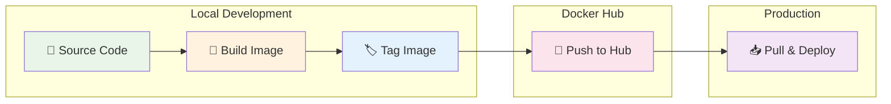
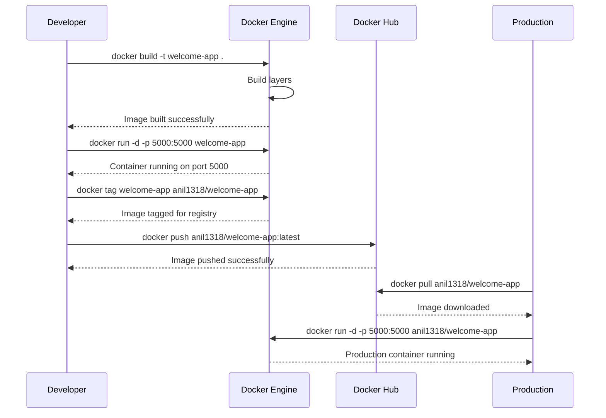
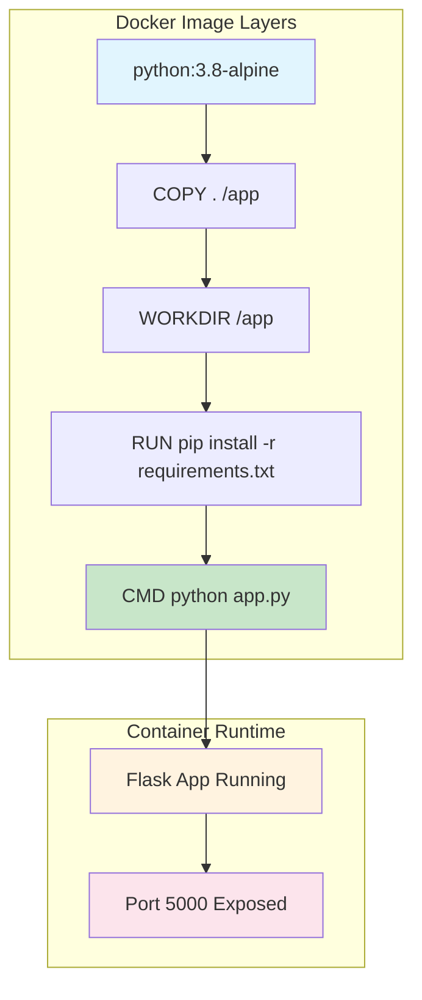

# 🏗️ Creating Docker Image

> **Build, tag, and deploy custom Docker images with animated workflow**

## 📁 Project Files
- `app.py` - Flask web application 🐍
- `Dockerfile` - Image build instructions 📦
- `requirements.txt` - Python dependencies 📋
- `Docker build command.ipynb` - Interactive commands 📝

---

## 🏗️ Docker Image Pipeline



## 🎬 Animated Build Process

### Step 1: 🔨 Build Local Image
```bash
docker build -t welcome-app .
```

```
🔄 Building Docker Image...

#1 [internal] load build definition
    ✅ Dockerfile loaded
    
#2 [internal] load metadata  
    📦 python:3.8-alpine
    ✅ Base image ready
    
#3 [1/4] FROM python:3.8-alpine
    ⬇️  Pulling base layers...
    ██████████ 100%
    
#4 [2/4] COPY . /app
    📁 Copying application files...
    ✅ Files copied
    
#5 [3/4] WORKDIR /app
    📂 Setting working directory...
    ✅ Workdir set
    
#6 [4/4] RUN pip install -r requirements.txt
    📦 Installing Flask dependencies...
    ✅ Dependencies installed
    
✅ Image 'welcome-app' built successfully!
```

### Step 2: 🚀 Test Container
```bash
docker run -d -p 5000:5000 welcome-app
```

```
🌐 Starting Flask Application...

┌───────────────────────────────────┐
│  🐍 Flask App Running           │
│  🌐 URL: http://localhost:5000   │
│  📡 Port: 5000 → 5000            │
│  ✅ Status: Active                │
└───────────────────────────────────┘
```

### Step 3: 🏷️ Tag for Docker Hub
```bash
docker build -t anil1318/welcome-app .
docker tag anil1318/welcome-app anil1318/welcome-app1
```

```
🏷️  Image Tagging Process:

    welcome-app:latest
         │
         ↓ 🏷️ tag
         │
    anil1318/welcome-app:latest
         │
         ↓ 🏷️ tag  
         │
    anil1318/welcome-app1:latest
    
✅ Multiple tags created!
```

### Step 4: 🔐 Docker Hub Login & Push
```bash
docker login
docker push anil1318/welcome-app:latest
```

```
🔐 Docker Hub Authentication:
    👤 Username: anil1318
    ✅ Login Succeeded
    
🚀 Pushing to Docker Hub...

    ⬆️  Uploading layers:
    ██████████ ff4dc4e6d13f: Pushed
    ██████████ bbd039b2f2dc: Pushed  
    ██████████ 86e037ebf8b6: Pushed
    ██████████ 2fe9ed713579: Pushed
    
✅ Image pushed successfully!
🌐 Available at: docker.io/anil1318/welcome-app
```

### Step 5: 📥 Pull & Deploy
```bash
docker image rm -f anil1318/welcome-app
docker pull anil1318/welcome-app
docker run -d -p 5000:5000 anil1318/welcome-app
```

```
📥 Pulling from Docker Hub...

    ⬇️  Downloading layers:
    ██████████ c622a5ca5072: Already exists
    ██████████ ff4dc4e6d13f: Already exists
    ██████████ 4f4fb700ef54: Already exists
    
✅ Pull complete!
🚀 Container deployed from registry
```

## 🔄 Build Process Flow



## 🏗️ Image Layers



---

## 📈 Build Pipeline Progress

```
Docker Image Lifecycle:

📁 Source Code → 🔨 Build → 🏷️ Tag → 🚀 Push → 📥 Deploy

[████████████████████] 100% Complete

✅ Local build successful
✅ Container tested locally  
✅ Image tagged for registry
✅ Pushed to Docker Hub
✅ Deployed from registry
```

## 🎯 Application Details
- **Framework**: Flask 🐍
- **Base Image**: python:3.8-alpine 🏔️
- **Port**: 5000 🌐
- **Size**: ~92.9MB 📊
- **Registry**: Docker Hub 🌐