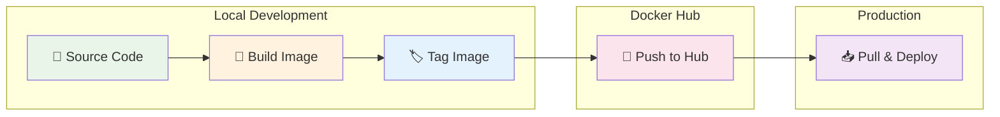
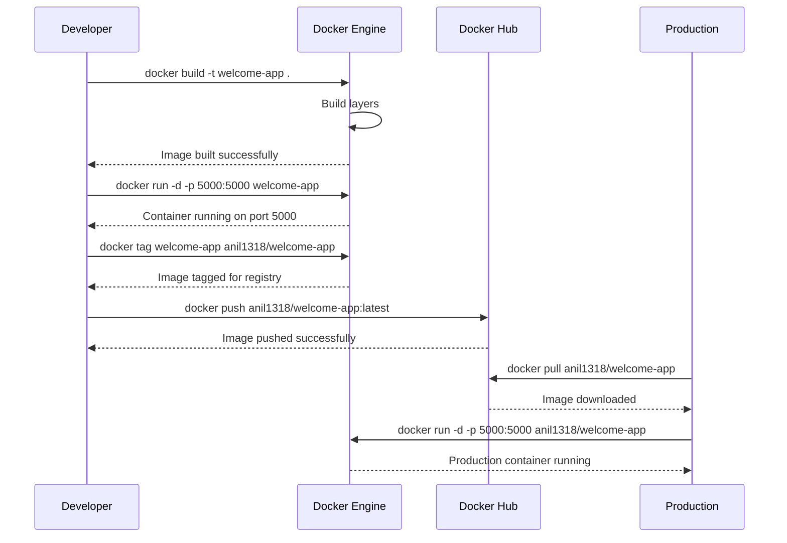
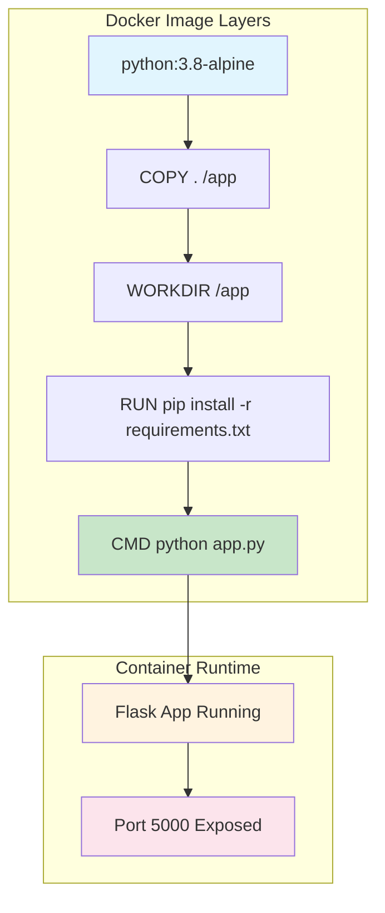

# 🏗️ Creating Docker Image

> **Build, tag, and deploy custom Docker images with Flask application**

## 📁 Project Files
- `app.py` - Flask web application 🐍
- `Dockerfile` - Image build instructions 📦
- `requirements.txt` - Python dependencies 📋
- `Docker build command.ipynb` - Interactive build commands 📝

---

<details>
<summary>🚀 <strong>Docker Image Build Workflow</strong></summary>


</details>

<details>
<summary>📝 <strong>1. Flask Application Code</strong></summary>

### app.py - Simple Flask Web Server
```python
from flask import Flask
import os

app = Flask(__name__)

@app.route('/', methods=["GET"])
def home():
    return "hello Anil"

if __name__ == "__main__":
    app.run(debug=True, host="0.0.0.0", port=5000)
```

### Application Features
- **Framework**: Flask web framework
- **Route**: Single GET endpoint at `/`
- **Response**: Simple text message
- **Host**: Binds to all interfaces (0.0.0.0)
- **Port**: Runs on port 5000
- **Debug**: Enabled for development
</details>

<details>
<summary>📦 <strong>2. Dockerfile Configuration</strong></summary>

### Dockerfile - Multi-stage Build
```dockerfile
FROM python:3.8-alpine
COPY . /app
WORKDIR /app
RUN pip install -r requirements.txt
CMD python app.py
```

### Build Instructions Breakdown
- **Base Image**: `python:3.8-alpine` (lightweight Linux)
- **Copy Files**: Copy all project files to `/app`
- **Working Directory**: Set `/app` as working directory
- **Install Dependencies**: Install Python packages from requirements.txt
- **Start Command**: Run the Flask application

### Image Characteristics
- **Size**: ~92.9MB (Alpine-based)
- **OS**: Alpine Linux
- **Python**: Version 3.8
- **Architecture**: Multi-platform support
</details>

<details>
<summary>📋 <strong>3. Dependencies Management</strong></summary>

### requirements.txt
```txt
flask
```

### Dependency Details
- **Flask**: Web framework for Python
- **Version**: Latest stable (3.0.3)
- **Dependencies**: Automatically installs:
  - Werkzeug (WSGI toolkit)
  - Jinja2 (template engine)
  - Click (CLI toolkit)
  - MarkupSafe (string handling)
  - Blinker (signals)
  - itsdangerous (security utilities)

### Installation Process
```bash
pip install -r requirements.txt
```
</details>

<details>
<summary>🔨 <strong>4. Building Docker Image</strong></summary>

### Local Image Build
```bash
# Build image with local tag
docker build -t welcome-app .
```

### Build Process Output
```
🔄 Building Docker Image...

#1 [internal] load build definition
    ✅ Dockerfile loaded
    
#2 [internal] load metadata  
    📦 python:3.8-alpine
    ✅ Base image ready
    
#3 [1/4] FROM python:3.8-alpine
    ⬇️  Pulling base layers...
    ██████████ 100%
    
#4 [2/4] COPY . /app
    📁 Copying application files...
    ✅ Files copied
    
#5 [3/4] WORKDIR /app
    📂 Setting working directory...
    ✅ Workdir set
    
#6 [4/4] RUN pip install -r requirements.txt
    📦 Installing Flask dependencies...
    ✅ Dependencies installed
    
✅ Image 'welcome-app' built successfully!
```

### Build with Registry Tag
```bash
# Build with Docker Hub username
docker build -t anil1318/welcome-app .
```
</details>

<details>
<summary>🏷️ <strong>5. Image Tagging Strategy</strong></summary>

### Tagging Commands
```bash
# Create additional tag
docker tag anil1318/welcome-app anil1318/welcome-app1

# List all images
docker images
```

### Tag Management
```
🏷️  Image Tagging Process:

    welcome-app:latest
         │
         ↓ 🏷️ tag
         │
    anil1318/welcome-app:latest
         │
         ↓ 🏷️ tag  
         │
    anil1318/welcome-app1:latest
    
✅ Multiple tags created!
```

### Tagging Best Practices
- **Latest**: Default tag for current version
- **Version**: Specific version tags (v1.0, v1.1)
- **Environment**: Environment-specific tags (dev, staging, prod)
- **Registry**: Include registry prefix for pushing
</details>

<details>
<summary>🚀 <strong>6. Running Containers</strong></summary>

### Local Container Execution
```bash
# Run container in detached mode
docker run -d -p 5000:5000 welcome-app

# Check running containers
docker ps -a
```

### Container Status
```
📊 Container Status:
┌──────────────┬─────────────┬──────────┬─────────────┐
│ CONTAINER ID │ IMAGE       │ STATUS   │ PORTS       │
├──────────────┼─────────────┼──────────┼─────────────┤
│ cfa7d427caa2 │ welcome-app │ Running  │ 5000:5000   │
└──────────────┴─────────────┴──────────┴─────────────┘
```

### Container Management
```bash
# Stop container
docker stop <container_id>

# Remove container
docker rm <container_id>

# View logs
docker logs <container_id>
```
</details>

<details>
<summary>🌐 <strong>7. Docker Hub Registry</strong></summary>

### Authentication
```bash
# Login to Docker Hub
docker login
```

### Login Process
```
🔐 Docker Hub Authentication:
    👤 Username: anil1318
    ✅ Login Succeeded
```

### Push to Registry
```bash
# Push image to Docker Hub
docker push anil1318/welcome-app:latest
```

### Push Process
```
🚀 Pushing to Docker Hub...

    ⬆️  Uploading layers:
    ██████████ ff4dc4e6d13f: Pushed
    ██████████ bbd039b2f2dc: Pushed  
    ██████████ 86e037ebf8b6: Pushed
    ██████████ 2fe9ed713579: Pushed
    
✅ Image pushed successfully!
🌐 Available at: docker.io/anil1318/welcome-app
```
</details>

<details>
<summary>📥 <strong>8. Image Distribution & Deployment</strong></summary>

### Remove Local Image
```bash
# Force remove local image
docker image rm -f anil1318/welcome-app
```

### Pull from Registry
```bash
# Pull image from Docker Hub
docker pull anil1318/welcome-app
```

### Pull Process
```
📥 Pulling from Docker Hub...

    ⬇️  Downloading layers:
    ██████████ c622a5ca5072: Already exists
    ██████████ ff4dc4e6d13f: Already exists
    ██████████ 4f4fb700ef54: Already exists
    
✅ Pull complete!
🌐 Image downloaded from registry
```

### Deploy from Registry
```bash
# Run container from registry image
docker run -d -p 5000:5000 anil1318/welcome-app
```

### Deployment Verification
```bash
# Test application
curl http://localhost:5000
# Expected output: "hello Anil"
```
</details>

## 🏗️ Image Build Pipeline



## 📊 Image Layers Architecture



## 🎓 Build Process Checklist

```
Progress: [████████████████████] 100%

✅ Flask application development
✅ Dockerfile creation and optimization
✅ Local image building and testing
✅ Container execution and verification
✅ Image tagging strategies
✅ Docker Hub authentication
✅ Registry push and distribution
✅ Image pull and deployment
```

## 🔑 Key Docker Image Concepts
- 🏗️ **Multi-stage Build**: Efficient layer management
- 📦 **Base Image**: Alpine Linux for minimal size
- 🏷️ **Image Tagging**: Version and registry management
- 🚀 **Container Deployment**: Local and registry-based
- 🌐 **Registry Integration**: Docker Hub distribution
- 📊 **Layer Caching**: Optimized build performance
- 🔄 **CI/CD Ready**: Automated build pipeline
- 🛡️ **Security**: Minimal attack surface with Alpine