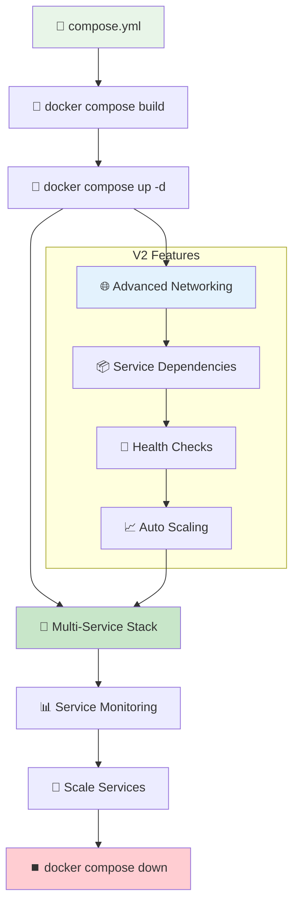
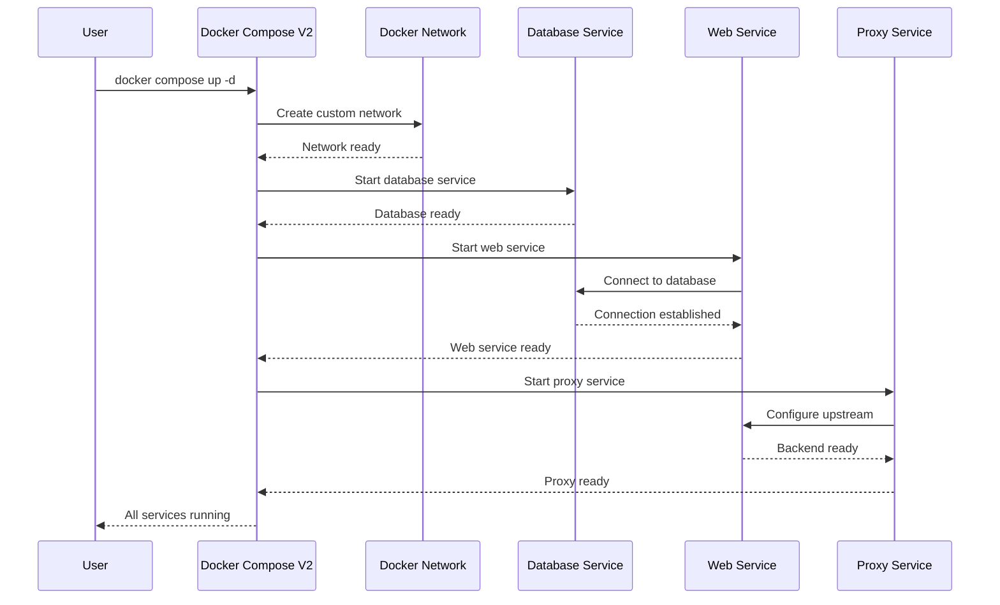
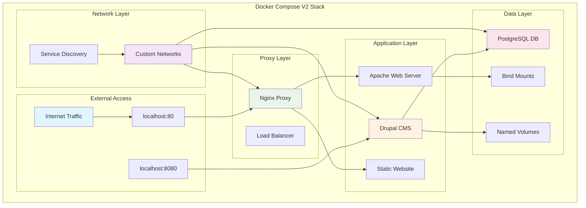
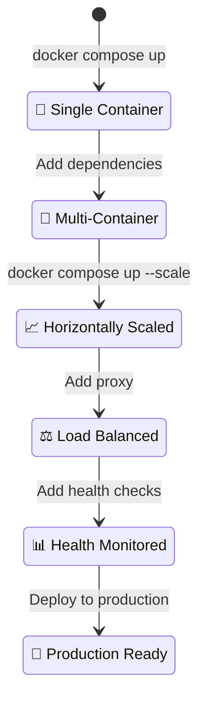

# 🐳 Docker Compose V2

> **Advanced multi-container orchestration with enhanced Docker Compose features and animated workflows**

This directory contains advanced Docker Compose examples and assignments demonstrating multi-container applications and orchestration patterns.

## 🎼 Advanced Compose Workflow



## Overview

Docker Compose V2 introduces improved syntax, better performance, and enhanced features for container orchestration. This section covers practical examples of multi-service applications using the latest Docker Compose specifications.

## Directory Structure

### Assignment Examples
- **compose-assignment-1/**: Drupal CMS with PostgreSQL database
- **compose-assignment-2/**: Custom application with database integration

### Sample Applications
- **compose-sample-2/**: Nginx proxy with Apache web server
- **compose-sample-3/**: Static website with Nginx proxy and Apache backend

## Key Features Demonstrated

### Multi-Service Applications
- Web applications with database backends
- Reverse proxy configurations
- Service networking and communication

### Volume Management
- Named volumes for data persistence
- Bind mounts for development workflows
- Volume cleanup and management

### Network Configuration
- Service discovery and internal networking
- Port mapping and exposure
- Load balancing with reverse proxies

## 🎬 Animated Service Orchestration

### Multi-Container Deployment Flow
```
🚀 Starting Multi-Service Application...

🌐 Network Creation:
    ✅ Creating network "compose-v2_default"
    
📦 Service Startup Sequence:
    ✅ Creating database... done
    ✅ Creating web-app... done
    ✅ Creating proxy... done
    
📡 Port Mapping:
    proxy   | 🌐 Running on http://0.0.0.0:80
    web-app | 🐍 Running on http://0.0.0.0:8080
    database| 🗄️  Ready for connections
```

### Service Health Monitoring
```
📊 Service Health Dashboard:

┌──────────────────────────────────────┐
│  🐳 Service: drupal                 │
│  🟢 Status: Healthy                  │
│  🌐 Port: 8080:80                   │
│  💾 Volumes: 4 mounted               │
│  🔗 URL: http://localhost:8080      │
└──────────────────────────────────────┘

┌──────────────────────────────────────┐
│  🐳 Service: postgres                │
│  🟢 Status: Running                  │
│  🔒 Port: Internal only              │
│  💾 Data: Persistent                 │
│  🔗 Connected to drupal              │
└──────────────────────────────────────┘
```

## 🔄 Service Orchestration Patterns



## Examples Covered

### 1. Drupal with PostgreSQL (compose-assignment-1)
```yaml
services:
  drupal:
    image: drupal:9
    ports:
      - "8080:80"
    volumes:
      - drupal-modules:/var/www/html/modules
      - drupal-profiles:/var/www/html/profiles
      - drupal-sites:/var/www/html/sites
      - drupal-themes:/var/www/html/themes
  postgres:
    image: postgres:14
    environment:
      - POSTGRES_PASSWORD=mypasswd
```

### 2. Nginx Proxy with Apache (compose-sample-2)
```yaml
services:
  proxy:
    image: nginx:1.23
    ports:
      - '80:80'
    volumes:
      - ./nginx.conf:/etc/nginx/conf.d/default.conf
  web:
    image: httpd:latest
```

## Common Commands

### Basic Operations
```bash
# Start services in detached mode
docker-compose up -d

# View running services
docker-compose ps

# View service logs
docker-compose logs

# Stop and remove containers
docker-compose down

# Stop and remove containers with volumes
docker-compose down -v
```

### Service Management
```bash
# Scale services
docker-compose up -d --scale web=3

# Restart specific service
docker-compose restart web

# View service processes
docker-compose top
```

### Volume Operations
```bash
# List volumes
docker volume ls

# Remove unused volumes
docker volume prune

# Remove specific volumes
docker volume rm volume_name
```

## Best Practices

### Configuration
- Use environment variables for sensitive data
- Implement proper volume strategies for data persistence
- Configure appropriate restart policies
- Use specific image tags instead of 'latest'

### Security
- Avoid exposing unnecessary ports
- Use secrets management for sensitive information
- Implement proper network segmentation
- Regular security updates for base images

### Performance
- Optimize image sizes
- Use multi-stage builds when appropriate
- Configure resource limits
- Monitor container performance

## Troubleshooting

### Common Issues
- Port conflicts: Change host port mappings
- Volume permissions: Check file ownership and permissions
- Network connectivity: Verify service names and networking
- Resource constraints: Monitor CPU and memory usage

### Debugging Commands
```bash
# Check service status
docker-compose ps

# View detailed logs
docker-compose logs -f service_name

# Execute commands in running containers
docker-compose exec service_name bash

# Validate compose file
docker-compose config
```

## 🌐 Multi-Service Architecture



## 📊 Service Scaling Visualization



## 🎓 Learning Progress Tracker

```
Docker Compose V2 Mastery: [████████████████████] 100%

✅ Advanced compose file syntax
✅ Multi-service orchestration
✅ Custom network configuration
✅ Volume management strategies
✅ Service dependencies and health checks
✅ Reverse proxy implementation
✅ Database integration patterns
✅ Scaling and load balancing
✅ Production deployment practices
✅ Troubleshooting multi-service apps
```

## 🔄 Container Lifecycle Management

```
🎼 Compose V2 Service Lifecycle:

📁 Define → 🔨 Build → 🚀 Deploy → 📈 Scale → 🔧 Update → ⏹️ Stop

┌─────────────────────────────────────────────────────┐
│  Phase 1: 📁 Service Definition                    │
│  • YAML configuration                              │
│  • Service dependencies                            │
│  • Network topology                                │
└─────────────────────────────────────────────────────┘

┌─────────────────────────────────────────────────────┐
│  Phase 2: 🔨 Image Building                        │
│  • Custom Dockerfile builds                        │
│  • Multi-stage optimization                        │
│  • Layer caching                                   │
└─────────────────────────────────────────────────────┘

┌─────────────────────────────────────────────────────┐
│  Phase 3: 🚀 Service Deployment                    │
│  • Network creation                                │
│  • Volume mounting                                 │
│  • Container orchestration                         │
└─────────────────────────────────────────────────────┘
```

## Learning Objectives

By working through these examples, you will learn:
- 🎼 **Multi-container orchestration** with advanced Compose features
- 🌐 **Service networking** and inter-container communication
- 💾 **Volume management** and data persistence strategies
- ⚖️ **Reverse proxy configuration** and load balancing
- 🗄️ **Database integration** patterns and best practices
- 🔄 **Container lifecycle management** and automation
- 🔧 **Troubleshooting** multi-service applications
- 📈 **Scaling strategies** for production environments

## 🚀 Next Steps

1. 🧪 **Experiment** with different service combinations
2. 🌐 **Implement** custom networking configurations
3. 📊 **Add** monitoring and logging solutions
4. 🏭 **Explore** production deployment strategies
5. ☸️ **Learn** about Docker Swarm and Kubernetes migration paths
6. 🔒 **Implement** security best practices
7. 🔄 **Automate** CI/CD pipelines with Compose
8. 📈 **Optimize** performance and resource usage