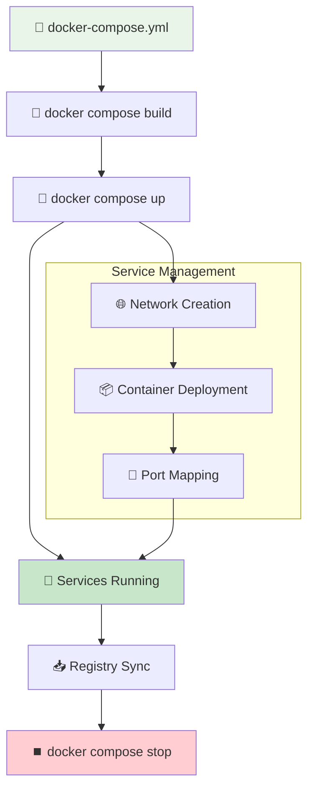
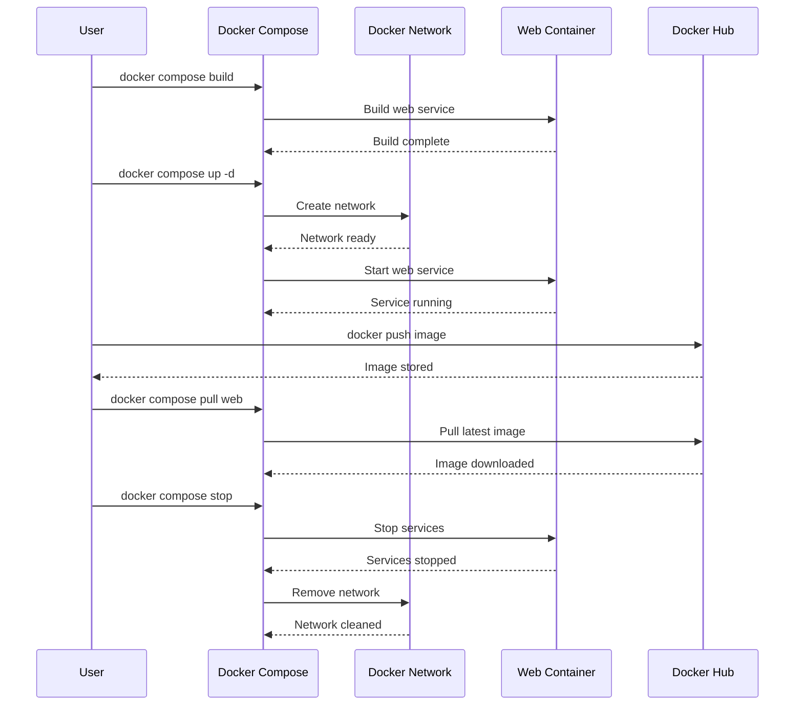
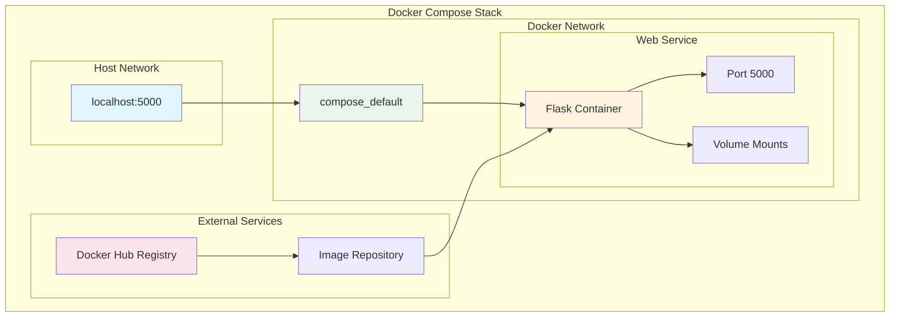

# 🐳 Docker Compose

> **Multi-container orchestration with animated service management**

## 📁 Project Files
- `app.py` - Flask web application 🐍
- `Dockerfile` - Container build config 📦
- `docker-compose.yml` - Service orchestration 🎼
- `requirements.txt` - Python dependencies 📋
- `docker build.ipynb` - Interactive commands 📝

---

## 🎼 Docker Compose Workflow



## 🎬 Animated Orchestration Flow

### Step 1: 🔨 Build Services
```bash
docker compose build
```

```
🔨 Building Services...

┌───────────────────────────────────┐
│  🎼 Service: web                 │
│  📦 Building from Dockerfile     │
│  ██████████ 100% Complete      │
│  ✅ Build successful             │
└───────────────────────────────────┘
```

### Step 2: 🚀 Start Services
```bash
docker compose up
```

```
🚀 Starting Multi-Container Application...

🌐 Network Creation:
    ✅ Creating network "docker-compose_default"
    
📦 Container Startup:
    ✅ Creating web_1...
    ✅ Starting web_1... done
    
📡 Port Mapping:
    web_1 | 🌐 Running on http://0.0.0.0:5000
    ✅ Service accessible on localhost:5000
```

### Step 3: 🔄 Background Mode
```bash
docker compose up -d
```

```
🔄 Detached Mode Activation:

    🎼 Services running in background...
    
    ┌──────────────────────────────────┐
    │  🐳 Container: web_1            │
    │  🟢 Status: Running              │
    │  🌐 Port: 5000:5000             │
    │  🔗 URL: http://localhost:5000  │
    └──────────────────────────────────┘
```

### Step 4: 📥 Registry Operations
```bash
docker push anil1318/web-app-compose:latest
docker compose pull web
```

```
📥 Registry Sync:

⬆️  Push to Registry:
    ██████████ Uploading layers...
    ✅ anil1318/web-app-compose:latest pushed
    
⬇️  Pull Latest Version:
    ██████████ Downloading updates...
    ✅ Service 'web' updated
```

### Step 5: ⏹️ Service Management
```bash
docker compose stop
```

```
⏹️  Graceful Shutdown:

    🔄 Stopping services...
    ✅ web_1 stopped
    
    🌐 Network cleanup...
    ✅ Network removed
    
    📊 Resource summary:
    • Containers: 0 running
    • Networks: 0 active
    • Volumes: 0 mounted
```

## 🔄 Service Orchestration



## 🌐 Multi-Container Architecture



---

## 🎼 Service Architecture

```
🌐 Docker Compose Stack:

┌──────────────────────────────────────────────────┐
│                    🌐 Host Network                    │
│  ┌──────────────────────────────────────────┐  │
│  │          🐳 Docker Compose Network          │  │
│  │  ┌──────────────────────────────────┐  │  │
│  │  │        🐍 Flask Web Service        │  │  │
│  │  │        Port: 5000 → 5000           │  │  │
│  │  │        Image: web-app-compose      │  │  │
│  │  └──────────────────────────────────┘  │  │
│  └──────────────────────────────────────────┘  │
└──────────────────────────────────────────────────┘
```

## 📈 Orchestration Progress

```
Compose Lifecycle:

📁 Config → 🔨 Build → 🚀 Deploy → 🔄 Scale → ⏹️ Stop

[████████████████████] 100% Orchestrated

✅ Services defined
✅ Images built
✅ Containers deployed
✅ Network configured
✅ Registry synchronized
```

## 🎯 Compose Features
- **Multi-Service**: Orchestrate multiple containers 🎼
- **Networking**: Automatic service discovery 🌐
- **Scaling**: Easy horizontal scaling 📈
- **Volumes**: Persistent data management 💾
- **Environment**: Configuration management ⚙️