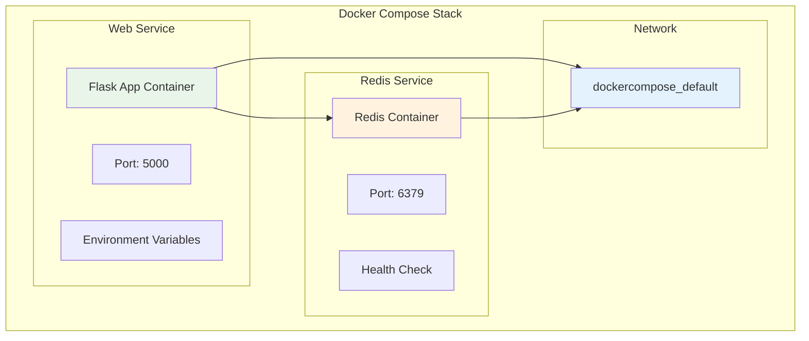
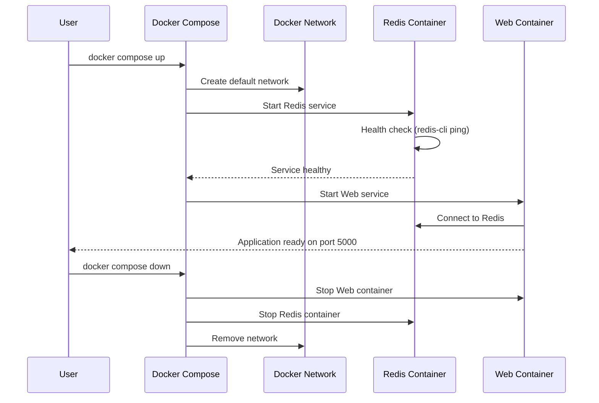
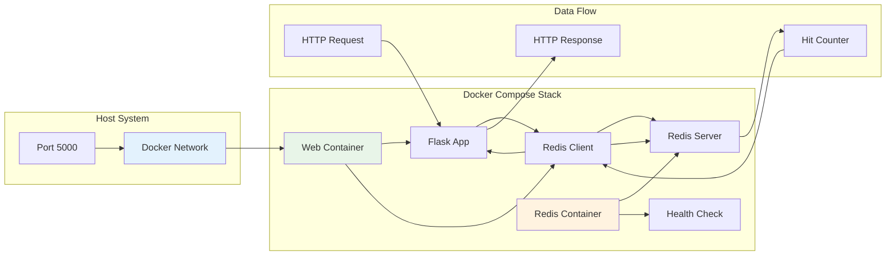

# 🐳 Docker Compose v2

> **Master multi-container applications with Docker Compose v2 - orchestrate Flask + Redis stack**

## 📁 Project Files
- `docker-compose.yml` - Multi-service orchestration configuration 🎼
- `app.py` - Flask web application with Redis integration 🐍
- `Dockerfile` - Flask application container build 📦
- `requirements.txt` - Python dependencies 📋
- `docker build.ipynb` - Interactive Compose commands and workflow 📝

---

<details>
<summary>🎼 <strong>Docker Compose Architecture</strong></summary>



### Service Dependencies
```
🔗 Service Dependency Chain:

redis (Redis 7 Alpine)
  ↓ health check
web (Flask App)
  ↓ depends_on: redis healthy
Application Ready
```
</details>

<details>
<summary>🐍 <strong>1. Flask Application with Redis</strong></summary>

### Flask App Code
```python
import os
import time
import redis
from flask import Flask

app = Flask(__name__)

REDIS_HOST = os.environ.get("REDIS_HOST", "redis")
REDIS_PORT = int(os.environ.get("REDIS_PORT", "6379"))

cache = redis.Redis(
    host=REDIS_HOST,
    port=REDIS_PORT,
    db=0,
    socket_connect_timeout=2,
    socket_timeout=2,
)

def get_hit_count():
    retries = 5
    while True:
        try:
            return cache.incr("hits")
        except redis.exceptions.ConnectionError as exc:
            if retries == 0:
                raise exc
            retries -= 1
            time.sleep(0.5)

@app.route("/")
def hello():
    hits = get_hit_count()
    return f"Hello Anil! I've been seen {hits} times.\n"

if __name__ == "__main__":
    app.run(host="0.0.0.0", port=5000)
```

### Application Features
```
🚀 Flask Application Features:

✅ Redis connection with retry logic
✅ Hit counter with persistence
✅ Environment variable configuration
✅ Connection error handling
✅ Docker-optimized settings
✅ Health check compatible
```

### Dockerfile Configuration
```dockerfile
FROM python:3.8-alpine
LABEL authors="anil"

WORKDIR /code
COPY requirements.txt /code/requirements.txt

# Faster/leaner pip install
RUN pip install --no-cache-dir -r requirements.txt

COPY . /code

ENV FLASK_APP=app.py
ENV FLASK_RUN_HOST=0.0.0.0
ENV PYTHONDONTWRITEBYTECODE=1
ENV PYTHONUNBUFFERED=1

EXPOSE 5000
CMD ["flask", "run"]
```
</details>

<details>
<summary>🎼 <strong>2. Docker Compose Configuration</strong></summary>

### Complete docker-compose.yml
```yaml
version: "3.8"
services:
  web:
    image: anil1318/web-app-compose:latest
    ports:
      - "5000:5000"
    environment:
      REDIS_HOST: redis
      REDIS_PORT: 6379
    depends_on:
      redis:
        condition: service_healthy
    restart: unless-stopped

  redis:
    image: redis:7-alpine
    healthcheck:
      test: ["CMD", "redis-cli", "ping"]
      interval: 2s
      timeout: 2s
      retries: 15
    restart: unless-stopped
```

### Service Configuration Breakdown
```
📊 Service Configuration:

Web Service:
├── Image: anil1318/web-app-compose:latest
├── Ports: 5000:5000 (host:container)
├── Environment: REDIS_HOST, REDIS_PORT
├── Depends on: redis (healthy condition)
└── Restart: unless-stopped

Redis Service:
├── Image: redis:7-alpine
├── Health Check: redis-cli ping
├── Check Interval: 2s
├── Timeout: 2s
├── Retries: 15
└── Restart: unless-stopped
```

### Network and Dependencies
```
🌐 Networking:

Default Network: dockercompose_default
├── Web container: accessible as 'web'
├── Redis container: accessible as 'redis'
└── Internal DNS resolution enabled

Dependency Management:
├── Web waits for Redis health check
├── Redis must respond to ping
└── Automatic startup ordering
```
</details>

<details>
<summary>🚀 <strong>3. Docker Compose Commands</strong></summary>

### Basic Operations
```bash
# Start all services (foreground)
docker compose up

# Start all services (background)
docker compose up -d

# Stop all services
docker compose stop

# Stop and remove containers
docker compose down

# View running services
docker compose ps
```

### Build and Pull Operations
```bash
# Build services with Dockerfile
docker compose build

# Pull latest images
docker compose pull

# Pull specific service
docker compose pull web

# Build and start
docker compose up --build
```

### Service Management
```bash
# Start specific service
docker compose start web

# Stop specific service
docker compose stop redis

# Restart service
docker compose restart web

# View service logs
docker compose logs web

# Follow logs in real-time
docker compose logs -f
```

### Development Workflow
```bash
# Development with rebuild
docker compose up --build

# Scale services
docker compose up --scale web=3

# Run one-off commands
docker compose exec web python -c "print('Hello')"

# Access service shell
docker compose exec web sh
```
</details>

<details>
<summary>📊 <strong>4. Service Orchestration Flow</strong></summary>

### Startup Sequence
```
🔄 Container Startup Flow:

1. Network Creation
   └── dockercompose_default network created

2. Redis Service Start
   ├── Pull redis:7-alpine image
   ├── Create redis container
   ├── Start Redis server
   └── Health check: redis-cli ping

3. Web Service Start (after Redis healthy)
   ├── Pull anil1318/web-app-compose image
   ├── Create web container
   ├── Set environment variables
   ├── Connect to Redis
   └── Start Flask application

4. Application Ready
   └── Web accessible on http://localhost:5000
```

### Health Check Process
```bash
# Redis health check command
redis-cli ping
# Expected response: PONG

# Health check configuration
test: ["CMD", "redis-cli", "ping"]
interval: 2s      # Check every 2 seconds
timeout: 2s       # Wait 2 seconds for response
retries: 15       # Try 15 times before failing
```

### Service Communication
```
🔗 Inter-Service Communication:

Flask App → Redis:
├── Host: redis (service name)
├── Port: 6379 (default Redis port)
├── Connection: Internal Docker network
└── Data: Hit counter persistence

External Access:
├── Web UI: http://localhost:5000
├── Port mapping: 5000:5000
└── Response: "Hello Anil! I've been seen X times."
```
</details>

<details>
<summary>🛠️ <strong>5. Production Deployment</strong></summary>

### Registry Operations
```bash
# Tag image for registry
docker tag dockercompose-web anil1318/web-app-compose:latest

# Push to Docker Hub
docker push anil1318/web-app-compose:latest

# Pull from registry
docker pull anil1318/web-app-compose:latest

# Update compose with registry image
# (already configured in docker-compose.yml)
```

### Production Configuration
```yaml
# Production docker-compose.yml
version: "3.8"
services:
  web:
    image: anil1318/web-app-compose:latest
    ports:
      - "5000:5000"
    environment:
      REDIS_HOST: redis
      REDIS_PORT: 6379
      FLASK_ENV: production
    depends_on:
      redis:
        condition: service_healthy
    restart: unless-stopped
    deploy:
      replicas: 3
      resources:
        limits:
          memory: 512M
        reservations:
          memory: 256M

  redis:
    image: redis:7-alpine
    volumes:
      - redis_data:/data
    healthcheck:
      test: ["CMD", "redis-cli", "ping"]
      interval: 10s
      timeout: 5s
      retries: 3
    restart: unless-stopped

volumes:
  redis_data:
```

### Monitoring and Logging
```bash
# View all service logs
docker compose logs

# Monitor specific service
docker compose logs -f web

# Check service status
docker compose ps

# View resource usage
docker stats $(docker compose ps -q)
```
</details>

<details>
<summary>🔧 <strong>6. Advanced Compose Features</strong></summary>

### Environment Variables
```yaml
# Using .env file
services:
  web:
    environment:
      - REDIS_HOST=${REDIS_HOST:-redis}
      - REDIS_PORT=${REDIS_PORT:-6379}
      - DEBUG=${DEBUG:-false}
    env_file:
      - .env
```

### Volume Management
```yaml
services:
  redis:
    volumes:
      - redis_data:/data
      - ./redis.conf:/usr/local/etc/redis/redis.conf
  
  web:
    volumes:
      - ./app:/code
      - logs:/var/log

volumes:
  redis_data:
  logs:
```

### Network Configuration
```yaml
networks:
  frontend:
    driver: bridge
  backend:
    driver: bridge

services:
  web:
    networks:
      - frontend
      - backend
  
  redis:
    networks:
      - backend
```

### Override Files
```bash
# Development override
# docker-compose.override.yml
version: "3.8"
services:
  web:
    volumes:
      - ./app:/code
    environment:
      - FLASK_DEBUG=1

# Production override
# docker-compose.prod.yml
version: "3.8"
services:
  web:
    deploy:
      replicas: 3
```
</details>

## 🔄 Compose Lifecycle Management



## 📊 Service Architecture



## 🎓 Docker Compose Mastery Checklist

```
Progress: [████████████████████] 100%

✅ Multi-service application orchestration
✅ Service dependencies and health checks
✅ Environment variable configuration
✅ Network communication between services
✅ Volume management and data persistence
✅ Production deployment strategies
✅ Registry integration and image management
✅ Monitoring and logging techniques
✅ Advanced Compose features and overrides
✅ Scaling and resource management
```

## 🔑 Key Docker Compose Concepts
- 🎼 **Orchestration**: Multi-container application management
- 🔗 **Dependencies**: Service startup ordering with health checks
- 🌐 **Networking**: Automatic service discovery and communication
- 📊 **Scaling**: Horizontal scaling with replica management
- 🔄 **Lifecycle**: Complete application lifecycle management
- 📦 **Registry**: Production deployment with image registries
- 🛠️ **Configuration**: Environment-based configuration management
- 📈 **Monitoring**: Service health monitoring and logging