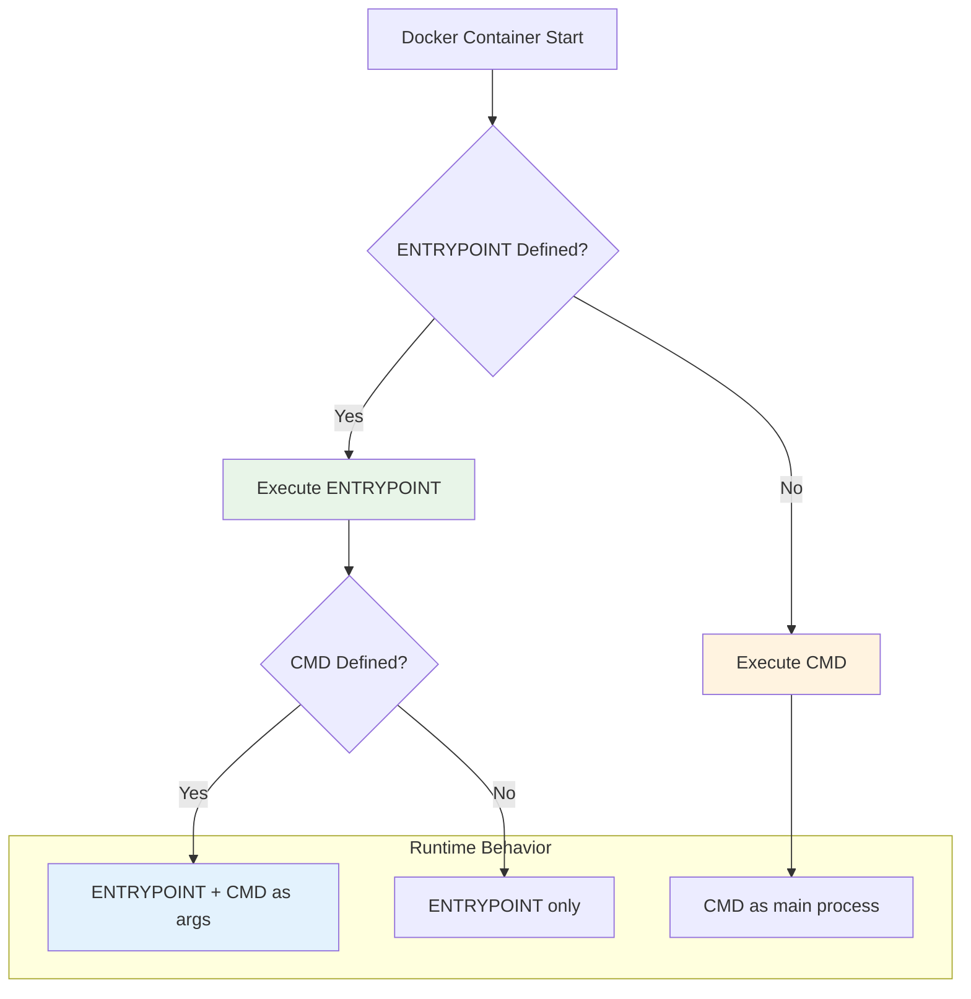
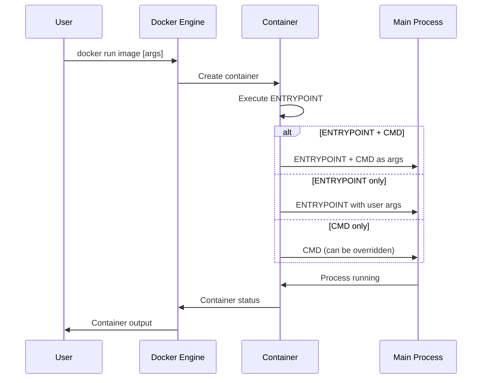

# 🚀 Docker File Entry Point

> **Master Docker ENTRYPOINT and CMD instructions with practical examples and advanced patterns**

## 📁 Project Files
- `entrypoint.ipynb` - Basic ENTRYPOINT concepts and usage 📝
- `Entrypoint and CMD combined.ipynb` - Advanced ENTRYPOINT + CMD patterns 🔧
- `Dockerfile` - Simple hostname ENTRYPOINT example 📦
- `cmatrix/` - Matrix animation with configurable parameters 🎬
  - `Dockerfile` - CMatrix with ENTRYPOINT and CMD
- `apachebench/` - Apache benchmarking tool container 📊
  - `Dockerfile` - AB tool with default parameters
- `assignment2/` - FastAPI application with custom entrypoint 🐍
  - `main.py` - FastAPI file upload/download service
  - `Dockerfile` - Multi-stage build with entrypoint script
  - `docker-entrypoint.sh` - Custom initialization script

---

<details>
<summary>🚀 <strong>ENTRYPOINT vs CMD Overview</strong></summary>



### Key Differences
```
📊 ENTRYPOINT vs CMD:

                    │ ENTRYPOINT │    CMD
────────────────────┼────────────┼──────────
Override at runtime │     ❌     │    ✅
Always executed     │     ✅     │    ❌
Used as arguments   │     ❌     │    ✅
Best for            │   Tools    │  Apps
```
</details>

<details>
<summary>📝 <strong>1. Basic ENTRYPOINT Concepts</strong></summary>

### Simple Hostname Example
```dockerfile
FROM busybox:latest

ENTRYPOINT [ "hostname" ]
```

### Container Behavior
```bash
# Build the image
docker build -t hostname .

# Run container - always executes hostname
docker run hostname
# Output: container_id (e.g., 535ed873f185)

# Try to override with date - fails
docker run hostname date
# Output: hostname: sethostname: Operation not permitted
```

### ENTRYPOINT Characteristics
```
🔒 ENTRYPOINT Features:

✅ Cannot be overridden at runtime
✅ Always executed as main process
✅ Perfect for containerized tools
✅ Provides consistent interface
❌ Less flexible than CMD
```

### Image Inspection
```json
"Config": {
    "Cmd": null,
    "Entrypoint": ["hostname"],
    "Env": ["PATH=/usr/local/sbin:/usr/local/bin:/usr/sbin:/usr/bin:/sbin:/bin"]
}
```

### Override ENTRYPOINT
```bash
# Use --entrypoint to override
docker run --entrypoint date hostname
# Output: Mon Aug 11 01:37:06 UTC 2025

# Interactive shell override
docker run --entrypoint sh hostname
```
</details>

<details>
<summary>🎬 <strong>2. CMatrix - ENTRYPOINT + CMD Pattern</strong></summary>

### CMatrix Dockerfile
```dockerfile
FROM alpine:latest

RUN apk add --no-cache cmatrix

ENTRYPOINT [ "cmatrix" ]

CMD [ "-abs", "-C", "red" ]
```

### Build and Run
```bash
# Build CMatrix image
docker build -t cmatrix cmatrix/.

# Run with default parameters
docker run -it cmatrix
# Executes: cmatrix -abs -C red

# Override CMD parameters
docker run -it cmatrix -C green -u 5
# Executes: cmatrix -C green -u 5
```

### Parameter Flexibility
```
🎨 CMatrix Parameters:

Default CMD: [ "-abs", "-C", "red" ]
├── -a: Asynchronous scroll
├── -b: Bold characters
├── -s: Screensaver mode
└── -C red: Red color

Override Examples:
├── docker run cmatrix -C blue
├── docker run cmatrix -u 10 -C green
└── docker run cmatrix -h (help)
```

### Container Registry
```bash
# Tag and push to registry
docker tag cmatrix anil1318/cmatrix:latest
docker push anil1318/cmatrix:latest
```
</details>

<details>
<summary>📊 <strong>3. Apache Benchmark Tool</strong></summary>

### ApacheBench Dockerfile
```dockerfile
FROM ubuntu:latest

RUN apt-get update && apt-get install -y apache2-utils && rm -rf /var/lib/apt/lists/*

ENTRYPOINT [ "ab" ]

CMD [ "-n", "10", "-c", "2", "https://www.bretfisher.com/" ]
```

### Build and Test
```bash
# Build ApacheBench image
docker build -t apachebench apachebench/.

# Run with default parameters
docker run apachebench
```

### Benchmark Results
```
📈 ApacheBench Output:

Server Software:        openresty
Server Hostname:        www.bretfisher.com
Server Port:            443

Document Path:          /
Document Length:        29058 bytes

Concurrency Level:      2
Time taken for tests:   0.413 seconds
Complete requests:      10
Failed requests:        0

Requests per second:    24.22 [#/sec] (mean)
Time per request:       82.578 [ms] (mean)
Transfer rate:          702.08 [Kbytes/sec] received
```

### Custom Benchmarks
```bash
# Test different website
docker run apachebench -n 100 -c 10 https://google.com/

# Load testing with higher concurrency
docker run apachebench -n 1000 -c 50 https://example.com/

# POST request testing
docker run apachebench -n 10 -c 2 -p data.json -T application/json https://api.example.com/
```

### Registry Deployment
```bash
# Tag and push
docker tag apachebench anil1318/apachebench:latest
docker push anil1318/apachebench:latest
```
</details>

<details>
<summary>🐍 <strong>4. FastAPI with Custom Entrypoint</strong></summary>

### FastAPI Application
```python
from fastapi import FastAPI, UploadFile, File, HTTPException
from fastapi.responses import FileResponse
import os
from datetime import datetime

app = FastAPI()

@app.get("/")
async def root():
    return {"message": "Welcome to FastAPI"}

@app.get("/api/items")
async def get_items():
    files = os.listdir("/app/data")
    return [{"filename": f} for f in files]

@app.post("/api/upload")
async def upload_file(file: UploadFile = File(...)):
    timestamp = datetime.now().strftime("%Y%m%d_%H%M%S")
    filename = f"{timestamp}_{file.filename}"
    file_path = os.path.join("/app/data", filename)
    
    content = await file.read()
    with open(file_path, "wb") as f:
        f.write(content)
    
    return {"filename": filename, "size": len(content)}
```

### Advanced Dockerfile
```dockerfile
FROM python:slim

WORKDIR /app

COPY requirements.txt .
RUN pip install --no-cache-dir -r requirements.txt

COPY . .

VOLUME [ "/app/data" ]

ENTRYPOINT [ "./docker-entrypoint.sh" ]

CMD [ "uvicorn", "main:app", "--host", "0.0.0.0", "--port", "8000" ]
```

### Custom Entrypoint Script
```bash
#!/bin/sh
set -e

# Seed mounted volume with default data if empty
if [ -z "$(ls -A /app/data)" ]; then
    cp -r /app/data-default/* /app/data/
fi

# Process Docker secrets as environment variables
if [ -d "/run/secrets" ]; then
    for secret in /run/secrets/*; do
        if [ -f "$secret" ]; then
            name=$(basename "$secret")
            export "$name"="$(cat $secret)"
        fi
    done
fi

# Environment variable substitution in config
if [ -f "/app/data/config.json" ]; then
    envsubst < /app/data/config.json > /app/data/config.json.tmp
    mv /app/data/config.json.tmp /app/data/config.json
fi

# Execute the main command
exec "$@"
```

### Build and Deploy
```bash
# Build FastAPI application
docker build -t fastapi assignment2/.

# Run with default settings
docker run -p 8000:8000 fastapi

# Run with custom command
docker run -p 8000:8000 fastapi python -c "print('Custom command')"

# Run with volume mount
docker run -p 8000:8000 -v ./data:/app/data fastapi
```

### API Endpoints
```
🌐 FastAPI Endpoints:

GET  /                     - Welcome message
GET  /api/items           - List uploaded files
POST /api/upload          - Upload file
GET  /api/download/{file} - Download file

Volume: /app/data (persistent storage)
Port: 8000 (web interface)
```
</details>

<details>
<summary>🔧 <strong>5. Advanced ENTRYPOINT Patterns</strong></summary>

### Multi-Command Entrypoint
```dockerfile
FROM alpine:latest

COPY entrypoint.sh /entrypoint.sh
RUN chmod +x /entrypoint.sh

ENTRYPOINT ["/entrypoint.sh"]
CMD ["default-app"]
```

```bash
#!/bin/sh
# entrypoint.sh

# Initialize application
echo "Initializing application..."

# Set up environment
export APP_ENV=${APP_ENV:-production}

# Run migrations or setup
if [ "$1" = "migrate" ]; then
    echo "Running migrations..."
    exec migrate-command
elif [ "$1" = "seed" ]; then
    echo "Seeding database..."
    exec seed-command
else
    echo "Starting application..."
    exec "$@"
fi
```

### Configuration Management
```bash
# Entrypoint with config processing
#!/bin/sh

# Process environment variables
envsubst < /app/config.template > /app/config.json

# Wait for dependencies
wait-for-it database:5432 --timeout=30

# Start application
exec "$@"
```

### Signal Handling
```bash
# Proper signal handling in entrypoint
#!/bin/sh

# Trap signals and forward to child process
trap 'kill -TERM $PID' TERM INT

# Start application in background
"$@" &
PID=$!

# Wait for application to finish
wait $PID
```

### Health Check Integration
```dockerfile
FROM node:alpine

COPY entrypoint.sh /entrypoint.sh
RUN chmod +x /entrypoint.sh

ENTRYPOINT ["/entrypoint.sh"]
CMD ["node", "app.js"]

HEALTHCHECK --interval=30s --timeout=3s --start-period=5s --retries=3 \
  CMD curl -f http://localhost:3000/health || exit 1
```
</details>

<details>
<summary>🛠️ <strong>6. Best Practices and Patterns</strong></summary>

### ENTRYPOINT Best Practices
```
✅ ENTRYPOINT Best Practices:

1. Use exec form: ENTRYPOINT ["cmd", "arg1"]
2. Make scripts executable: RUN chmod +x script.sh
3. Use set -e for error handling
4. Forward signals properly with exec "$@"
5. Validate required environment variables
6. Provide meaningful error messages
7. Support --help flag for tools
```

### Common Patterns
```dockerfile
# Tool Pattern (always same command)
ENTRYPOINT ["tool-name"]
CMD ["--default", "args"]

# Application Pattern (flexible startup)
ENTRYPOINT ["./entrypoint.sh"]
CMD ["start-app"]

# Init Pattern (setup + run)
ENTRYPOINT ["./init.sh"]
CMD ["main-process"]
```

### Error Handling
```bash
#!/bin/sh
set -e  # Exit on error

# Validate required variables
if [ -z "$REQUIRED_VAR" ]; then
    echo "ERROR: REQUIRED_VAR must be set"
    exit 1
fi

# Check dependencies
if ! command -v required-tool >/dev/null 2>&1; then
    echo "ERROR: required-tool not found"
    exit 1
fi

# Execute main command
exec "$@"
```

### Development vs Production
```dockerfile
# Multi-stage with different entrypoints
FROM node:alpine AS base
COPY package*.json ./
RUN npm install

FROM base AS development
ENTRYPOINT ["./dev-entrypoint.sh"]
CMD ["npm", "run", "dev"]

FROM base AS production
RUN npm prune --production
ENTRYPOINT ["./prod-entrypoint.sh"]
CMD ["npm", "start"]
```
</details>

## 🔄 ENTRYPOINT Execution Flow



## 🏗️ Container Startup Architecture

```mermaid
graph TB
    subgraph "Container Startup"
        A[Docker Run] --> B{ENTRYPOINT?}
        B -->|Yes| C[Execute Entrypoint Script]
        B -->|No| D[Execute CMD]
        
        C --> E[Initialize Environment]
        E --> F[Process Configuration]
        F --> G[Start Main Process]
        
        D --> H[Direct Process Start]
    end
    
    subgraph "Entrypoint Script"
        E --> I[Set Environment Variables]
        F --> J[Process Templates]
        F --> K[Wait for Dependencies]
        G --> L[exec "$@"]
    end
    
    style C fill:#e8f5e8
    style G fill:#fff3e0
    style L fill:#e3f2fd
```

## 🎓 ENTRYPOINT Mastery Checklist

```
Progress: [████████████████████] 100%

✅ Basic ENTRYPOINT vs CMD understanding
✅ Tool containerization patterns
✅ Application initialization scripts
✅ Parameter passing and overrides
✅ Signal handling and process management
✅ Configuration and environment setup
✅ Multi-stage builds with different entrypoints
✅ Production deployment strategies
```

## 🔑 Key ENTRYPOINT Concepts
- 🚀 **ENTRYPOINT**: Fixed command that always executes
- 📝 **CMD**: Default arguments that can be overridden
- 🔧 **Exec Form**: `["cmd", "arg"]` - preferred format
- 🛠️ **Shell Form**: `cmd arg` - enables variable expansion
- 🔄 **Signal Handling**: Proper process management with `exec`
- ⚙️ **Initialization**: Setup scripts for complex applications
- 🏗️ **Tool Pattern**: Containerized CLI tools and utilities
- 🌐 **App Pattern**: Web applications with flexible startup