# 🐝 Docker Swarm Setup

> **Enterprise-grade container orchestration with multi-node clustering and animated swarm management**

## 📁 Project Files
- `Single Node Swarm.ipynb` - Single node swarm initialization and management 🔧
- `Multi Node Swarm Setp using Vagrant.ipynb` - Multi-node cluster setup with Vagrant 🌐
- `Vagrantfile` - Virtual machine configuration for multi-node setup 📋
- `manager.token` - Manager join token for cluster expansion 🔑
- `worker.token` - Worker join token for node addition 👷

---

## 🚀 Docker Swarm Architecture Flow


## 🎬 Animated Swarm Orchestration

### Step 1: 🔧 Swarm Initialization
```bash
docker swarm init
```

```
🔧 Initializing Docker Swarm...

┌─────────────────────────────────────────────────────┐
│  🐝 Swarm Mode: ACTIVATED                          │
│  👑 Node Role: Manager (Leader)                    │
│  🌐 Advertise Address: 192.168.65.3:2377          │
│  🔑 Join Tokens: Generated                         │
│  ✅ Swarm initialized successfully                 │
└─────────────────────────────────────────────────────┘
```

### Step 2: 🌐 Multi-Node Cluster Setup with Vagrant

#### Phase 1: Vagrant Environment Setup
```bash
# Add Ubuntu box
vagrant box add ubuntu/focal64 --provider virtualbox

# Check available boxes
vagrant box list
```

```
📦 Vagrant Box Management:

⬇️  Downloading Ubuntu 20.04 LTS...
    ██████████ ubuntu/focal64 (virtualbox, 20240821.0.1)
    ✅ Box added successfully
```

#### Phase 2: Multi-VM Deployment
```bash
# Start all VMs defined in Vagrantfile
vagrant up

# Check VM status
vagrant status
```

```
🚀 Starting Virtual Machines...

Current machine states:

┌─────────────────────────────────────┐
│  server1    running (virtualbox)   │
│  server2    running (virtualbox)   │  
│  server3    running (virtualbox)   │
└─────────────────────────────────────┘

✅ All VMs are running and ready
```

#### Phase 3: Swarm Initialization on Manager
```bash
# SSH into manager node
vagrant ssh server1

# Initialize swarm with advertise address
docker swarm init --advertise-addr 192.168.1.10
```

```
🐝 Swarm Initialization on server1:

    Welcome to Ubuntu 20.04.6 LTS
    System load: 0.9, Memory usage: 4%
    IPv4 address: 10.0.2.15
    
    vagrant@server1:~$ docker swarm init --advertise-addr 192.168.1.10
    
    ✅ Swarm initialized: current node is now a manager
    
    🔑 Worker join command:
    docker swarm join --token SWMTKN-1-xxx... 192.168.1.10:2377
    
    🔑 Manager join command available via:
    docker swarm join-token manager
```

#### Phase 4: Adding Worker Nodes
```bash
# SSH into worker nodes and join swarm
vagrant ssh server2
docker swarm join --token SWMTKN-1-xxx... 192.168.1.10:2377

vagrant ssh server3  
docker swarm join --token SWMTKN-1-xxx... 192.168.1.10:2377
```

#### Phase 5: Promote Worker to Manager
```bash
# Back on manager node (server1)
vagrant ssh server1

# Promote server2 to manager role
docker node update --role manager server2

# Verify cluster state
docker node ls
```

```
👑 Final Cluster Configuration:

ID                    HOSTNAME   STATUS   AVAILABILITY   MANAGER STATUS   ENGINE VERSION
rj2jq5yju422k2j4x *   server1    Ready    Active         Leader           28.1.1
5dcs8nclmedv8vanb     server2    Ready    Active         Reachable        28.1.1  
pcow2ivo4wmaz01ec     server3    Ready    Active                          28.1.1

✅ Multi-node swarm cluster ready!
```

```
🌐 Building Multi-Node Cluster...

    📡 Manager Node (server1):
    ┌──────────────────────────────────┐
    │  🐝 Role: Leader                │
    │  🌐 IP: 192.168.1.10            │
    │  🟢 Status: Ready               │
    │  ⚡ Engine: 28.1.1              │
    └──────────────────────────────────┘
    
    👷 Manager Node (server2):
    ┌──────────────────────────────────┐
    │  🐝 Role: Reachable Manager     │
    │  🌐 IP: 192.168.1.11            │
    │  🟢 Status: Ready               │
    │  ⚡ Engine: 28.1.1              │
    └──────────────────────────────────┘
    
    👷 Worker Node (server3):
    ┌──────────────────────────────────┐
    │  🐝 Role: Worker                │
    │  🌐 IP: 192.168.1.12            │
    │  🟢 Status: Ready               │
    │  ⚡ Engine: 28.1.1              │
    └──────────────────────────────────┘
```

### Step 3: 📦 Service Deployment
```bash
docker service create --replicas 3 alpine ping 8.8.8.8
```

```
📦 Deploying Distributed Service...

🔄 Service Creation Progress:
    ██████████ Creating service...
    ██████████ Scheduling tasks...
    ██████████ Starting containers...
    
📊 Task Distribution:
    server1: ✅ frosty_brown.1 (Running)
    server2: ✅ frosty_brown.2 (Running)  
    server3: ✅ frosty_brown.3 (Running)
    
🎯 Service Status: 3/3 replicas running
✅ Service converged successfully
```

## 🏗️ Swarm Cluster Architecture

```mermaid
graph TB
    subgraph "Docker Swarm Cluster"
        subgraph "Manager Nodes"
            M1[👑 Manager 1<br/>Leader<br/>192.168.1.10]
            M2[👑 Manager 2<br/>Reachable<br/>192.168.1.11]
        end
        
        subgraph "Worker Nodes"
            W1[👷 Worker 1<br/>192.168.1.12]
            W2[👷 Worker 2<br/>192.168.1.13]
            W3[👷 Worker 3<br/>192.168.1.14]
        end
        
        subgraph "Services Layer"
            S1[📦 Web Service<br/>3 Replicas]
            S2[📦 Database Service<br/>1 Replica]
            S3[📦 Cache Service<br/>2 Replicas]
        end
        
        subgraph "Network Layer"
            N1[🌐 Ingress Network]
            N2[🌐 Overlay Networks]
            N3[🌐 Host Networks]
        end
        
        subgraph "Storage Layer"
            V1[💾 Named Volumes]
            V2[💾 Bind Mounts]
            V3[💾 Secrets & Configs]
        end
    end
    
    M1 -.-> M2
    M1 --> W1
    M1 --> W2
    M1 --> W3
    M2 --> W1
    M2 --> W2
    M2 --> W3
    
    S1 --> M1
    S1 --> M2
    S1 --> W1
    S2 --> M2
    S3 --> W2
    S3 --> W3
    
    N1 --> S1
    N2 --> S2
    N3 --> S3
    
    V1 --> S1
    V2 --> S2
    V3 --> S3
    
    style M1 fill:#fff3e0
    style M2 fill:#fff3e0
    style W1 fill:#e8f5e8
    style W2 fill:#e8f5e8
    style W3 fill:#e8f5e8
    style S1 fill:#e3f2fd
    style S2 fill:#e3f2fd
    style S3 fill:#e3f2fd
```



## 🔄 Service Orchestration Sequence


## 🌐 Swarm Networking Model


## 📊 Swarm State Management


## 🛠️ Swarm Management Commands

<details>
<summary>🔧 <strong>Swarm Initialization & Management</strong></summary>

### Initialize Swarm
```bash
# Initialize swarm on manager node
docker swarm init

# Initialize with specific advertise address
docker swarm init --advertise-addr 192.168.1.10

# Initialize with external CA
docker swarm init --external-ca protocol=cfssl,url=https://ca.example.com
```

### Join Tokens Management
```bash
# Get worker join token
docker swarm join-token worker

# Get manager join token
docker swarm join-token manager

# Rotate join tokens
docker swarm join-token --rotate worker
docker swarm join-token --rotate manager
```

### Leave Swarm
```bash
# Leave swarm (worker node)
docker swarm leave

# Force leave swarm (manager node)
docker swarm leave --force
```
</details>

<details>
<summary>👑 <strong>Node Management</strong></summary>

### Node Operations
```bash
# List all nodes
docker node ls

# Inspect node details
docker node inspect <node-id>

# Update node availability
docker node update --availability drain <node-id>
docker node update --availability active <node-id>
docker node update --availability pause <node-id>

# Promote worker to manager
docker node promote <node-id>

# Demote manager to worker
docker node demote <node-id>

# Remove node from swarm
docker node rm <node-id>
```

### Node Labels & Constraints
```bash
# Add labels to nodes
docker node update --label-add environment=production <node-id>
docker node update --label-add zone=us-west-1a <node-id>

# Remove labels
docker node update --label-rm environment <node-id>

# List tasks on specific node
docker node ps <node-id>
```
</details>

<details>
<summary>📦 <strong>Service Management</strong></summary>

### Service Creation
```bash
# Create basic service
docker service create --name web nginx

# Create service with replicas
docker service create --name web --replicas 3 nginx

# Create service with port mapping
docker service create --name web --publish 80:80 nginx

# Create service with constraints
docker service create --name web --constraint 'node.role==worker' nginx

# Create service with placement preferences
docker service create --name web --placement-pref 'spread=node.labels.zone' nginx
```

### Service Updates
```bash
# Scale service
docker service scale web=5

# Update service image
docker service update --image nginx:1.21 web

# Update service ports
docker service update --publish-add 443:443 web

# Rolling update with delay
docker service update --update-delay 30s --image nginx:1.21 web

# Rollback service
docker service rollback web
```

### Service Monitoring
```bash
# List services
docker service ls

# Inspect service
docker service inspect web

# View service tasks
docker service ps web

# View service logs
docker service logs web

# Remove service
docker service rm web
```
</details>

<details>
<summary>🌐 <strong>Network Management</strong></summary>

### Overlay Networks
```bash
# Create overlay network
docker network create --driver overlay my-network

# Create encrypted overlay network
docker network create --driver overlay --opt encrypted my-secure-network

# Create network with custom subnet
docker network create --driver overlay --subnet 10.0.0.0/24 my-network

# Attach service to network
docker service create --name web --network my-network nginx

# Connect service to additional network
docker service update --network-add my-network2 web
```

### Ingress Network
```bash
# View ingress network
docker network ls | grep ingress

# Inspect ingress network
docker network inspect ingress

# Remove and recreate ingress (advanced)
docker network rm ingress
docker network create --driver overlay --ingress my-ingress
```
</details>

<details>
<summary>🔐 <strong>Secrets & Configs Management</strong></summary>

### Secrets Management
```bash
# Create secret from file
docker secret create my-secret ./secret.txt

# Create secret from stdin
echo "my-secret-data" | docker secret create my-secret -

# List secrets
docker secret ls

# Inspect secret
docker secret inspect my-secret

# Use secret in service
docker service create --name web --secret my-secret nginx

# Remove secret
docker secret rm my-secret
```

### Configs Management
```bash
# Create config from file
docker config create my-config ./config.conf

# List configs
docker config ls

# Use config in service
docker service create --name web --config my-config nginx

# Remove config
docker config rm my-config
```
</details>

<details>
<summary>📦 <strong>Vagrant Multi-Node Setup (Complete Workflow)</strong></summary>

### Prerequisites
```bash
# Install required software
# - VirtualBox (hypervisor)
# - Vagrant (VM management)
# - Git (version control)
```

### Step 1: Environment Preparation
```bash
# Check Vagrant installation
vagrant --version

# Add Ubuntu 20.04 LTS box
vagrant box add ubuntu/focal64 --provider virtualbox

# Verify box installation
vagrant box list
```

### Step 2: Vagrantfile Configuration
```ruby
# Sample Vagrantfile for 3-node cluster
Vagrant.configure("2") do |config|
  config.vm.box = "ubuntu/focal64"
  
  # Manager Node
  config.vm.define "server1" do |server1|
    server1.vm.hostname = "server1"
    server1.vm.network "private_network", ip: "192.168.1.10"
    server1.vm.provider "virtualbox" do |vb|
      vb.memory = "2048"
      vb.cpus = 2
    end
  end
  
  # Worker Node 1
  config.vm.define "server2" do |server2|
    server2.vm.hostname = "server2"
    server2.vm.network "private_network", ip: "192.168.1.11"
    server2.vm.provider "virtualbox" do |vb|
      vb.memory = "1024"
      vb.cpus = 1
    end
  end
  
  # Worker Node 2
  config.vm.define "server3" do |server3|
    server3.vm.hostname = "server3"
    server3.vm.network "private_network", ip: "192.168.1.12"
    server3.vm.provider "virtualbox" do |vb|
      vb.memory = "1024"
      vb.cpus = 1
    end
  end
end
```

### Step 3: VM Deployment
```bash
# Start all VMs
vagrant up

# Check status
vagrant status

# Expected output:
Current machine states:
server1    running (virtualbox)
server2    running (virtualbox)
server3    running (virtualbox)
```

### Step 4: Docker Installation (on each VM)
```bash
# SSH into each server and install Docker
vagrant ssh server1

# Install Docker (run on each node)
curl -fsSL https://get.docker.com -o get-docker.sh
sudo sh get-docker.sh
sudo usermod -aG docker vagrant
sudo systemctl enable docker
sudo systemctl start docker

# Verify installation
docker --version
exit

# Repeat for server2 and server3
vagrant ssh server2
# ... install Docker ...
vagrant ssh server3
# ... install Docker ...
```

### Step 5: Swarm Cluster Formation
```bash
# Initialize swarm on manager (server1)
vagrant ssh server1
docker swarm init --advertise-addr 192.168.1.10

# Copy the join token output
# Example: docker swarm join --token SWMTKN-1-xxx... 192.168.1.10:2377
```

### Step 6: Join Worker Nodes
```bash
# Join server2 to swarm
vagrant ssh server2
docker swarm join --token SWMTKN-1-xxx... 192.168.1.10:2377
exit

# Join server3 to swarm
vagrant ssh server3
docker swarm join --token SWMTKN-1-xxx... 192.168.1.10:2377
exit
```

### Step 7: Verify Cluster
```bash
# Check cluster status from manager
vagrant ssh server1
docker node ls

# Expected output:
ID                    HOSTNAME   STATUS   AVAILABILITY   MANAGER STATUS   ENGINE VERSION
xxx *                 server1    Ready    Active         Leader           28.1.1
yyy                   server2    Ready    Active                          28.1.1
zzz                   server3    Ready    Active                          28.1.1
```

### Step 8: Test Service Deployment
```bash
# Create a test service with 3 replicas
docker service create --name test-service --replicas 3 alpine ping 8.8.8.8

# Check service status
docker service ls
docker service ps test-service

# Expected: Tasks distributed across all nodes
ID             NAME               IMAGE           NODE      DESIRED STATE   CURRENT STATE
xxx            test-service.1     alpine:latest   server1   Running         Running
yyy            test-service.2     alpine:latest   server2   Running         Running
zzz            test-service.3     alpine:latest   server3   Running         Running
```

### Step 9: Promote Additional Manager (Optional)
```bash
# Promote server2 to manager for HA
docker node update --role manager server2

# Verify manager status
docker node ls

# Now you have 2 managers and 1 worker
```

### Step 10: Cleanup (When Done)
```bash
# Leave swarm on all nodes
vagrant ssh server2
docker swarm leave
exit

vagrant ssh server3
docker swarm leave
exit

vagrant ssh server1
docker swarm leave --force
exit

# Destroy VMs
vagrant destroy -f
```

### Troubleshooting Common Issues
```bash
# VM networking issues
vagrant reload --provision

# SSH connection problems
vagrant ssh-config

# Docker daemon issues
vagrant ssh server1
sudo systemctl status docker
sudo systemctl restart docker

# Swarm token regeneration
docker swarm join-token worker
docker swarm join-token manager
```

### Vagrant Management Commands
```bash
# Start specific VM
vagrant up server1

# Restart VM
vagrant reload server1

# Suspend/Resume VMs
vagrant suspend
vagrant resume

# SSH into specific VM
vagrant ssh server1

# Check VM status
vagrant status
vagrant global-status

# Destroy specific VM
vagrant destroy server1
```

</details>

## 🎯 Advanced Swarm Features

### High Availability Setup
```bash
# Create 3-manager cluster for HA
docker swarm init --advertise-addr manager1-ip
docker swarm join-token manager  # Run on manager2 & manager3

# Configure manager quorum
# Odd number of managers (3, 5, 7) for fault tolerance
```

### Service Placement Strategies
```bash
# Spread across availability zones
docker service create --name web \
  --placement-pref 'spread=node.labels.zone' \
  --replicas 6 nginx

# Pin to specific nodes
docker service create --name db \
  --constraint 'node.labels.type==database' \
  --replicas 1 postgres

# Avoid certain nodes
docker service create --name web \
  --constraint 'node.labels.environment!=staging' \
  nginx
```

### Rolling Updates & Rollbacks
```bash
# Configure update policy
docker service create --name web \
  --update-delay 10s \
  --update-parallelism 2 \
  --update-failure-action rollback \
  --rollback-parallelism 1 \
  nginx:1.20

# Perform rolling update
docker service update --image nginx:1.21 web

# Monitor update progress
docker service ps web

# Manual rollback if needed
docker service rollback web
```

## 🔄 Swarm Lifecycle States

```
🐝 Swarm Node Lifecycle:

Inactive → Active → Ready → Down → Removed

┌─────────────────────────────────────────────────────┐
│  Phase 1: 🔧 Initialization                        │
│  • docker swarm init                               │
│  • Generate join tokens                            │
│  • Establish cluster state                         │
└─────────────────────────────────────────────────────┘

┌─────────────────────────────────────────────────────┐
│  Phase 2: 🌐 Cluster Formation                     │
│  • Add worker nodes                                │
│  • Add manager nodes                               │
│  • Configure networking                            │
└─────────────────────────────────────────────────────┘

┌─────────────────────────────────────────────────────┐
│  Phase 3: 📦 Service Deployment                    │
│  • Create services                                 │
│  • Schedule tasks                                  │
│  • Configure load balancing                        │
└─────────────────────────────────────────────────────┘

┌─────────────────────────────────────────────────────┐
│  Phase 4: 🔄 Operations & Maintenance              │
│  • Rolling updates                                 │
│  • Scaling operations                              │
│  • Health monitoring                               │
└─────────────────────────────────────────────────────┘
```

## 🎓 Learning Progress Tracker

```
Docker Swarm Mastery: [████████████████████] 100%

✅ Single-node swarm initialization
✅ Multi-node cluster setup with Vagrant
✅ Manager and worker node management
✅ Service creation and scaling
✅ Rolling updates and rollbacks
✅ Overlay networking configuration
✅ Secrets and configs management
✅ Load balancing and service discovery
✅ High availability patterns
✅ Production deployment strategies
```

## 🚀 Production Best Practices

### Cluster Sizing
- **Small**: 3 managers, 2-5 workers
- **Medium**: 5 managers, 10-50 workers  
- **Large**: 7 managers, 100+ workers

### Security Hardening
```bash
# Enable autolock for manager nodes
docker swarm update --autolock=true

# Rotate certificates
docker swarm ca --rotate

# Use external CA
docker swarm init --external-ca protocol=cfssl,url=https://ca.example.com
```

### Monitoring & Logging
```bash
# Service-level monitoring
docker service logs --follow web

# Node-level monitoring
docker node ps $(docker node ls -q)

# System events
docker system events --filter type=service
```

## 🔑 Key Swarm Concepts

- 🐝 **Swarm Mode**: Native clustering and orchestration
- 👑 **Manager Nodes**: Cluster state management and API endpoints
- 👷 **Worker Nodes**: Task execution and container hosting
- 📦 **Services**: Declarative service definitions
- 🎯 **Tasks**: Individual container instances
- 🌐 **Overlay Networks**: Multi-host container networking
- ⚖️ **Load Balancing**: Built-in service load balancing
- 🔐 **Secrets Management**: Encrypted configuration data
- 🔄 **Rolling Updates**: Zero-downtime deployments
- 📊 **Service Discovery**: Automatic service registration

## 🌟 Next Steps

1. 🏗️ **Design** multi-tier application architectures
2. 🔐 **Implement** security best practices and secrets management
3. 📊 **Set up** monitoring and logging solutions
4. 🌐 **Configure** advanced networking with multiple overlays
5. 🚀 **Deploy** production workloads with HA patterns
6. 🔄 **Automate** CI/CD pipelines with Swarm
7. ⚖️ **Optimize** resource allocation and scaling policies
8. 🛡️ **Secure** cluster communications and access controls