# 🐝 Docker Swarm Setup

> **Enterprise-grade container orchestration with automated multi-node clustering and Vagrant infrastructure**

## 📁 Project Files
- `Single Node Swarm.ipynb` - Single node swarm initialization and management 🔧
- `Multi Node Swarm Setp using Vagrant.ipynb` - Multi-node cluster setup with Vagrant 🌐
- `Vagrantfile` - Automated 3-node cluster provisioning with Docker installation 📋
- `manager.token` - Manager join token for cluster expansion 🔑
- `worker.token` - Worker join token for node addition 👷

---

## 🚀 Automated Swarm Deployment Flow

```mermaid
flowchart TD
    A[📦 vagrant up] --> B[🔧 Ubuntu VMs Creation]
    B --> C[🐳 Docker Installation]
    C --> D[👑 Manager Init - server1]
    D --> E[🔑 Token Generation]
    E --> F[👷 Workers Join - server2,3]
    F --> G[🌐 3-Node Swarm Cluster]
    G --> H[📊 Service Deployment]
    H --> I[⚖️ Load Balancing]
    I --> J[🔄 Health Monitoring]
    
    subgraph "Vagrant Automation"
        K[🏗️ VM Provisioning]
        L[🔧 Docker Setup]
        M[🌐 Network Config]
        N[🔑 Token Management]
    end
    
    B --> K
    C --> L
    D --> M
    E --> N
    
    style A fill:#e8f5e8
    style D fill:#fff3e0
    style G fill:#c8e6c9
    style H fill:#e3f2fd
```



## 🎬 Animated Cluster Provisioning

### Step 1: 📦 Vagrant Infrastructure Setup
```bash
vagrant up
```

```
🚀 Automated 3-Node Cluster Deployment...

┌─────────────────────────────────────────────────────┐
│  🏗️  Creating Virtual Infrastructure               │
│  ┌─────────────────────────────────────────────┐   │
│  │  server1: 192.168.56.11 (Manager)          │   │
│  │  Memory: 8200MB, CPUs: 4                   │   │
│  │  ✅ VM Created                              │   │
│  └─────────────────────────────────────────────┘   │
│  ┌─────────────────────────────────────────────┐   │
│  │  server2: 192.168.56.12 (Worker)           │   │
│  │  Memory: 8200MB, CPUs: 4                   │   │
│  │  ✅ VM Created                              │   │
│  └─────────────────────────────────────────────┘   │
│  ┌─────────────────────────────────────────────┐   │
│  │  server3: 192.168.56.13 (Worker)           │   │
│  │  Memory: 8200MB, CPUs: 4                   │   │
│  │  ✅ VM Created                              │   │
│  └─────────────────────────────────────────────┘   │
└─────────────────────────────────────────────────────┘
```

### Step 2: 🐳 Docker Installation & Swarm Init
```
🐳 Docker Installation Progress:

server1 (Manager):
    ██████████ Installing Docker CE...
    ██████████ Configuring Docker daemon...
    ██████████ Initializing Swarm cluster...
    ✅ Swarm manager ready at 192.168.56.11
    🔑 Tokens generated: worker.token, manager.token

server2 (Worker):
    ██████████ Installing Docker CE...
    ██████████ Waiting for manager tokens...
    ██████████ Joining swarm cluster...
    ✅ Joined swarm at 192.168.56.11

server3 (Worker):
    ██████████ Installing Docker CE...
    ██████████ Waiting for manager tokens...
    ██████████ Joining swarm cluster...
    ✅ Joined swarm at 192.168.56.11
```

## 🏗️ Vagrant Infrastructure Architecture

```mermaid
graph TB
    subgraph "Host Machine"
        V[🔧 Vagrant Controller]
        VB[📦 VirtualBox Hypervisor]
    end
    
    subgraph "Virtual Network: 192.168.56.0/24"
        subgraph "server1 - Manager Node"
            M1[👑 Docker Swarm Manager<br/>192.168.56.11<br/>8200MB RAM, 4 CPUs]
            D1[🐳 Docker CE]
            S1[🔑 Token Generator]
        end
        
        subgraph "server2 - Worker Node"
            W1[👷 Docker Swarm Worker<br/>192.168.56.12<br/>8200MB RAM, 4 CPUs]
            D2[🐳 Docker CE]
        end
        
        subgraph "server3 - Worker Node"
            W2[👷 Docker Swarm Worker<br/>192.168.56.13<br/>8200MB RAM, 4 CPUs]
            D3[🐳 Docker CE]
        end
        
        subgraph "Shared Storage"
            T1[📄 worker.token]
            T2[📄 manager.token]
        end
    end
    
    V --> VB
    VB --> M1
    VB --> W1
    VB --> W2
    
    M1 --> D1
    W1 --> D2
    W2 --> D3
    
    S1 --> T1
    S1 --> T2
    T1 --> W1
    T1 --> W2
    
    M1 -.-> W1
    M1 -.-> W2
    
    style M1 fill:#fff3e0
    style W1 fill:#e8f5e8
    style W2 fill:#e8f5e8
    style T1 fill:#e3f2fd
    style T2 fill:#e3f2fd
```



## 🔄 Automated Provisioning Sequence


<details>
<summary>🔧 <strong>Single Node Swarm Operations</strong></summary>

### Initialize Single Node Swarm
```bash
# Check Docker installation
docker info

# Initialize swarm mode
docker swarm init
```

### Basic Service Management
```bash
# Create service with single replica
docker service create alpine ping 8.8.8.8

# List services
docker service ls

# Check service tasks
docker service ps <service-id>

# Scale service
docker service update <service-id> --replicas 3

# Remove service
docker service rm <service-id>
```

### Node Management
```bash
# List nodes
docker node ls

# Node inspection
docker node inspect <node-id>

# Update node availability
docker node update --availability drain <node-id>
```

### Service Lifecycle
```bash
# Create named service
docker service create --name web-service nginx

# Update service image
docker service update --image nginx:1.21 web-service

# View service logs
docker service logs web-service

# Remove service
docker service rm web-service
```

</details>

<details>
<summary>🌐 <strong>Multi-Node Vagrant Cluster Setup</strong></summary>

### Vagrantfile Configuration Analysis
```ruby
# 3-Node cluster with automated Docker installation
Vagrant.configure("2") do |config|
  config.vm.box = "ubuntu/focal64"
  
  # Docker installation script
  DOCKER_INSTALL = <<-'SHELL'
    # Update system packages
    apt-get update -y && apt-get upgrade -y
    
    # Install Docker dependencies
    apt-get install -y ca-certificates curl gnupg lsb-release
    
    # Add Docker GPG key and repository
    install -m 0755 -d /etc/apt/keyrings
    curl -fsSL https://download.docker.com/linux/ubuntu/gpg | \
      gpg --dearmor -o /etc/apt/keyrings/docker.gpg
    
    # Install Docker CE
    apt-get update -y
    apt-get install -y docker-ce docker-ce-cli containerd.io
    
    # Configure Docker for vagrant user
    usermod -aG docker vagrant
    systemctl enable --now docker
  SHELL
```

### VM Specifications
```yaml
Node Configuration:
  server1 (Manager):
    IP: 192.168.56.11
    Memory: 8200MB
    CPUs: 4
    Role: Swarm Manager
    
  server2 (Worker):
    IP: 192.168.56.12
    Memory: 8200MB
    CPUs: 4
    Role: Swarm Worker
    
  server3 (Worker):
    IP: 192.168.56.13
    Memory: 8200MB
    CPUs: 4
    Role: Swarm Worker
```

### Automated Swarm Initialization
```bash
# Manager node (server1) initialization
docker swarm init --advertise-addr "192.168.56.11"

# Token generation and sharing
docker swarm join-token -q worker > /vagrant/worker.token
docker swarm join-token -q manager > /vagrant/manager.token

# Worker nodes auto-join using shared tokens
TOKEN="$(cat /vagrant/worker.token)"
docker swarm join --token "$TOKEN" "192.168.56.11:2377"
```

### Cluster Verification
```bash
# SSH into manager node
vagrant ssh server1

# Check cluster status
docker node ls

# Expected output:
ID                    HOSTNAME   STATUS   AVAILABILITY   MANAGER STATUS
xxx *                 server1    Ready    Active         Leader
yyy                   server2    Ready    Active         
zzz                   server3    Ready    Active         
```

</details>

<details>
<summary>📦 <strong>Service Deployment & Management</strong></summary>

### Multi-Replica Service Deployment
```bash
# Create service across all nodes
docker service create --name distributed-app \
  --replicas 3 \
  --publish 8080:80 \
  nginx

# Verify task distribution
docker service ps distributed-app

# Expected distribution:
ID        NAME                IMAGE       NODE      DESIRED STATE
xxx       distributed-app.1   nginx       server1   Running
yyy       distributed-app.2   nginx       server2   Running  
zzz       distributed-app.3   nginx       server3   Running
```

### Service Scaling Operations
```bash
# Scale up service
docker service scale distributed-app=6

# Scale down service
docker service scale distributed-app=2

# Update service with rolling deployment
docker service update --image nginx:1.21 distributed-app
```

### Service Constraints & Placement
```bash
# Deploy only on worker nodes
docker service create --name worker-only \
  --constraint 'node.role==worker' \
  --replicas 2 \
  alpine ping 8.8.8.8

# Deploy on specific node
docker service create --name manager-only \
  --constraint 'node.hostname==server1' \
  --replicas 1 \
  redis
```

### Health Monitoring
```bash
# Service health check
docker service create --name web-health \
  --health-cmd "curl -f http://localhost/" \
  --health-interval 30s \
  --health-retries 3 \
  nginx

# Monitor service health
docker service ps web-health
docker service logs web-health
```

</details>

<details>
<summary>🌐 <strong>Network & Storage Management</strong></summary>

### Overlay Network Creation
```bash
# Create encrypted overlay network
docker network create --driver overlay \
  --opt encrypted \
  secure-network

# Deploy service on custom network
docker service create --name secure-app \
  --network secure-network \
  --replicas 3 \
  nginx
```

### Volume Management
```bash
# Create named volume
docker volume create shared-data

# Deploy service with volume
docker service create --name data-service \
  --mount type=volume,source=shared-data,target=/data \
  --replicas 2 \
  alpine tail -f /dev/null
```

### Secrets Management
```bash
# Create secret
echo "my-secret-password" | docker secret create db-password -

# Use secret in service
docker service create --name secure-db \
  --secret db-password \
  --env POSTGRES_PASSWORD_FILE=/run/secrets/db-password \
  postgres
```

### Config Management
```bash
# Create config from file
docker config create nginx-config nginx.conf

# Deploy service with config
docker service create --name web-configured \
  --config source=nginx-config,target=/etc/nginx/nginx.conf \
  nginx
```

</details>

<details>
<summary>🔧 <strong>Cluster Management & Maintenance</strong></summary>

### Node Maintenance
```bash
# Drain node for maintenance
docker node update --availability drain server2

# Verify tasks moved to other nodes
docker service ps <service-name>

# Return node to active state
docker node update --availability active server2
```

### Manager Node Operations
```bash
# Promote worker to manager
docker node promote server2

# Demote manager to worker
docker node demote server2

# Add new manager using token
docker swarm join-token manager
```

### Backup & Recovery
```bash
# Backup swarm state (on manager)
sudo tar -czf swarm-backup.tar.gz -C /var/lib/docker/swarm .

# Stop Docker on all nodes
sudo systemctl stop docker

# Restore swarm state
sudo tar -xzf swarm-backup.tar.gz -C /var/lib/docker/swarm

# Start Docker
sudo systemctl start docker
```

### Cluster Monitoring
```bash
# Real-time cluster events
docker system events --filter type=service

# Node resource usage
docker node ps $(docker node ls -q)

# Service resource consumption
docker stats $(docker ps -q)
```

</details>

<details>
<summary>🚀 <strong>Production Deployment Strategies</strong></summary>

### Rolling Updates
```bash
# Configure update policy
docker service create --name production-app \
  --replicas 6 \
  --update-delay 30s \
  --update-parallelism 2 \
  --update-failure-action rollback \
  --rollback-parallelism 1 \
  nginx:1.20

# Perform rolling update
docker service update --image nginx:1.21 production-app

# Monitor update progress
watch docker service ps production-app
```

### Blue-Green Deployment
```bash
# Deploy green version
docker service create --name app-green \
  --replicas 3 \
  --network production \
  myapp:v2

# Switch traffic (update load balancer)
docker service update --publish-rm 80:80 app-blue
docker service update --publish-add 80:80 app-green

# Remove old version
docker service rm app-blue
```

### Canary Deployment
```bash
# Deploy canary with 10% traffic
docker service create --name app-canary \
  --replicas 1 \
  --label canary=true \
  myapp:v2

# Main production service
docker service create --name app-main \
  --replicas 9 \
  myapp:v1

# Monitor canary metrics before full rollout
```

### High Availability Setup
```bash
# 5-manager cluster for maximum availability
# Managers: server1, server2, server3
# Workers: server4, server5, server6, server7

# Promote additional managers
docker node promote server2 server3

# Verify manager quorum
docker node ls --filter role=manager
```

</details>

## 🎯 Token Management System

```
🔑 Swarm Token Architecture:

Manager Token: SWMTKN-1-0amy0402npldoganmz0aigfct5qfic2a8hdhvy7ada9rghlkpt-0b93eqmd7hheat33l2jb4j5lt
Worker Token:  SWMTKN-1-0amy0402npldoganmz0aigfct5qfic2a8hdhvy7ada9rghlkpt-306b4qllfzjpu86ry1wi7jufg

┌─────────────────────────────────────────────────────┐
│  Token Structure:                                   │
│  SWMTKN-1-<cluster-id>-<role-specific-secret>      │
│                                                     │
│  🔐 Cluster ID: Shared across all tokens           │
│  🎭 Role Secret: Unique per role (manager/worker)  │
│  🔄 Rotation: Tokens can be rotated for security   │
└─────────────────────────────────────────────────────┘
```

## 📊 Cluster State Monitoring


## 🎓 Learning Progress Tracker

```
Docker Swarm Mastery: [████████████████████] 100%

✅ Single-node swarm initialization and management
✅ Automated multi-node cluster with Vagrant
✅ Docker CE installation and configuration
✅ Token-based node joining mechanism
✅ Service deployment across cluster nodes
✅ Rolling updates and scaling operations
✅ Network and storage management
✅ Secrets and configuration management
✅ High availability and fault tolerance
✅ Production deployment strategies
```

## 🔑 Key Infrastructure Features

- 🏗️ **Automated Provisioning**: Vagrant-based infrastructure as code
- 🐳 **Docker CE Integration**: Latest Docker engine with swarm mode
- 🔑 **Token Management**: Secure cluster joining with shared tokens
- 🌐 **Private Networking**: Isolated 192.168.56.0/24 network
- 💾 **High-Spec VMs**: 8200MB RAM, 4 CPUs per node
- 🔄 **Robust Initialization**: Retry logic and health checks
- 📁 **Shared Storage**: /vagrant mount for token sharing
- 🛡️ **Security**: Encrypted overlay networks and secrets

## 🚀 Quick Start Commands

```bash
# Deploy entire cluster
vagrant up

# Access manager node
vagrant ssh server1

# Deploy test service
docker service create --name test --replicas 3 alpine ping 8.8.8.8

# Check cluster status
docker node ls
docker service ps test

# Cleanup
vagrant destroy -f
```