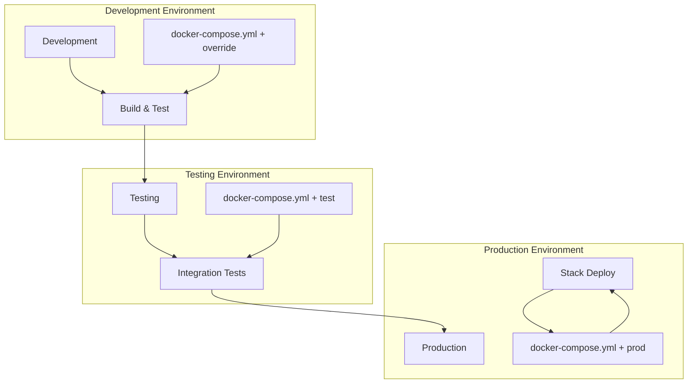
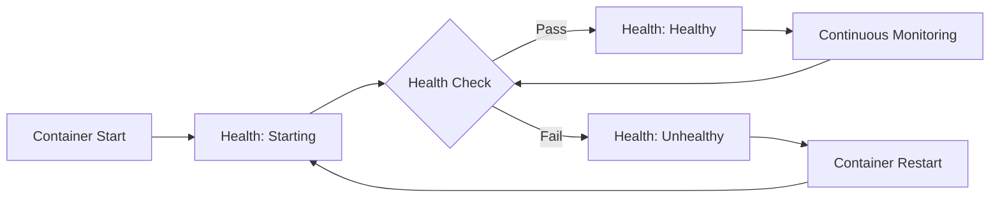
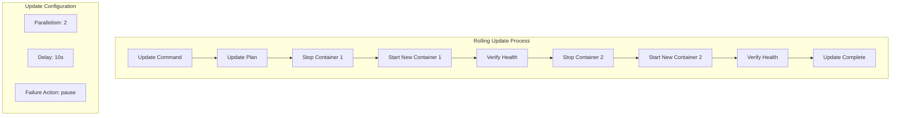
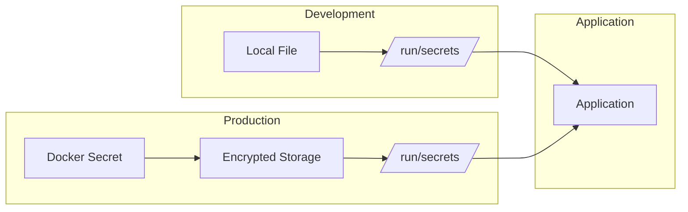
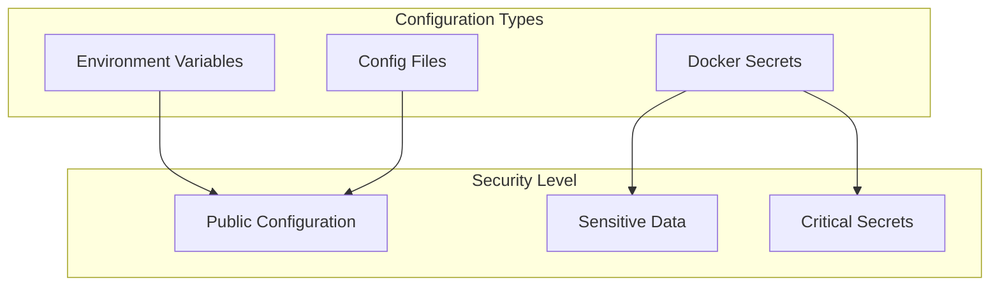

# Docker Swarm Application Lifecycle

A comprehensive guide to managing Docker Swarm applications throughout their entire lifecycle, from development to production deployment. This repository demonstrates advanced Docker Swarm concepts including multi-environment configurations, health checks, service updates, and secrets management.

## 📋 Table of Contents

- [Overview](#overview)
- [Application Lifecycle](#application-lifecycle)
- [Multi-Environment Setup](#multi-environment-setup)
- [Health Checks](#health-checks)
- [Service Updates](#service-updates)
- [Secrets Management](#secrets-management)
- [Examples](#examples)
- [Best Practices](#best-practices)

## 🎯 Overview

This repository showcases a complete Docker Swarm application lifecycle management approach, featuring:

- **Multi-environment Docker Compose configurations**
- **Health check implementations**
- **Rolling service updates**
- **Secrets management across environments**
- **Production-grade deployment strategies**

## 🔄 Application Lifecycle



## 🏗️ Multi-Environment Setup

<details>
<summary><strong>📁 Environment Configuration Structure</strong></summary>

The project uses Docker Compose's override mechanism for environment-specific configurations:

```
swarm-stack-3/
├── docker-compose.yml          # Base configuration
├── docker-compose.override.yml # Development (default)
├── docker-compose.test.yml     # Testing environment
├── docker-compose.prod.yml     # Production environment
└── Dockerfile                  # Custom Drupal image
```

### Base Configuration
```yaml
# docker-compose.yml
version: '3.9'
services:
  drupal:
    image: custom-drupal:latest
  postgres:
    image: postgres:14
```

### Development Environment
```yaml
# docker-compose.override.yml
services:
  drupal:
    build: .
    ports:
      - "8080:80"
    volumes:
      - ./themes:/var/www/html/themes  # Live theme development
```

### Production Environment
```yaml
# docker-compose.prod.yml
services:
  drupal:
    ports:
      - "80:80"
  secrets:
    psql-pw:
      external: true  # External secret management
```

</details>

<details>
<summary><strong>🚀 Deployment Commands</strong></summary>

```bash
# Development (uses override by default)
docker-compose up -d

# Testing environment
docker-compose -f docker-compose.yml -f docker-compose.test.yml up -d

# Production environment
docker-compose -f docker-compose.yml -f docker-compose.prod.yml config > output.yml
docker stack deploy -c output.yml myapp
```

</details>

## 🏥 Health Checks

<details>
<summary><strong>Container vs Service Health Checks</strong></summary>

### Container Health Checks

```bash
# Basic container without health check
docker container run --name p1 -e POSTGRES_PASSWORD=password -d postgres

# Container with health check
docker container run --name p2 \
  -e POSTGRES_PASSWORD=password \
  --health-cmd="pg_isready -U postgres || exit 1" \
  -d postgres
```

### Service Health Checks

```bash
# Service without health check
docker service create --name p1 -e POSTGRES_PASSWORD=password postgres

# Service with health check
docker service create --name p2 \
  -e POSTGRES_PASSWORD=password \
  --health-cmd="pg_isready -U postgres || exit 1" \
  postgres
```

### Health Check Flow



</details>

## 🔄 Service Updates

<details>
<summary><strong>Rolling Updates & Scaling</strong></summary>

### Service Scaling
```bash
# Create service
docker service create -p 8080:80 --name web nginx

# Scale service
docker service scale web=10

# Check status
docker service ls
docker service ps web
```

### Rolling Updates
```bash
# Update image version
docker service update --image nginx:1.13.6 web

# Update port configuration
docker service update --publish-rm 8080 --publish-add 9090:80 web

# Force update (recreate all containers)
docker service update --force web
```

### Update Process Flow



</details>

## 🔐 Secrets Management

<details>
<summary><strong>Development vs Production Secrets</strong></summary>

### Development Secrets (File-based)
```yaml
# docker-compose.override.yml
secrets:
  psql-pw:
    file: psql-fake-password.txt  # Local file for development
```

### Production Secrets (External)
```yaml
# docker-compose.prod.yml
secrets:
  psql-pw:
    external: true  # Managed by Docker Swarm
```

### Local Docker Compose with Secrets
```bash
# Create and use secrets in local development
docker-compose -f secrets-sample-2/docker-compose.yml up -d

# Verify secret mounting
docker-compose exec psql cat /run/secrets/psql_user
```

### Secret Management Flow



</details>

## 📚 Examples

### 1. Multi-Environment Drupal Application

<details>
<summary><strong>View Complete Setup</strong></summary>

A production-ready Drupal application with PostgreSQL backend:

**Custom Dockerfile:**
```dockerfile
FROM drupal:9

RUN apt-get update \
    && apt-get install -y --no-install-recommends git \
    && rm -rf /var/lib/apt/lists/*

WORKDIR /var/www/html/core
COPY ./themes ./themes
WORKDIR /var/www/html
```

**Environment Configurations:**
- **Development**: Live theme mounting, build context, port 8080
- **Testing**: Sample data mounting, integration testing setup
- **Production**: External secrets, port 80, named volumes

**Deployment Process:**
```bash
# Development
docker-compose up -d

# Generate production config
docker compose -f docker-compose.yml -f docker-compose.prod.yml config > output.yml

# Deploy to production
docker stack deploy -c output.yml drupal-app
```

</details>

### 2. Health Check Implementation

<details>
<summary><strong>PostgreSQL Health Monitoring</strong></summary>

Demonstrates the difference between container and service health checks:

**Container Level:**
```bash
docker container run --name postgres-health \
  -e POSTGRES_PASSWORD=password \
  --health-cmd="pg_isready -U postgres || exit 1" \
  --health-interval=30s \
  --health-timeout=10s \
  --health-retries=3 \
  -d postgres
```

**Service Level:**
```bash
docker service create --name postgres-service \
  -e POSTGRES_PASSWORD=password \
  --health-cmd="pg_isready -U postgres || exit 1" \
  --health-interval=30s \
  --health-timeout=10s \
  --health-retries=3 \
  postgres
```

</details>

### 3. Service Update Strategies

<details>
<summary><strong>Zero-Downtime Updates</strong></summary>

Complete service update lifecycle:

```bash
# Initial deployment
docker service create -p 8080:80 --name web nginx

# Scale for high availability
docker service scale web=10

# Rolling update with new image
docker service update --image nginx:1.13.6 web

# Update configuration
docker service update --publish-rm 8080 --publish-add 9090:80 web

# Force recreation (maintenance)
docker service update --force web
```

**Update Configuration:**
- **Parallelism**: 2 containers at a time
- **Delay**: 10 seconds between batches
- **Failure Action**: Pause on failure
- **Monitor Period**: 5 seconds verification

</details>

## 🎯 Best Practices

<details>
<summary><strong>🔧 Development Best Practices</strong></summary>

- ✅ Use override files for environment-specific configurations
- ✅ Implement proper health checks for all services
- ✅ Use bind mounts for development, named volumes for production
- ✅ Separate secrets management per environment
- ✅ Version your Docker Compose files

</details>

<details>
<summary><strong>🚀 Production Best Practices</strong></summary>

- ✅ Use external secrets in production
- ✅ Implement rolling updates with proper health checks
- ✅ Configure resource limits and reservations
- ✅ Use placement constraints for critical services
- ✅ Monitor service health and performance

</details>

<details>
<summary><strong>🔒 Security Best Practices</strong></summary>

- ✅ Never commit secrets to version control
- ✅ Use Docker secrets for sensitive data
- ✅ Implement least privilege access
- ✅ Regular security updates and patches
- ✅ Network segmentation with overlay networks

</details>

## 🛠️ Configuration Management

### Environment Variables vs Secrets



### Multi-Stage Configuration

```yaml
# Base configuration
services:
  app:
    image: myapp:latest
    
# Development additions
  app:
    build: .
    volumes:
      - .:/app
    environment:
      - DEBUG=true
      
# Production additions  
  app:
    deploy:
      replicas: 3
      resources:
        limits:
          memory: 512M
    secrets:
      - app_secret
```

## 📁 File Structure

```
Docker swarm App lifecycle/
├── App lifecycle dev build and deploy with single compose design.ipynb
├── healthcheck.ipynb
├── swarm service update.ipynb
├── using secret with local docker compose.ipynb
├── secrets-sample-2/
│   ├── docker-compose.yml
│   ├── psql_password.txt
│   └── psql_user.txt
└── swarm-stack-3/
    ├── docker-compose.yml          # Base configuration
    ├── docker-compose.override.yml # Development environment
    ├── docker-compose.prod.yml     # Production environment
    ├── docker-compose.test.yml     # Testing environment
    ├── Dockerfile                  # Custom Drupal image
    ├── psql-fake-password.txt      # Development secret
    └── themes/                     # Custom themes directory
```

## 🎓 Learning Path

1. **Environment Management**: Multi-file Docker Compose configurations
2. **Health Monitoring**: Container and service health checks
3. **Update Strategies**: Rolling updates and scaling operations
4. **Security**: Secrets management across environments
5. **Production Deployment**: Stack deployment and monitoring

## 🔍 Troubleshooting

<details>
<summary><strong>Common Issues & Solutions</strong></summary>

### Service Update Failures
```bash
# Check service status
docker service ps <service-name>

# View service logs
docker service logs <service-name>

# Rollback if needed
docker service rollback <service-name>
```

### Health Check Issues
```bash
# Inspect container health
docker container inspect <container-name> | grep -A 10 Health

# Test health check manually
docker exec <container-name> pg_isready -U postgres
```

### Secret Access Problems
```bash
# Verify secret exists
docker secret ls

# Check secret mounting
docker exec <container-name> ls -la /run/secrets/
```

</details>

---

**Note**: This repository demonstrates production-ready Docker Swarm application lifecycle management with emphasis on multi-environment deployment, health monitoring, and security best practices.