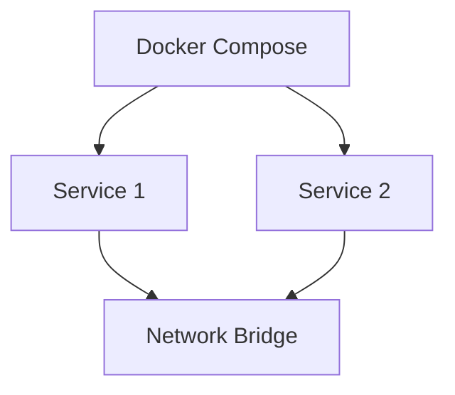

# Docker Compose Assignment 1

## Overview
This directory contains Docker Compose configuration files for Assignment 1, focusing on multi-container application orchestration.

## Files
- `docker-compose.yml` - Main compose configuration file

<details>
<summary>📋 Assignment Details</summary>

### Objectives
- Practice Docker Compose multi-container setup
- Configure service dependencies
- Implement container networking
- Manage environment variables

### Architecture


</details>

<details>
<summary>🚀 Quick Start</summary>

### Prerequisites
- Docker installed
- Docker Compose installed

### Running the Assignment
```bash
# Navigate to directory
cd compose-assignment-1

# Start services
docker-compose up -d

# View logs
docker-compose logs

# Stop services
docker-compose down
```

</details>

<details>
<summary>📚 Learning Outcomes</summary>

- Multi-container orchestration
- Service networking
- Volume management
- Environment configuration

</details>