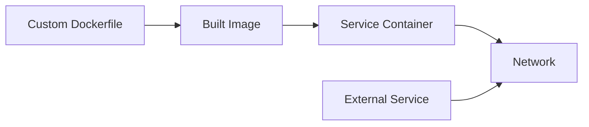

# Docker Compose Assignment 2

## Overview
Advanced Docker Compose assignment focusing on custom Dockerfile integration and multi-service applications.

## Files
- `docker-compose.yml` - Compose configuration with custom builds
- `Dockerfile` - Custom image definition

<details>
<summary>📋 Assignment Details</summary>

### Objectives
- Build custom Docker images within Compose
- Configure multi-service applications
- Implement service communication
- Practice advanced Compose features

### Architecture


</details>

<details>
<summary>🚀 Quick Start</summary>

### Prerequisites
- Docker and Docker Compose installed
- Basic understanding of Dockerfile syntax

### Running the Assignment
```bash
# Build and start services
docker-compose up --build

# View running containers
docker-compose ps

# Access logs
docker-compose logs -f

# Clean up
docker-compose down --rmi all
```

</details>

<details>
<summary>🔧 Configuration</summary>

### Custom Build Process
- Dockerfile defines custom application image
- Compose orchestrates build and deployment
- Services communicate via internal networks

### Key Features
- Custom image building
- Service dependencies
- Volume mounting
- Environment variables

</details>