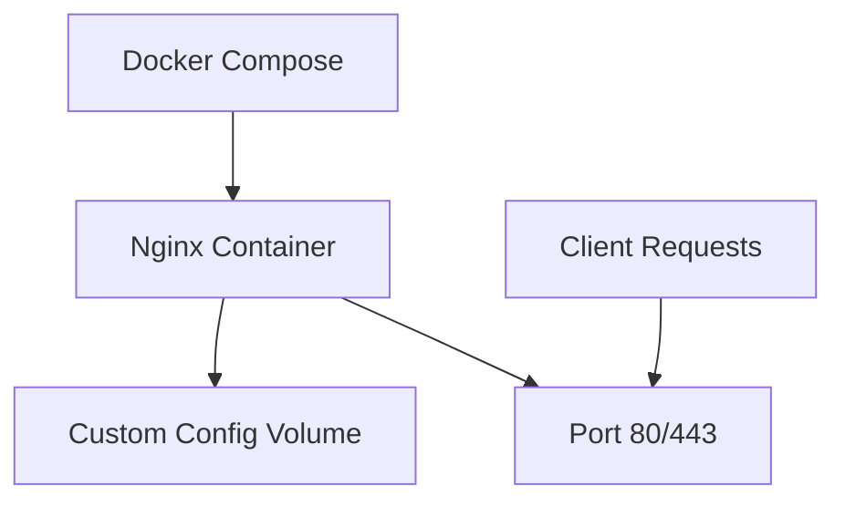

# Docker Compose Sample 2

## Overview
Sample Docker Compose configuration demonstrating Nginx web server setup with custom configuration.

## Files
- `docker-compose.yml` - Compose configuration for Nginx
- `nginx.conf` - Custom Nginx configuration file

<details>
<summary>📋 Sample Details</summary>

### Purpose
- Demonstrate Nginx containerization
- Show custom configuration mounting
- Practice web server deployment

### Architecture


</details>

<details>
<summary>🚀 Quick Start</summary>

### Prerequisites
- Docker and Docker Compose installed

### Running the Sample
```bash
# Start Nginx service
docker-compose up -d

# Check service status
docker-compose ps

# View Nginx logs
docker-compose logs nginx

# Test web server
curl http://localhost

# Stop service
docker-compose down
```

</details>

<details>
<summary>⚙️ Configuration</summary>

### Nginx Setup
- Custom nginx.conf mounted as volume
- Port mapping for web access
- Optimized for development/testing

### Key Features
- Custom configuration mounting
- Port exposure
- Log management
- Service health monitoring

</details>