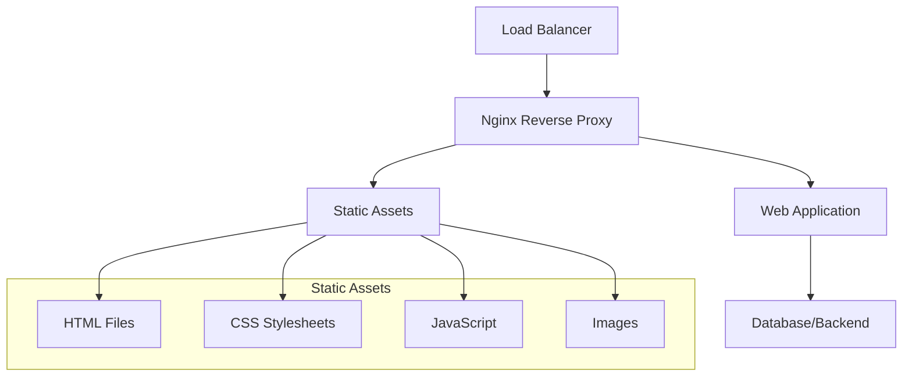

# Docker Compose Sample 3

## Overview
Complex Docker Compose sample featuring a complete web application stack with Nginx, custom application, and static assets.

## Structure
- `docker-compose.yml` - Multi-service compose configuration
- `nginx.conf` - Nginx reverse proxy configuration  
- `nginx.Dockerfile` - Custom Nginx image
- `html/` - Static web assets and application files

<details>
<summary>📋 Sample Details</summary>

### Purpose
- Demonstrate multi-tier web application
- Show Nginx as reverse proxy
- Practice static asset serving
- Implement complete web stack

### Architecture


</details>

<details>
<summary>🚀 Quick Start</summary>

### Prerequisites
- Docker and Docker Compose installed
- Basic web development knowledge

### Running the Sample
```bash
# Build and start all services
docker-compose up --build -d

# Check all services
docker-compose ps

# View application logs
docker-compose logs -f

# Access application
open http://localhost

# Stop all services
docker-compose down
```

</details>

<details>
<summary>📁 Directory Structure</summary>

### HTML Assets
```
html/
├── css/           # Stylesheets
├── js/            # JavaScript files
├── img/           # Image assets
├── lib/           # Third-party libraries
├── mail/          # Contact form handlers
├── scss/          # Sass source files
├── index.html     # Main application page
└── package.json   # Node.js dependencies
```

### Key Components
- **Bootstrap Framework** - Responsive UI components
- **Font Awesome** - Icon library
- **jQuery** - JavaScript utilities
- **Agency Theme** - Professional business template

</details>

<details>
<summary>⚙️ Configuration</summary>

### Services
- **Nginx**: Reverse proxy and static file server
- **Web App**: Custom application container
- **Assets**: Static file serving

### Features
- Custom Nginx configuration
- Static asset optimization
- Responsive web design
- Contact form functionality
- Professional business theme

</details>