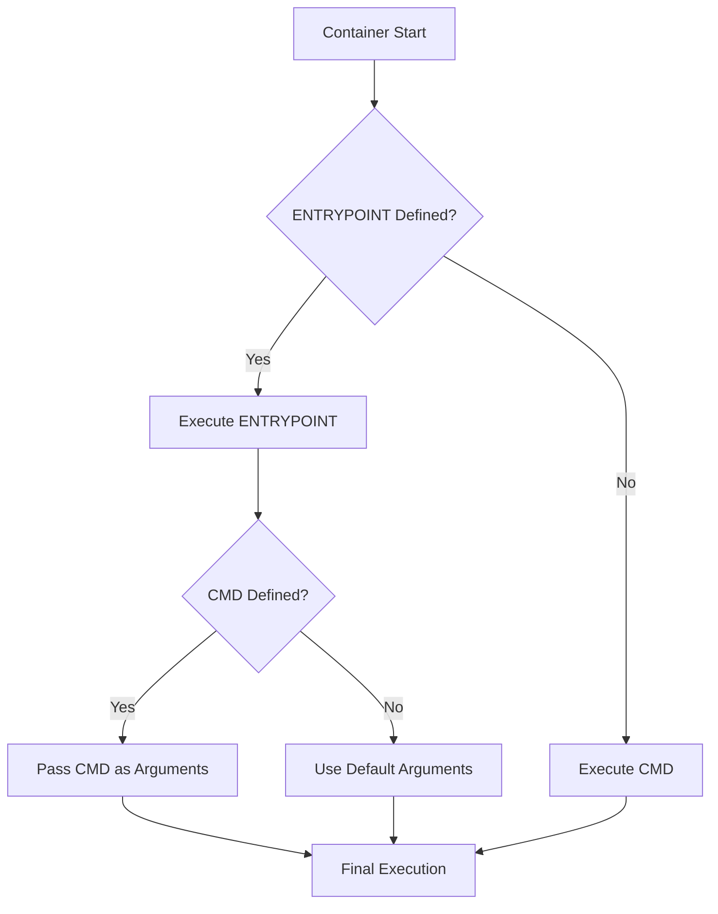

# Docker ENTRYPOINT and CMD Combined

## Overview
Demonstration of combining Docker ENTRYPOINT and CMD instructions for flexible container execution patterns.

## Files
- `Dockerfile` - Example showing ENTRYPOINT and CMD combination

<details>
<summary>📋 Concept Details</summary>

### Purpose
- Understand ENTRYPOINT vs CMD differences
- Learn flexible container execution patterns
- Practice advanced Dockerfile techniques
- Implement configurable container behavior

### Execution Flow


</details>

<details>
<summary>🚀 Quick Start</summary>

### Building and Testing
```bash
# Build the example image
docker build -t entrypoint-cmd-demo .

# Run with default CMD
docker run --rm entrypoint-cmd-demo

# Override CMD arguments
docker run --rm entrypoint-cmd-demo --help

# Pass custom parameters
docker run --rm entrypoint-cmd-demo --version
```

</details>

<details>
<summary>⚙️ Implementation Patterns</summary>

### Pattern 1: Script + Arguments
```dockerfile
ENTRYPOINT ["./script.sh"]
CMD ["--default", "--options"]
```

### Pattern 2: Executable + Parameters
```dockerfile
ENTRYPOINT ["python", "app.py"]
CMD ["--port", "8080"]
```

### Pattern 3: Wrapper Script
```dockerfile
ENTRYPOINT ["./entrypoint.sh"]
CMD ["start-service"]
```

</details>

<details>
<summary>📚 Key Differences</summary>

### ENTRYPOINT Characteristics
- Always executed
- Cannot be overridden easily
- Defines container's main purpose
- Receives CMD as arguments

### CMD Characteristics
- Provides default arguments
- Easily overridden at runtime
- Optional when ENTRYPOINT exists
- Defines default behavior

### Combined Benefits
- Flexible runtime configuration
- Consistent base behavior
- Easy parameter customization
- Professional container design

</details>

<details>
<summary>🔧 Best Practices</summary>

### Design Guidelines
- Use ENTRYPOINT for main executable
- Use CMD for default parameters
- Make containers configurable
- Provide helpful defaults

### Common Use Cases
- Web servers with configurable ports
- Database containers with init scripts
- CLI tools with default options
- Microservices with environment configs

</details>