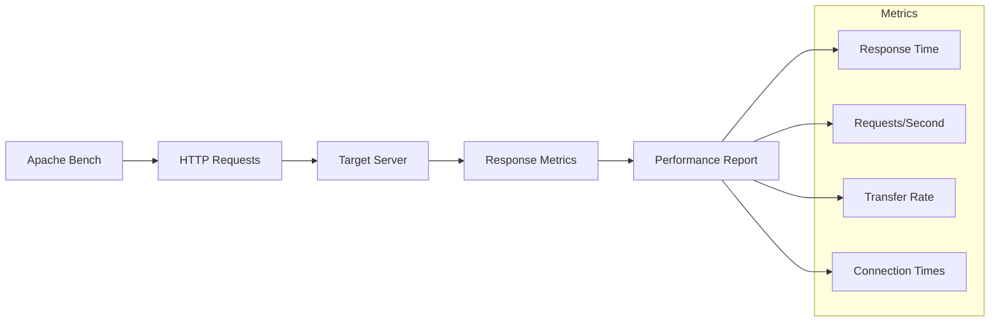

# Apache Bench Docker Container

## Overview
Docker container setup for Apache Bench (ab) - a tool for benchmarking HTTP web servers.

## Files
- `Dockerfile` - Container definition for Apache Bench

<details>
<summary>📋 Tool Details</summary>

### Purpose
- HTTP server performance testing
- Load testing and benchmarking
- Response time measurement
- Concurrent request handling analysis

### Apache Bench Features


</details>

<details>
<summary>🚀 Quick Start</summary>

### Building the Container
```bash
# Build Apache Bench image
docker build -t apachebench .

# Run basic test
docker run --rm apachebench ab -n 100 -c 10 http://example.com/

# Run with custom parameters
docker run --rm apachebench ab -n 1000 -c 50 -t 30 http://target-server/
```

### Common Parameters
- `-n` requests: Total number of requests
- `-c` concurrency: Number of concurrent requests
- `-t` timelimit: Maximum time for testing
- `-k` keepalive: Use HTTP KeepAlive feature

</details>

<details>
<summary>📊 Usage Examples</summary>

### Basic Load Test
```bash
# Test with 1000 requests, 10 concurrent
docker run --rm apachebench ab -n 1000 -c 10 http://localhost:8080/

# Test with time limit
docker run --rm apachebench ab -t 60 -c 20 http://api.example.com/endpoint
```

### Advanced Testing
```bash
# POST request testing
docker run --rm apachebench ab -n 100 -c 5 -p data.json -T application/json http://api.server.com/

# With custom headers
docker run --rm apachebench ab -n 500 -c 25 -H "Authorization: Bearer token" http://secure.api.com/
```

</details>

<details>
<summary>📈 Interpreting Results</summary>

### Key Metrics
- **Requests per second**: Server throughput
- **Time per request**: Average response time
- **Transfer rate**: Data throughput
- **Connection times**: Network performance

### Performance Analysis
- Compare baseline vs load performance
- Identify bottlenecks and limits
- Validate server capacity planning
- Monitor response time distribution

</details>