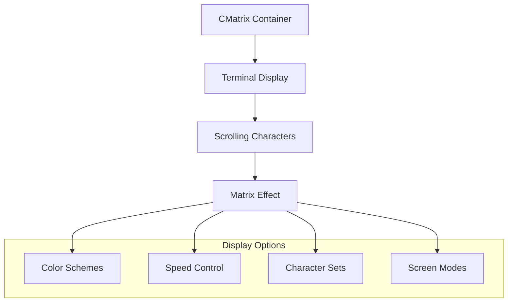

# CMatrix Docker Container

## Overview
Docker container for CMatrix - a terminal-based "Matrix" movie effect simulator that displays scrolling green text.

## Files
- `Dockerfile` - Container definition for CMatrix application

<details>
<summary>📋 Application Details</summary>

### Purpose
- Terminal eye-candy and screensaver
- Demonstrate Docker GUI applications
- Practice container display forwarding
- Fun Matrix movie effect simulation

### CMatrix Features


</details>

<details>
<summary>🚀 Quick Start</summary>

### Building and Running
```bash
# Build CMatrix image
docker build -t cmatrix .

# Run with default settings
docker run --rm -it cmatrix

# Run with custom options
docker run --rm -it cmatrix cmatrix -b -s -u 5
```

### Display Forwarding (Linux/macOS)
```bash
# Enable X11 forwarding
xhost +local:docker

# Run with display
docker run --rm -it -e DISPLAY=$DISPLAY -v /tmp/.X11-unix:/tmp/.X11-unix cmatrix
```

</details>

<details>
<summary>⚙️ Configuration Options</summary>

### Command Line Parameters
- `-b` : Bold characters
- `-s` : Screensaver mode
- `-u <delay>` : Update delay (1-10)
- `-C <color>` : Color (red, green, blue, etc.)
- `-r` : Rainbow mode
- `-m` : Lambda mode

### Usage Examples
```bash
# Slow green matrix
docker run --rm -it cmatrix cmatrix -s -u 8

# Fast rainbow mode
docker run --rm -it cmatrix cmatrix -r -u 2

# Bold blue matrix
docker run --rm -it cmatrix cmatrix -b -C blue
```

</details>

<details>
<summary>🎨 Visual Effects</summary>

### Matrix Simulation
- Authentic Matrix movie scrolling effect
- Customizable colors and speeds
- Multiple character sets available
- Full-screen terminal display

### Educational Value
- Learn Docker interactive containers
- Practice display forwarding
- Understand terminal applications
- Explore container GUI concepts

</details>