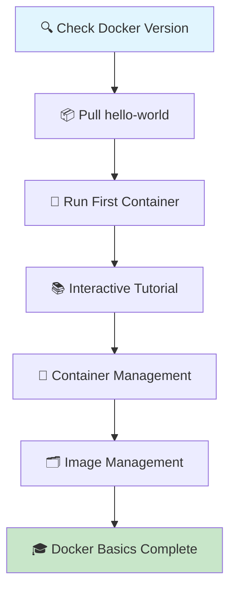
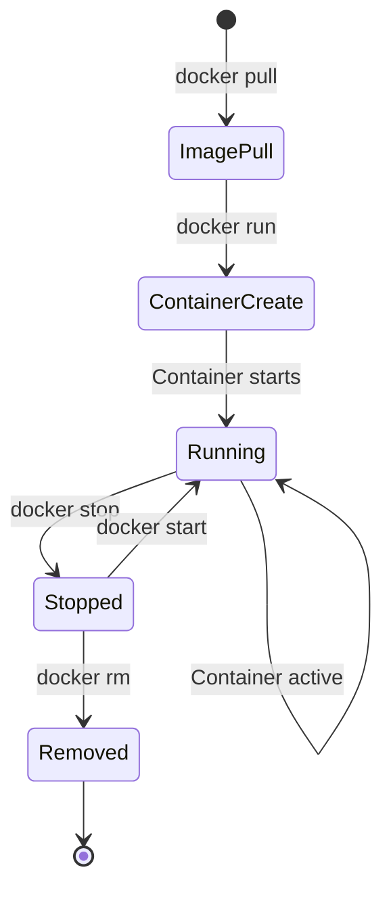
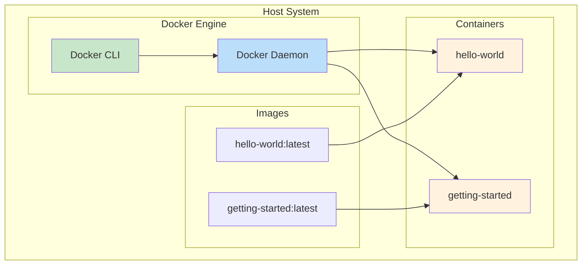

# 🐳 Docker Getting Started

> **Step-by-step Docker fundamentals with animated workflow**

## 📁 Files
- `getting started.ipynb` - Interactive Docker commands tutorial

---

## 🎯 Docker Learning Flow



## 🎯 Animated Learning Steps

### Step 1: 🔍 Verify Docker Installation
```bash
# Check if Docker is installed and running
docker -v
```
**Expected Output:** `Docker version 28.3.2, build 578ccf6`

```
┌─────────────────────────────────────┐
│  🐳 Docker Installation Check      │
│  ✅ Version: 28.3.2                │
│  ✅ Status: Running                 │
└─────────────────────────────────────┘
```

### Step 2: 👋 Hello World Container
```bash
# Pull and run your first container
docker pull hello-world
docker run hello-world
```

```
📦 Pulling hello-world image...
    ⬇️  Downloading layers
    ✅ Pull complete

🚀 Running container...
    📝 Hello from Docker!
    ✅ Container executed successfully
```

### Step 3: 📚 Interactive Tutorial
```bash
# Run Docker's interactive tutorial
docker pull docker/getting-started
docker run -d -p 80:80 docker/getting-started
```

```
🌐 Starting Tutorial Server...
    📡 Port mapping: 80:80
    🔗 Access: http://localhost:80
    ✅ Tutorial ready!
```

### Step 4: 🔧 Container Management
```bash
# Monitor and control containers
docker ps -a                 # List all containers
docker stop <container_id>   # Stop running container
```

```
📊 Container Status:
┌──────────────┬─────────────┬──────────┐
│ CONTAINER ID │ IMAGE       │ STATUS   │
├──────────────┼─────────────┼──────────┤
│ e4534a6449a4 │ tutorial    │ Running  │
│ cd3afaec02fb │ hello-world │ Exited   │
└──────────────┴─────────────┴──────────┘
```

### Step 5: 🗂️ Image Management
```bash
# Manage Docker images
docker images                # List images
docker image rm -f <image_id> # Remove image
```

```
🖼️  Image Inventory:
    📦 hello-world:latest (20.4kB)
    📦 getting-started:latest (73.9MB)
    
🗑️  Cleanup:
    ❌ Removing unused images...
    ✅ Storage optimized!
```

## 📊 Container Lifecycle



## 🏗️ Docker Architecture



---

## 🎓 Learning Progress

```
Progress: [████████████████████] 100%

✅ Step 1: Docker verification
✅ Step 2: Hello World container  
✅ Step 3: Interactive tutorial
✅ Step 4: Container lifecycle
✅ Step 5: Image management
```

## 🔑 Key Concepts Mastered
- 🏗️ **Container vs Image**: Understanding the difference
- 🌐 **Port Mapping**: `-p 80:80` connects host to container
- 🔄 **Detached Mode**: `-d` runs containers in background
- ⚡ **Lifecycle**: Create → Run → Stop → Remove