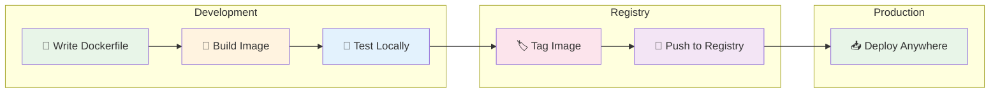
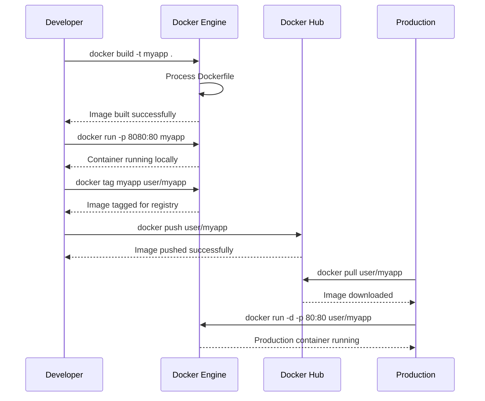
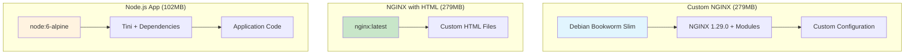

# 🖼️ Docker Images

> **Master Docker image management, building custom images, and Docker Hub operations**

## 📁 Project Files
- `Building Docker Images.ipynb` - Custom image building and deployment 🏗️
- `docker hub images.ipynb` - Docker Hub operations and image management 🌐
- `Dockerfile` - Custom NGINX image configuration 📦
- `custom_Image/` - Custom HTML NGINX image example 🎨
  - `Dockerfile` - Extended NGINX with custom content
  - `index.html` - Custom HTML page
- `docker-file-assignment-1/` - Node.js application containerization 📝

---

<details>
<summary>🏗️ <strong>Building Docker Images Overview</strong></summary>


</details>

<details>
<summary>🔨 <strong>1. Custom NGINX Image Building</strong></summary>

### Custom NGINX Dockerfile
```dockerfile
FROM debian:bookworm-slim

LABEL maintainer="NGINX Docker Maintainers <docker-maint@nginx.com>"

ENV NGINX_VERSION   1.29.0
ENV NJS_VERSION     0.9.0
ENV NJS_RELEASE     1~bookworm
ENV PKG_RELEASE     1~bookworm
ENV DYNPKG_RELEASE  1~bookworm

# Complex RUN instruction for NGINX installation
RUN set -x \
    && groupadd --system --gid 101 nginx \
    && useradd --system --gid nginx --no-create-home nginx \
    && apt-get update \
    && apt-get install -y gnupg1 ca-certificates \
    # ... (GPG key setup and package installation)
    
EXPOSE 80 443 8080
STOPSIGNAL SIGQUIT
CMD ["nginx", "-g", "daemon off;"]
```

### Build Process
```bash
# Build custom NGINX image
docker image build -t customnginx .
```

### Build Output
```
🔄 Building Custom NGINX...

#1 [internal] load build definition
    ✅ Dockerfile loaded (6.70kB)
    
#2 [internal] load metadata
    📦 debian:bookworm-slim
    ✅ Base image ready
    
#3 [1/2] FROM debian:bookworm-slim
    ⬇️  Pulling base layers...
    ██████████ 100%
    
#4 [2/2] RUN set -x && groupadd...
    🔧 Installing NGINX packages...
    ✅ NGINX installed successfully
    
✅ Image 'customnginx' built (279MB)
```

### Image Characteristics
- **Base**: Debian Bookworm Slim
- **Size**: ~279MB
- **NGINX Version**: 1.29.0
- **Exposed Ports**: 80, 443, 8080
- **Modules**: XSLT, GeoIP, Image Filter, NJS
</details>

<details>
<summary>🎨 <strong>2. Custom HTML NGINX Image</strong></summary>

### Extended NGINX Dockerfile
```dockerfile
# Extend existing official image
FROM nginx:latest

WORKDIR /usr/share/nginx/html
# Change to nginx webhost root

COPY index.html index.html
# Copy custom HTML file

# EXPOSE and CMD inherited from base image
```

### Custom HTML Content
```html
<!doctype html>
<html lang="en">
<head>
  <meta charset="utf-8">
  <title>My 2nd Dockerfile worked!</title>
</head>
<body>
  <h1>You just successfully ran a container with a custom file 
      copied into the image at build time!</h1>
</body>
</html>
```

### Build and Run
```bash
# Build custom HTML image
docker image build -t nginx-with-html ./custom_Image/.

# Run container
docker container run -p 81:80 --rm nginx-with-html
```

### Build Process
```
🎨 Building Custom HTML Image...

#1 [internal] load build definition
    ✅ Dockerfile loaded (459B)
    
#2 [1/3] FROM nginx:latest
    ✅ Base image ready
    
#3 [2/3] WORKDIR /usr/share/nginx/html
    📂 Setting working directory...
    
#4 [3/3] COPY index.html index.html
    📄 Copying custom HTML...
    
✅ Image 'nginx-with-html' built successfully!
```
</details>

<details>
<summary>📦 <strong>3. Node.js Application Image</strong></summary>

### Node.js Dockerfile
```dockerfile
FROM node:6-alpine

# Install tini for proper signal handling
RUN apk add --no-cache tini

WORKDIR /usr/src/app

# Copy package.json first for better caching
COPY package.json package.json

# Install dependencies
RUN npm install && npm cache clean --force

# Copy application code
COPY . .

# Use tini as init system
ENTRYPOINT ["/sbin/tini", "--"]

# Start application
CMD ["node", "app.js"]
```

### Build Process
```bash
# Build Node.js application
docker build -t testnode ./docker-file-assignment-1/.
```

### Build Output
```
📦 Building Node.js Application...

#1 [1/6] FROM node:6-alpine
    ⬇️  Pulling Alpine Node.js...
    ██████████ 100%
    
#2 [2/6] RUN apk add --no-cache tini
    🔧 Installing tini...
    ✅ Tini installed
    
#3 [3/6] WORKDIR /usr/src/app
    📂 Setting working directory...
    
#4 [4/6] COPY package.json package.json
    📄 Copying package.json...
    
#5 [5/6] RUN npm install
    📦 Installing dependencies...
    ✅ Express, HBS, Morgan installed
    
#6 [6/6] COPY . .
    📁 Copying application files...
    
✅ Image 'testnode' built (102MB)
```

### Application Features
- **Framework**: Express.js with Handlebars
- **Base**: Node.js 6 Alpine
- **Size**: ~102MB
- **Init System**: Tini for proper signal handling
- **Port**: 3000
</details>

<details>
<summary>🌐 <strong>4. Docker Hub Operations</strong></summary>

### Image Management Commands
```bash
# List all images
docker image ls

# Pull specific versions
docker pull nginx:1.11.9
docker pull nginx:1.11.9-alpine
docker pull nginx:mainline

# View image history
docker history nginx:latest
docker history mysql

# Inspect image details
docker image inspect nginx
```

### Image Comparison
```
📊 Image Size Comparison:

nginx:latest          279MB  (Debian-based)
nginx:1.11.9-alpine    76.5MB (Alpine-based)
nginx:1.11.9          279MB  (Debian-based)
mysql:latest          1.26GB (Oracle Linux)
mongo:latest          1.22GB (Ubuntu-based)
alpine:latest         12.8MB (Minimal)
ubuntu:latest         117MB  (Standard)
```

### Image History Analysis
```bash
# View layer history
docker history nginx:latest
```

```
📜 NGINX Image Layers:

IMAGE          CREATED       SIZE      COMMENT
84ec966e61a8   3 weeks ago   0B        CMD ["nginx", "-g", "daemon off;"]
<missing>      3 weeks ago   0B        STOPSIGNAL SIGQUIT
<missing>      3 weeks ago   0B        EXPOSE map[80/tcp:{}]
<missing>      3 weeks ago   0B        ENTRYPOINT ["/docker-entrypoint.sh"]
<missing>      3 weeks ago   121MB     RUN nginx installation
<missing>      3 weeks ago   85.2MB    Base Debian layer
```
</details>

<details>
<summary>🏷️ <strong>5. Image Tagging and Registry</strong></summary>

### Tagging Strategy
```bash
# Tag for personal registry
docker image tag nginx anil1318/nginx
docker image tag nginx-with-html anil1318/nginx-with-html
docker image tag testnode anil1318/testing-node

# Create multiple tags
docker image tag anil1318/nginx anil1318/testing
```

### Registry Operations
```bash
# Login to Docker Hub
docker login

# Push images to registry
docker image push anil1318/nginx
docker image push anil1318/nginx-with-html
docker image push anil1318/testing-node
```

### Push Process
```
🚀 Pushing to Docker Hub...

The push refers to repository [docker.io/anil1318/nginx]
f30ffbee4c54: Mounted from library/nginx
2ef442a3816e: Mounted from library/nginx
140da4f89dcb: Mounted from library/nginx
4b1e45a9989f: Mounted from library/nginx
59e22667830b: Mounted from library/nginx
96e47e70491e: Mounted from library/nginx
1d9f51194194: Mounted from library/nginx

✅ latest: digest: sha256:6533ddd... size: 2292
```

### Registry Management
```
🏷️  Image Tags Created:

Local Images:
├── nginx:latest → anil1318/nginx:latest
├── nginx-with-html:latest → anil1318/nginx-with-html:latest
└── testnode:latest → anil1318/testing-node:latest

Registry Images:
├── docker.io/anil1318/nginx
├── docker.io/anil1318/nginx-with-html
├── docker.io/anil1318/testing-node
└── docker.io/anil1318/testing
```
</details>

<details>
<summary>🔍 <strong>6. Image Inspection and Analysis</strong></summary>

### Image Inspection
```bash
# Detailed image information
docker image inspect nginx
```

### Inspection Output
```json
{
    "Id": "sha256:84ec966e61a8...",
    "RepoTags": ["nginx:latest"],
    "Created": "2025-07-14T22:07:26Z",
    "Architecture": "amd64",
    "Os": "linux",
    "Size": 72223946,
    "Config": {
        "Cmd": ["nginx", "-g", "daemon off;"],
        "Entrypoint": ["/docker-entrypoint.sh"],
        "ExposedPorts": {"80/tcp": {}},
        "Env": [
            "NGINX_VERSION=1.29.0",
            "NJS_VERSION=0.9.0"
        ]
    }
}
```

### Layer Analysis
```bash
# View image layers
docker history nginx:latest --no-trunc
```

### Size Optimization
```
📊 Image Size Optimization:

Alpine-based:     76.5MB  ✅ Recommended
Debian-based:     279MB   ⚠️  Standard
Ubuntu-based:     300MB+  ❌ Avoid for production

Optimization Tips:
✅ Use Alpine base images
✅ Multi-stage builds
✅ Minimize layers
✅ Remove package caches
✅ Use .dockerignore
```
</details>

## 🏗️ Image Build Pipeline



## 📊 Image Architecture Comparison



## 🎓 Image Management Checklist

```
Progress: [████████████████████] 100%

✅ Custom Dockerfile creation and optimization
✅ Multi-stage build techniques
✅ Base image selection strategies
✅ Layer caching and optimization
✅ Image tagging and versioning
✅ Docker Hub registry operations
✅ Image inspection and analysis
✅ Size optimization techniques
✅ Security best practices
✅ Production deployment strategies
```

## 🔑 Key Docker Image Concepts
- 🏗️ **Dockerfile**: Instructions for building images
- 📦 **Layers**: Cached, reusable image components
- 🏷️ **Tags**: Version and variant identification
- 🌐 **Registry**: Centralized image distribution
- 🔍 **Inspection**: Detailed image metadata analysis
- ⚡ **Optimization**: Size and performance improvements
- 🛡️ **Security**: Minimal attack surface principles
- 🔄 **CI/CD**: Automated build and deployment pipelines