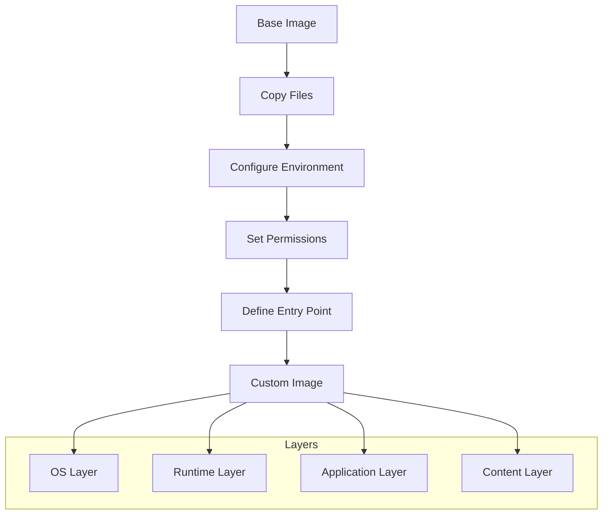

# Custom Docker Image

## Overview
Custom Docker image example demonstrating how to build and customize container images with static web content.

## Files
- `Dockerfile` - Custom image definition
- `index.html` - Static web content

<details>
<summary>📋 Image Details</summary>

### Purpose
- Learn custom image creation
- Practice Dockerfile best practices
- Understand image layering
- Deploy static web content

### Build Process


</details>

<details>
<summary>🚀 Quick Start</summary>

### Building the Image
```bash
# Build custom image
docker build -t custom-web-app .

# Run container
docker run -d -p 8080:80 --name my-web-app custom-web-app

# Test the application
curl http://localhost:8080

# View container logs
docker logs my-web-app

# Stop and remove
docker stop my-web-app && docker rm my-web-app
```

</details>

<details>
<summary>🔧 Customization Options</summary>

### Dockerfile Modifications
```dockerfile
# Change base image
FROM nginx:alpine

# Add custom content
COPY index.html /usr/share/nginx/html/

# Set environment variables
ENV APP_ENV=production

# Configure ports
EXPOSE 80
```

### Content Updates
- Modify `index.html` for custom content
- Add CSS/JS files for styling
- Include additional static assets
- Configure web server settings

</details>

<details>
<summary>📚 Learning Objectives</summary>

### Docker Concepts
- Image layering and caching
- Dockerfile instruction optimization
- Build context management
- Image tagging and versioning

### Best Practices
- Minimize image size
- Use appropriate base images
- Optimize layer caching
- Implement security measures

### Advanced Topics
- Multi-stage builds
- Build arguments and variables
- Health checks
- Image scanning and security

</details>