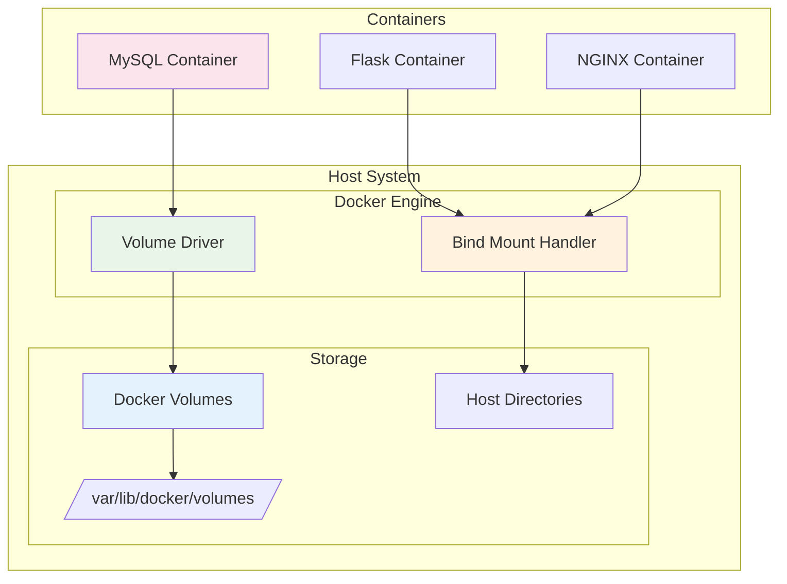
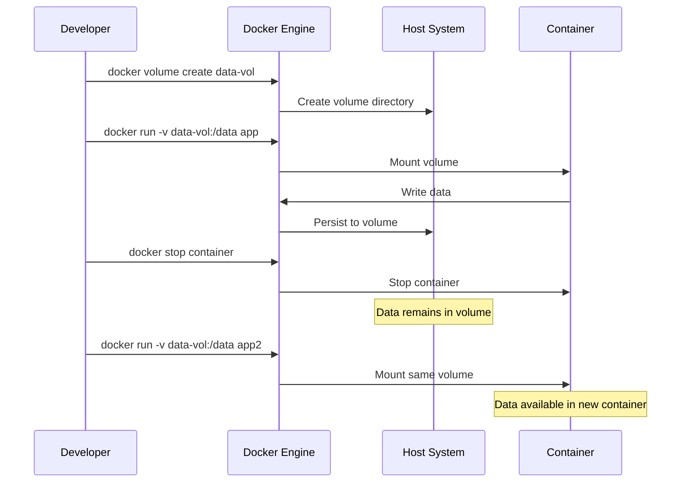

# 💾 Docker Persistent Data and Volumes

> **Master Docker data persistence with volumes, bind mounts, and data management strategies**

## 📁 Project Files
- `Data Volumes.ipynb` - Anonymous and named volumes management 📦
- `Bind Mounting.ipynb` - Host directory bind mounting 🔗
- `Assignment Bind Mounts.ipynb` - Flask app with bind mount development 🐍
- `Assignment Name Volume.ipynb` - PostgreSQL with named volumes 🐘
- `bindmount-sample-1/` - Flask application for bind mount demo 🌐
  - `app.py` - Flask web application
  - `Dockerfile` - Container configuration
  - `requirements.txt` - Python dependencies
  - `templates/index.html` - HTML template
- `custom_Image/` - Custom NGINX with persistent data 📄

---

```mermaid
flowchart TD
    A[Container Data] --> B{Persistence Type}
    B --> C[📦 Volumes]
    B --> D[🔗 Bind Mounts]
    B --> E[💾 tmpfs Mounts]
    
    C --> F[Anonymous Volumes]
    C --> G[Named Volumes]
    
    D --> H[Host Directory]
    D --> I[Development Files]
    
    E --> J[Memory Storage]
    
    subgraph "Docker Managed"
        F
        G
    end
    
    subgraph "Host Managed"
        H
        I
    end
    
    subgraph "Memory"
        J
    end
    
    style C fill:#e8f5e8
    style D fill:#fff3e0
    style E fill:#e3f2fd
```

<details>
<summary>💾 <strong>Docker Data Persistence Overview</strong></summary>


</details>

<details>
<summary>📦 <strong>1. Data Volumes Management</strong></summary>

### Anonymous Volumes
```bash
# MySQL with anonymous volume (auto-created)
docker container run -d --name mysql-db1 -e MYSQL_ALLOW_EMPTY_PASSWORD=True mysql

# Inspect container to see volume
docker container inspect mysql-db1
```

### Anonymous Volume Details
```json
"Mounts": [
    {
        "Type": "volume",
        "Name": "1787f6edcb752610ce759c8ba443eff52050500e394fa688dcc5cd38f07a5177",
        "Source": "/var/lib/docker/volumes/1787f6.../data",
        "Destination": "/var/lib/mysql",
        "Driver": "local",
        "Mode": "",
        "RW": true,
        "Propagation": ""
    }
]
```

### Named Volumes
```bash
# Create named volume
docker volume create mysql-db

# Use named volume
docker container run -d --name mysql-db \
  -e MYSQL_ALLOW_EMPTY_PASSWORD=True \
  -v mysql-db:/var/lib/mysql mysql

# List volumes
docker volume ls

# Inspect volume
docker volume inspect mysql-db
```

### Volume Management
```bash
# Volume operations
docker volume ls                    # List all volumes
docker volume inspect <volume>     # Inspect volume details
docker volume rm <volume>          # Remove volume
docker volume prune                # Remove unused volumes
```

### Volume Lifecycle
```
📦 Volume Lifecycle:

Container Removed → Volume Persists
├── Anonymous Volume: Orphaned (manual cleanup needed)
└── Named Volume: Available for reuse

✅ Data survives container recreation
✅ Shared between multiple containers
✅ Managed by Docker daemon
```
</details>

<details>
<summary>🔗 <strong>2. Bind Mounting</strong></summary>

### Basic Bind Mount
```bash
# Mount host directory to container
docker container run -d --name nginx \
  -p 80:80 \
  -v ./custom_Image:/usr/share/nginx/html \
  nginx
```

### Bind Mount Characteristics
```
🔗 Bind Mount Features:

Host Path → Container Path
├── Real-time file synchronization
├── Host filesystem dependency
├── Development-friendly
└── Direct file access from host

⚠️  Host path must exist
✅ Perfect for development
✅ Live code reloading
```

### Development Workflow
```bash
# Development container with live reload
docker container run -d --name nginx2 -p 8080:80 nginx

# Compare: Static vs Dynamic content
curl http://localhost:80    # Bind mounted (custom)
curl http://localhost:8080  # Default nginx page
```
</details>

<details>
<summary>🐍 <strong>3. Flask Development with Bind Mounts</strong></summary>

### Flask Application Structure
```python
# app.py
from flask import Flask, render_template

app = Flask(__name__)

@app.route("/")
def home():
    return render_template("index.html")

if __name__ == "__main__":
    app.run(host="0.0.0.0", port=5000)
```

### Development Dockerfile
```dockerfile
FROM python:3.11-slim
WORKDIR /app
COPY requirements.txt .
RUN pip install --no-cache-dir -r requirements.txt

# No COPY for app files - using bind mount
ENV FLASK_APP=app.py 
ENV FLASK_RUN_HOST=0.0.0.0 
ENV FLASK_DEBUG=1

EXPOSE 5000
CMD ["flask", "run", "--port", "5000"]
```

### Build and Run with Bind Mount
```bash
# Build Flask development image
docker build -t flask-bind-demo ./bindmount-sample-1/.

# Run with bind mount for live development
docker run -d --name flask-app-bind-mount \
  -p 5000:5000 \
  -e FLASK_APP=app.py \
  -e FLASK_RUN_HOST=0.0.0.0 \
  -e FLASK_DEBUG=1 \
  -v "./bindmount-sample-1:/app" \
  flask-bind-demo
```

### Development Benefits
```
🚀 Development Workflow:

Edit Files on Host → Instant Container Update
├── No rebuild required
├── Live code reloading
├── Template changes reflected immediately
└── Debugging in real-time

✅ Fast iteration cycle
✅ Native IDE support
✅ Version control integration
```
</details>

<details>
<summary>🐘 <strong>4. PostgreSQL with Named Volumes</strong></summary>

### Volume Creation and Management
```bash
# Create named volume for PostgreSQL
docker volume create psql

# Inspect volume details
docker volume inspect psql
```

### PostgreSQL Container with Volume
```bash
# Run PostgreSQL with named volume
docker run -d --name psql1 \
  -e POSTGRES_PASSWORD=mypassword \
  -p 5433:5432 \
  -v psql:/var/lib/postgresql/data \
  postgres:15.1
```

### Data Persistence Testing
```python
import psycopg2

# Connect to PostgreSQL
conn = psycopg2.connect(
    host="localhost",
    port=5433,
    user="postgres",
    password="mypassword",
    dbname="postgres"
)

cur = conn.cursor()

# Create table and insert data
cur.execute("""
    CREATE TABLE IF NOT EXISTS test_table (
        id SERIAL PRIMARY KEY,
        name TEXT
    )
""")

cur.execute("INSERT INTO test_table (name) VALUES (%s) RETURNING id", 
           ("Hello from Python",))
new_id = cur.fetchone()[0]
print(f"Inserted row with ID: {new_id}")

conn.commit()
cur.close()
conn.close()
```

### Container Recreation Test
```bash
# Stop and remove container
docker stop psql1
docker rm psql1

# Create new container with same volume
docker run -d --name psql2 \
  -e POSTGRES_PASSWORD=mypassword \
  -p 5433:5432 \
  -v psql:/var/lib/postgresql/data \
  postgres:15.2

# Data persists across container recreation!
```

### Data Verification
```python
# Verify data persistence
conn = psycopg2.connect(
    host="localhost",
    port=5433,
    user="postgres", 
    password="mypassword",
    dbname="postgres"
)

cur = conn.cursor()
cur.execute("SELECT id, name FROM test_table")
for row in cur.fetchall():
    print(row)  # (1, 'Hello from Python')

cur.close()
conn.close()
```
</details>

<details>
<summary>🔧 <strong>5. Volume vs Bind Mount Comparison</strong></summary>

### Feature Comparison
```
📊 Volumes vs Bind Mounts:

                    │ Volumes  │ Bind Mounts
────────────────────┼──────────┼─────────────
Docker Managed      │    ✅    │     ❌
Host Path Required  │    ❌    │     ✅
Performance         │   High   │   Medium
Portability         │   High   │    Low
Development         │  Medium  │    High
Production          │   High   │   Medium
Backup/Restore      │   Easy   │   Manual
Cross-Platform      │    ✅    │     ⚠️
```

### Use Case Guidelines
```
🎯 When to Use:

📦 Volumes:
├── Production databases
├── Application data
├── Cross-container sharing
└── Docker-managed lifecycle

🔗 Bind Mounts:
├── Development environments
├── Configuration files
├── Log file access
└── Host integration needs
```

### Performance Considerations
```
⚡ Performance Impact:

Volumes (Docker managed):
├── Optimized for container I/O
├── Better performance on Docker Desktop
└── Efficient for database workloads

Bind Mounts (Host filesystem):
├── Direct host filesystem access
├── Potential performance overhead
└── Platform-dependent behavior
```
</details>

<details>
<summary>🛠️ <strong>6. Advanced Volume Operations</strong></summary>

### Volume Drivers and Options
```bash
# Create volume with specific driver
docker volume create --driver local \
  --opt type=tmpfs \
  --opt device=tmpfs \
  --opt o=size=100m \
  temp-volume

# Create volume with labels
docker volume create --label environment=production \
  --label backup=daily \
  prod-data
```

### Volume Backup and Restore
```bash
# Backup volume data
docker run --rm \
  -v mysql-db:/data \
  -v $(pwd):/backup \
  alpine tar czf /backup/mysql-backup.tar.gz -C /data .

# Restore volume data
docker run --rm \
  -v mysql-db:/data \
  -v $(pwd):/backup \
  alpine tar xzf /backup/mysql-backup.tar.gz -C /data
```

### Multi-Container Volume Sharing
```bash
# Create shared volume
docker volume create shared-data

# Container 1: Writer
docker run -d --name writer \
  -v shared-data:/data \
  alpine sh -c "while true; do echo $(date) >> /data/log.txt; sleep 5; done"

# Container 2: Reader
docker run -d --name reader \
  -v shared-data:/data \
  alpine sh -c "while true; do tail -f /data/log.txt; sleep 1; done"
```

### Volume Cleanup Strategies
```bash
# List unused volumes
docker volume ls -f dangling=true

# Remove unused volumes
docker volume prune

# Remove specific volume (container must be stopped)
docker volume rm volume-name

# Force remove with containers
docker rm -f $(docker ps -aq)  # Remove all containers
docker volume prune             # Then remove volumes
```
</details>

## 💾 Data Persistence Architecture



## 🔄 Data Lifecycle Management



## 🎓 Data Persistence Checklist

```
Progress: [████████████████████] 100%

✅ Anonymous volume creation and management
✅ Named volume lifecycle and operations
✅ Bind mount development workflows
✅ Database data persistence strategies
✅ Multi-container data sharing
✅ Volume backup and restore procedures
✅ Performance optimization techniques
✅ Production deployment considerations
```

## 🔑 Key Data Persistence Concepts
- 📦 **Volumes**: Docker-managed persistent storage
- 🔗 **Bind Mounts**: Host directory mounting
- 💾 **Data Lifecycle**: Container-independent data survival
- 🔄 **Sharing**: Multi-container data access
- 🛡️ **Backup**: Data protection strategies
- ⚡ **Performance**: Storage optimization techniques
- 🚀 **Development**: Live reload and debugging
- 🏭 **Production**: Scalable data management