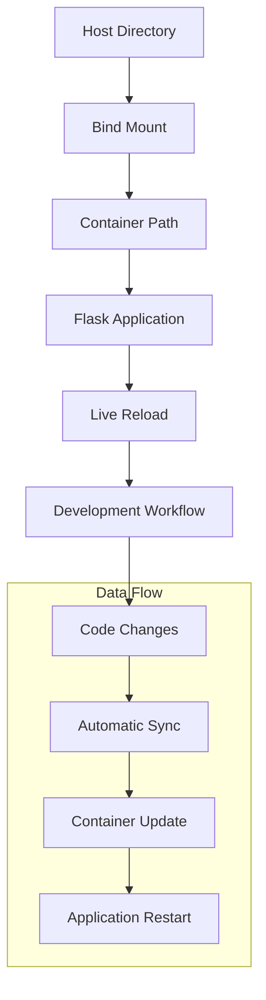

# Bind Mount Sample 1

## Overview
Demonstration of Docker bind mounts using a Flask web application with live code reloading and persistent data.

## Files
- `app.py` - Flask web application
- `Dockerfile` - Container definition
- `requirements.txt` - Python dependencies
- `templates/index.html` - Web template

<details>
<summary>📋 Sample Details</summary>

### Purpose
- Demonstrate bind mount functionality
- Enable live code development
- Practice persistent data patterns
- Learn volume vs bind mount differences

### Architecture


</details>

<details>
<summary>🚀 Quick Start</summary>

### Development Setup
```bash
# Build the Flask application
docker build -t flask-bindmount .

# Run with bind mount for development
docker run -d -p 5000:5000 \
  -v $(pwd):/app \
  --name flask-dev \
  flask-bindmount

# Access application
open http://localhost:5000

# View logs
docker logs -f flask-dev
```

### Live Development
```bash
# Edit app.py or templates - changes reflect immediately
# No need to rebuild container
# Flask auto-reloads on file changes
```

</details>

<details>
<summary>🔧 Configuration</summary>

### Flask Application Features
- Template rendering with Jinja2
- Static file serving
- Development server with auto-reload
- Error handling and debugging

### Bind Mount Benefits
- Real-time code synchronization
- No container rebuilds needed
- Persistent data across restarts
- Direct file system access

### Development Workflow
```bash
# Start development environment
docker run -v $(pwd):/app -p 5000:5000 flask-bindmount

# Edit files on host
vim app.py

# Changes automatically reflected in container
# Flask reloads application automatically
```

</details>

<details>
<summary>📚 Learning Outcomes</summary>

### Bind Mount Concepts
- Host-to-container directory mapping
- Bidirectional file synchronization
- Performance considerations
- Security implications

### vs Docker Volumes
- **Bind Mounts**: Direct host path mapping
- **Volumes**: Docker-managed storage
- **tmpfs**: Memory-based temporary storage

### Best Practices
- Use bind mounts for development
- Use volumes for production data
- Consider file permissions
- Implement proper security measures

</details>