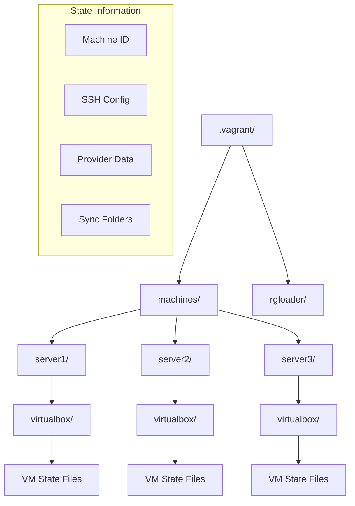

# Vagrant Configuration Directory

## Overview
Vagrant-generated configuration and state directory for multi-node Docker Swarm setup using VirtualBox provider.

## Structure
- `machines/` - Individual VM configurations and state
- `rgloader/` - Ruby gem loader configuration

<details>
<summary>📋 Vagrant State Management</summary>

### Purpose
- Store VM state and configuration
- Manage VirtualBox machine metadata
- Track provisioning status
- Enable vagrant command operations

### Directory Structure


</details>

<details>
<summary>🚀 Vagrant Operations</summary>

### VM Management
```bash
# Check VM status
vagrant status

# Start all VMs
vagrant up

# SSH into specific VM
vagrant ssh server1
vagrant ssh server2
vagrant ssh server3

# Halt VMs
vagrant halt

# Destroy VMs
vagrant destroy -f
```

### State Information
```bash
# View machine details
vagrant global-status

# Check provider info
ls -la .vagrant/machines/server1/virtualbox/

# SSH configuration
vagrant ssh-config server1
```

</details>

<details>
<summary>🔧 Configuration Details</summary>

### Machine State Files
- **id**: VirtualBox VM identifier
- **index_uuid**: Vagrant machine UUID
- **private_key**: SSH private key for access
- **synced_folders**: Shared directory configuration
- **creator_uid**: User ID of VM creator

### Provider Integration
- VirtualBox-specific metadata
- Network configuration state
- Resource allocation tracking
- Snapshot information

### Troubleshooting
```bash
# Reset Vagrant state
rm -rf .vagrant/
vagrant up

# Fix SSH issues
vagrant ssh-config > ssh_config
ssh -F ssh_config server1

# Provider debugging
vagrant up --debug
```

</details>

<details>
<summary>📊 Multi-Node Setup</summary>

### Swarm Cluster Nodes
- **server1**: Swarm manager node
- **server2**: Worker node
- **server3**: Worker node

### Network Configuration
- Private network for inter-node communication
- Port forwarding for external access
- SSH key-based authentication
- Shared folder mounting

### Provisioning Status
```bash
# Check provisioning
vagrant provision

# Re-provision specific node
vagrant provision server1

# View provisioning logs
vagrant up --provision
```

</details>

<details>
<summary>⚠️ Important Notes</summary>

### Version Control
- **DO NOT** commit `.vagrant/` directory
- Contains machine-specific state
- Includes private SSH keys
- Provider-dependent metadata

### Cleanup
```bash
# Clean slate setup
vagrant destroy -f
rm -rf .vagrant/
vagrant up

# Selective cleanup
vagrant halt server2
vagrant destroy server2
vagrant up server2
```

### Backup Considerations
- VM snapshots via VirtualBox
- Vagrantfile version control
- Provisioning script backup
- Configuration documentation

</details>