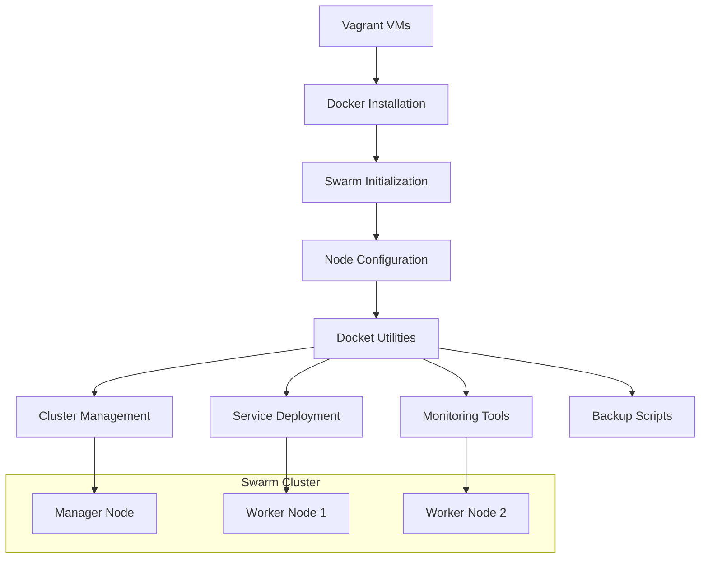

# Docker Swarm Setup - Docket Directory

## Overview
Supporting directory for Docker Swarm cluster setup and configuration management.

<details>
<summary>📋 Directory Purpose</summary>

### Functionality
- Store swarm setup scripts and utilities
- Manage cluster configuration files
- Provide helper tools for swarm operations
- Organize swarm-related documentation

### Integration with Swarm Setup


</details>

<details>
<summary>🚀 Usage Patterns</summary>

### Common Operations
```bash
# Navigate to docket directory
cd Docket/

# Run cluster setup scripts
./setup-swarm.sh

# Deploy sample applications
./deploy-stack.sh voting-app

# Monitor cluster health
./health-check.sh

# Backup cluster state
./backup-swarm.sh
```

### Integration Points
- Vagrant provisioning scripts
- Docker Swarm token management
- Service deployment automation
- Cluster monitoring utilities

</details>

<details>
<summary>🔧 Configuration Management</summary>

### Typical Contents
- **setup-scripts/**: Automated installation scripts
- **configs/**: Swarm configuration templates
- **stacks/**: Docker Compose stack definitions
- **monitoring/**: Cluster monitoring tools
- **backup/**: Backup and restore utilities

### Best Practices
```bash
# Make scripts executable
chmod +x *.sh

# Use environment variables
export SWARM_MANAGER_IP=192.168.50.10
export WORKER_NODES="192.168.50.11,192.168.50.12"

# Implement error handling
set -e
trap 'echo "Error on line $LINENO"' ERR
```

</details>

<details>
<summary>📚 Development Workflow</summary>

### Setup Process
1. **VM Provisioning**: Vagrant creates VMs
2. **Docker Installation**: Automated via provisioning
3. **Swarm Initialization**: Manager node setup
4. **Worker Joining**: Nodes join cluster
5. **Docket Deployment**: Utilities and tools

### Maintenance Tasks
- Regular health checks
- Token rotation
- Node management
- Service updates
- Backup operations

### Troubleshooting
```bash
# Check swarm status
docker node ls

# Verify connectivity
ping 192.168.50.11
ping 192.168.50.12

# Debug services
docker service ls
docker service ps <service-name>
```

</details>

<details>
<summary>🎯 Learning Objectives</summary>

### Swarm Concepts
- Multi-node cluster management
- Service orchestration
- Load balancing and scaling
- High availability patterns

### Operational Skills
- Cluster provisioning automation
- Service deployment strategies
- Monitoring and alerting
- Disaster recovery procedures

### Production Readiness
- Security hardening
- Performance optimization
- Compliance requirements
- Scalability planning

</details>