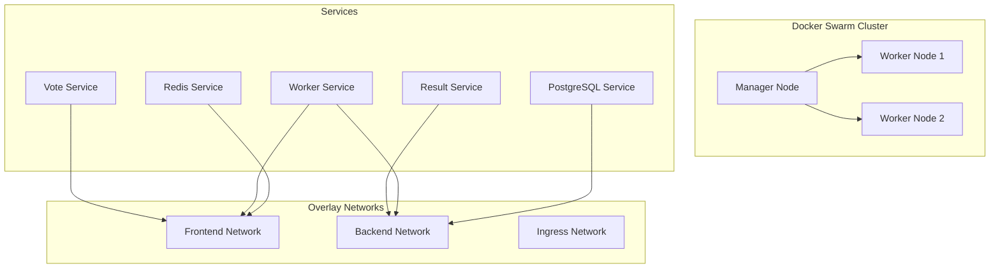
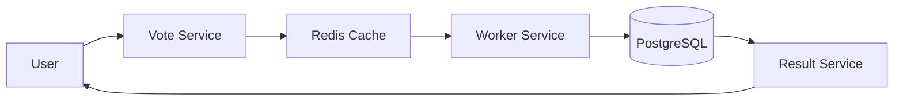
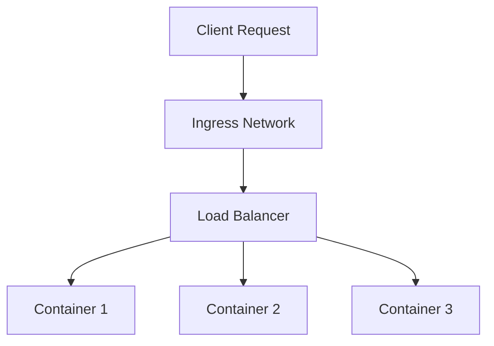
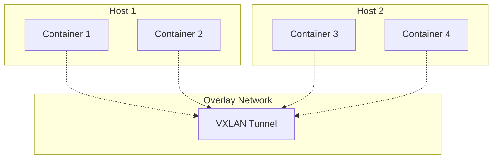

# Docker Swarm

A comprehensive collection of Docker Swarm examples, tutorials, and practical implementations demonstrating container orchestration, service management, networking, and security features.

## 📋 Table of Contents

- [Overview](#overview)
- [Architecture](#architecture)
- [Features Covered](#features-covered)
- [Quick Start](#quick-start)
- [Examples](#examples)
- [Network Architecture](#network-architecture)
- [Security & Secrets](#security--secrets)
- [Production Deployment](#production-deployment)
- [Troubleshooting](#troubleshooting)

## 🎯 Overview

This repository contains hands-on examples and tutorials for Docker Swarm, covering everything from basic service creation to production-grade multi-service applications with secrets management and overlay networking.

## 🏗️ Architecture



## ✨ Features Covered

<details>
<summary><strong>🔧 Core Swarm Operations</strong></summary>

- Swarm initialization and node management
- Service creation and scaling
- Rolling updates and rollbacks
- Health checks and restart policies
- Load balancing and service discovery

</details>

<details>
<summary><strong>🌐 Networking</strong></summary>

- Overlay network creation and management
- Multi-host networking
- Service mesh communication
- Ingress routing and load balancing
- Network isolation and security

</details>

<details>
<summary><strong>🔒 Security & Secrets</strong></summary>

- Docker secrets management
- Secure credential storage
- File-based and external secrets
- Secret rotation and updates
- Environment variable security

</details>

<details>
<summary><strong>📦 Stack Deployment</strong></summary>

- Docker Compose file deployment
- Multi-service application stacks
- Production-grade configurations
- Volume management
- Service dependencies

</details>

## 🚀 Quick Start

### Initialize Swarm
```bash
# Initialize swarm mode
docker swarm init

# Check swarm status
docker node ls
```

### Create Basic Service
```bash
# Create a simple web service
docker service create --name web --replicas 3 -p 80:80 nginx

# Scale the service
docker service scale web=5

# Check service status
docker service ls
docker service ps web
```

## 📚 Examples

### 1. Multi-Service Voting Application

<details>
<summary><strong>View Implementation Details</strong></summary>

A complete voting application demonstrating:
- Frontend voting interface
- Backend result display
- Redis for vote storage
- PostgreSQL for result persistence
- Worker service for vote processing



**Services Created:**
- `vote`: Web interface for voting (2 replicas)
- `redis`: In-memory cache (2 replicas)
- `worker`: Vote processor (1 replica)
- `db`: PostgreSQL database (1 replica)
- `result`: Results display (1 replica)

**Networks:**
- `frontend`: Vote service ↔ Redis
- `backend`: Worker ↔ Database ↔ Result

</details>

### 2. Overlay Network Configuration

<details>
<summary><strong>View Network Setup</strong></summary>

Demonstrates advanced networking with:
- Custom overlay networks
- Service-to-service communication
- Network isolation
- Multi-host connectivity

```bash
# Create overlay networks
docker network create --driver overlay frontend
docker network create --driver overlay backend

# Deploy services with network attachment
docker service create --name drupal --network frontend -p 80:80 drupal
docker service create --name psql --network backend postgres
```

</details>

### 3. Routing Mesh Load Balancing

<details>
<summary><strong>View Load Balancing Demo</strong></summary>

Shows Docker Swarm's built-in load balancing:
- Ingress routing mesh
- Round-robin load distribution
- High availability setup

```bash
# Create service with multiple replicas
docker service create --name search --replicas 3 -p 9200:9200 elasticsearch:2

# Test load balancing
curl localhost:9200  # Hits different containers each time
```

**Load Balancing Flow:**


</details>

### 4. Secrets Management

<details>
<summary><strong>View Security Implementation</strong></summary>

Comprehensive secrets management:
- File-based secrets
- Runtime secret injection
- Secure credential handling
- Secret rotation

```bash
# Create secrets
docker secret create psql_user secrets-sample-1/psql_user.txt
echo "mySecretPassword" | docker secret create psql_pass -

# Use secrets in services
docker service create --name psql \
  --secret psql_user \
  --secret psql_pass \
  -e POSTGRES_PASSWORD_FILE=/run/secrets/psql_pass \
  postgres
```

**Secret Flow:**


</details>

## 🌐 Network Architecture

### Overlay Networks



### Service Discovery

Services communicate using:
- Service names as DNS entries
- Automatic load balancing
- Health check integration
- Failover capabilities

## 🔒 Security & Secrets

### Secret Types

<details>
<summary><strong>File-based Secrets</strong></summary>

```yaml
secrets:
  psql_user:
    file: ./psql_user.txt
  psql_password:
    file: ./psql_password.txt
```

</details>

<details>
<summary><strong>External Secrets</strong></summary>

```yaml
secrets:
  psql-pw:
    external: true
```

</details>

### Security Best Practices

- ✅ Use secrets for sensitive data
- ✅ Implement network segmentation
- ✅ Regular secret rotation
- ✅ Principle of least privilege
- ✅ Monitor and audit access

## 🏭 Production Deployment

### Stack Deployment

<details>
<summary><strong>Complete Stack Example</strong></summary>

```yaml
version: "3.13"
services:
  vote:
    image: bretfisher/examplevotingapp_vote
    ports:
      - 5000:80
    networks:
      - frontend
    deploy:
      replicas: 5
      update_config:
        parallelism: 2
      restart_policy:
        condition: on-failure

  redis:
    image: redis:alpine
    networks:
      - frontend
    deploy:
      replicas: 1
      restart_policy:
        condition: on-failure

networks:
  frontend:
  backend:

volumes:
  db-data:
```

**Deployment Commands:**
```bash
# Deploy stack
docker stack deploy -c example-voting-app-stack.yml voteapp

# Monitor deployment
docker stack ls
docker stack ps voteapp
docker stack services voteapp

# Update stack
docker stack deploy -c updated-stack.yml voteapp

# Remove stack
docker stack rm voteapp
```

</details>

### Production Considerations

- **High Availability**: Multiple manager nodes
- **Resource Limits**: CPU and memory constraints
- **Health Checks**: Application-level monitoring
- **Rolling Updates**: Zero-downtime deployments
- **Backup Strategy**: Data persistence and recovery

## 🔧 Troubleshooting

<details>
<summary><strong>Common Issues & Solutions</strong></summary>

### Service Won't Start
```bash
# Check service logs
docker service logs <service-name>

# Inspect service configuration
docker service inspect <service-name>

# Check node availability
docker node ls
```

### Network Connectivity Issues
```bash
# List networks
docker network ls

# Inspect network configuration
docker network inspect <network-name>

# Test connectivity
docker exec -it <container> ping <service-name>
```

### Secret Access Problems
```bash
# List secrets
docker secret ls

# Check secret mounting
docker exec -it <container> ls -la /run/secrets/

# Verify secret content
docker exec -it <container> cat /run/secrets/<secret-name>
```

</details>

## 📁 File Structure

```
Docker Swarm/
├── Assignment Create multi-service app.ipynb    # Multi-service voting app
├── docker swarm overlay.ipynb                  # Overlay networking
├── routing mesh.ipynb                          # Load balancing demo
├── secret storage for swarm.ipynb              # Secrets management
├── swarm stacks and production grade compose.ipynb  # Stack deployment
├── compose-assignment-2/
│   └── answer/
│       └── docker-compose.yml                  # Drupal + PostgreSQL stack
├── secrets-sample-1/
│   └── psql_user.txt                          # Sample secret file
├── secrets-sample-2/
│   ├── docker-compose.yml                     # Compose with secrets
│   ├── psql_password.txt                      # Password secret
│   └── psql_user.txt                          # User secret
└── swarm-stack-1/
    ├── architecture.png                        # Architecture diagram
    └── example-voting-app-stack.yml           # Complete voting app stack
```

## 🎓 Learning Path

1. **Start Here**: Basic service creation and scaling
2. **Networking**: Overlay networks and service communication
3. **Load Balancing**: Routing mesh and traffic distribution
4. **Security**: Secrets management and secure deployments
5. **Production**: Stack deployment and management

## 🤝 Contributing

Feel free to contribute additional examples, improvements, or documentation updates to enhance this Docker Swarm learning resource.

---

**Note**: This repository is designed for educational purposes and demonstrates various Docker Swarm features through practical examples and hands-on tutorials.