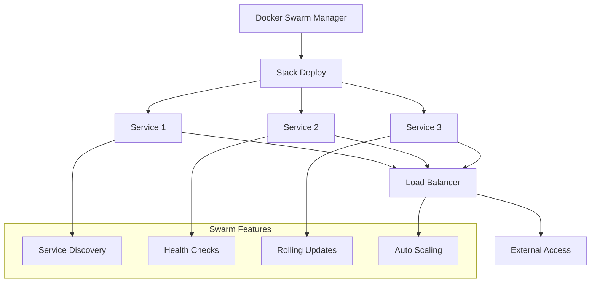

# Docker Swarm Compose Assignment 2 - Answer

## Overview
Solution for Docker Swarm Compose Assignment 2, demonstrating advanced swarm orchestration with custom images and multi-service deployment.

## Files
- `docker-compose.yml` - Swarm stack configuration
- `Dockerfile` - Custom service image definition

<details>
<summary>📋 Assignment Solution</summary>

### Objectives Achieved
- Multi-service swarm stack deployment
- Custom image integration in swarm mode
- Service scaling and load balancing
- Network isolation and communication
- Rolling updates and service management

### Architecture


</details>

<details>
<summary>🚀 Deployment Guide</summary>

### Prerequisites
- Docker Swarm initialized
- Manager node access
- Custom images built (if required)

### Stack Deployment
```bash
# Deploy the stack
docker stack deploy -c docker-compose.yml assignment2

# Check stack status
docker stack ls
docker stack services assignment2

# View service details
docker service ls
docker service ps assignment2_web

# Scale services
docker service scale assignment2_web=5

# Update services
docker service update --image newimage:tag assignment2_web
```

</details>

<details>
<summary>⚙️ Configuration Details</summary>

### Swarm-Specific Features
```yaml
version: '3.8'
services:
  web:
    image: custom-app:latest
    deploy:
      replicas: 3
      update_config:
        parallelism: 1
        delay: 10s
      restart_policy:
        condition: on-failure
    networks:
      - webnet
    ports:
      - "80:80"
```

### Key Components
- **Service Replicas**: Multiple container instances
- **Update Strategy**: Rolling update configuration
- **Health Checks**: Service monitoring
- **Networks**: Overlay network for service communication
- **Secrets**: Secure configuration management

</details>

<details>
<summary>📊 Monitoring & Management</summary>

### Service Monitoring
```bash
# Monitor service logs
docker service logs -f assignment2_web

# Check service health
docker service inspect assignment2_web

# View node distribution
docker node ls
docker service ps assignment2_web --no-trunc
```

### Troubleshooting
```bash
# Debug failed services
docker service ps assignment2_web --filter desired-state=running

# Check network connectivity
docker network ls
docker network inspect assignment2_webnet

# Rollback if needed
docker service rollback assignment2_web
```

</details>

<details>
<summary>🎯 Learning Outcomes</summary>

### Swarm Concepts Mastered
- Stack-based application deployment
- Service orchestration and scaling
- Rolling updates and rollbacks
- Network overlay configuration
- Load balancing and service discovery

### Production Readiness
- High availability setup
- Fault tolerance mechanisms
- Monitoring and logging
- Security best practices
- Performance optimization

</details>