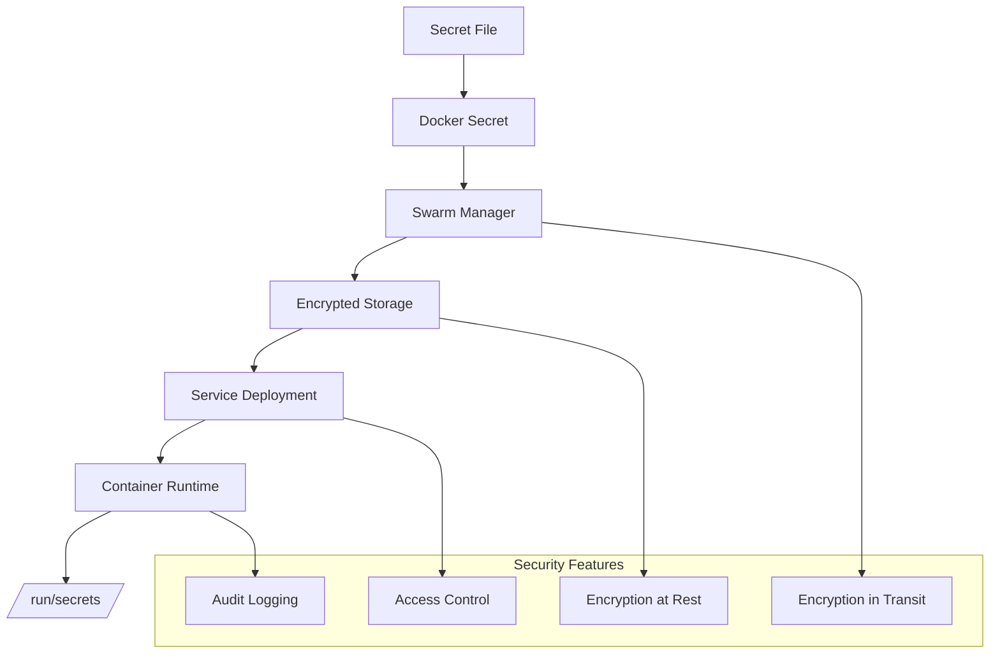

# Docker Swarm Secrets Sample 1

## Overview
Basic demonstration of Docker Swarm secrets management for secure configuration and sensitive data handling.

## Files
- `psql_user.txt` - PostgreSQL username secret

<details>
<summary>📋 Secrets Overview</summary>

### Purpose
- Secure sensitive data management
- Centralized secret distribution
- Runtime secret injection
- Access control and auditing

### Secrets Architecture


</details>

<details>
<summary>🚀 Quick Start</summary>

### Creating and Using Secrets
```bash
# Create secret from file
docker secret create psql_user psql_user.txt

# List secrets
docker secret ls

# Inspect secret (metadata only)
docker secret inspect psql_user

# Use in service
docker service create \
  --name postgres \
  --secret psql_user \
  -e POSTGRES_USER_FILE=/run/secrets/psql_user \
  postgres:13
```

### Alternative Creation Methods
```bash
# Create from stdin
echo "myusername" | docker secret create psql_user -

# Create from command output
openssl rand -base64 32 | docker secret create db_password -
```

</details>

<details>
<summary>🔧 Implementation Patterns</summary>

### Service Configuration
```yaml
version: '3.8'
services:
  database:
    image: postgres:13
    secrets:
      - psql_user
      - psql_password
    environment:
      POSTGRES_USER_FILE: /run/secrets/psql_user
      POSTGRES_PASSWORD_FILE: /run/secrets/psql_password

secrets:
  psql_user:
    file: ./psql_user.txt
  psql_password:
    external: true
```

### Secret Access in Container
```bash
# Secrets mounted at /run/secrets/
ls /run/secrets/
cat /run/secrets/psql_user

# Use in application
export DB_USER=$(cat /run/secrets/psql_user)
export DB_PASS=$(cat /run/secrets/psql_password)
```

</details>

<details>
<summary>🔒 Security Best Practices</summary>

### Secret Management
- Never commit secrets to version control
- Use external secret stores when possible
- Rotate secrets regularly
- Implement least privilege access

### Access Control
```bash
# Remove secret access from service
docker service update --secret-rm psql_user myservice

# Add new secret
docker service update --secret-add psql_password myservice

# Update secret (requires recreation)
docker secret rm old_secret
docker secret create new_secret secret_file.txt
```

### Monitoring and Auditing
- Monitor secret access patterns
- Log secret usage events
- Regular security assessments
- Compliance reporting

</details>

<details>
<summary>📚 Learning Outcomes</summary>

### Secrets Management Concepts
- Secure data distribution
- Runtime secret injection
- Access control mechanisms
- Encryption and security

### Production Considerations
- Secret rotation strategies
- Integration with external vaults
- Compliance requirements
- Disaster recovery planning

</details>