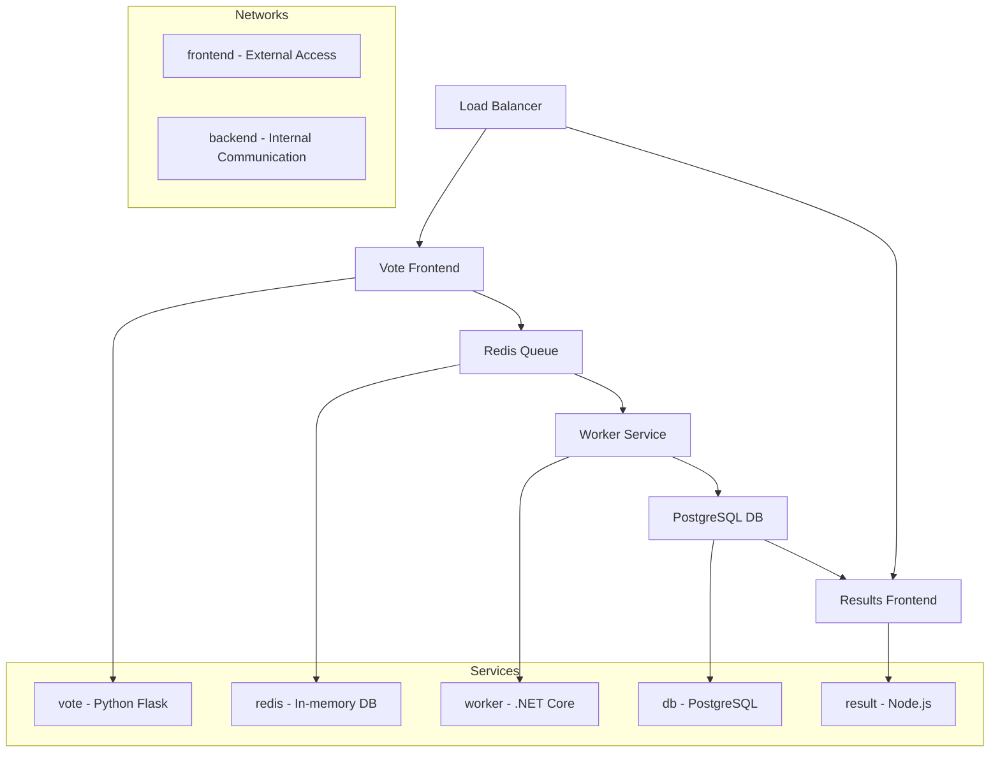

# Docker Swarm Stack 1 - Voting App

## Overview
Complete Docker Swarm stack implementation of a distributed voting application demonstrating microservices architecture, load balancing, and multi-tier application deployment.

## Files
- `example-voting-app-stack.yml` - Complete swarm stack configuration
- `architecture.png` - Application architecture diagram

<details>
<summary>📋 Application Overview</summary>

### Purpose
- Demonstrate complex microservices deployment
- Show inter-service communication patterns
- Practice production swarm orchestration
- Implement real-world application architecture

### Architecture


</details>

<details>
<summary>🚀 Deployment Guide</summary>

### Prerequisites
- Docker Swarm cluster initialized
- Manager node with stack deployment access
- Required images available (or internet access)

### Stack Deployment
```bash
# Deploy the voting app stack
docker stack deploy -c example-voting-app-stack.yml vote

# Monitor deployment progress
docker stack services vote
docker service ls --filter label=com.docker.stack.namespace=vote

# Check service status
docker service ps vote_vote
docker service ps vote_result
docker service ps vote_worker

# Access applications
# Vote: http://localhost:5000
# Results: http://localhost:5001
```

</details>

<details>
<summary>⚙️ Service Configuration</summary>

### Frontend Services
- **Vote Service**: Python Flask web interface
- **Result Service**: Node.js results dashboard
- **Load Balancing**: Automatic request distribution
- **Port Mapping**: External access configuration

### Backend Services
- **Redis**: Message queue and session storage
- **PostgreSQL**: Persistent vote storage
- **Worker**: Vote processing service
- **Internal Networks**: Secure service communication

### Scaling Configuration
```bash
# Scale vote frontend
docker service scale vote_vote=5

# Scale result service
docker service scale vote_result=3

# Scale worker processes
docker service scale vote_worker=2

# Monitor scaling
watch docker service ls
```

</details>

<details>
<summary>🔧 Network Architecture</summary>

### Network Segmentation
```yaml
networks:
  frontend:
    driver: overlay
  backend:
    driver: overlay
```

### Service Communication
- **Frontend Network**: External access and web services
- **Backend Network**: Database and internal services
- **Overlay Networks**: Cross-node communication
- **Service Discovery**: Automatic DNS resolution

### Security Considerations
- Network isolation between tiers
- No direct database access from frontend
- Encrypted overlay network communication
- Service-to-service authentication

</details>

<details>
<summary>📊 Monitoring & Management</summary>

### Health Monitoring
```bash
# Check service health
docker service inspect vote_vote --format='{{.Spec.TaskTemplate.ContainerSpec.Healthcheck}}'

# Monitor logs
docker service logs -f vote_vote
docker service logs -f vote_worker
docker service logs -f vote_result

# Performance monitoring
docker stats $(docker ps -q --filter label=com.docker.swarm.service.name=vote_vote)
```

### Troubleshooting
```bash
# Debug service issues
docker service ps vote_vote --no-trunc
docker service inspect vote_vote

# Network connectivity
docker network ls
docker network inspect vote_frontend
docker network inspect vote_backend

# Container inspection
docker exec -it $(docker ps -q -f name=vote_vote) /bin/bash
```

</details>

<details>
<summary>🎯 Production Considerations</summary>

### High Availability
- Multi-replica services
- Cross-node distribution
- Automatic failover
- Rolling updates

### Performance Optimization
- Resource constraints and limits
- Placement constraints
- Update strategies
- Health check configuration

### Security Hardening
- Secret management for database credentials
- Network segmentation
- Image vulnerability scanning
- Access control policies

### Monitoring Integration
- Prometheus metrics collection
- Grafana dashboards
- Log aggregation with ELK stack
- Alert management

</details>