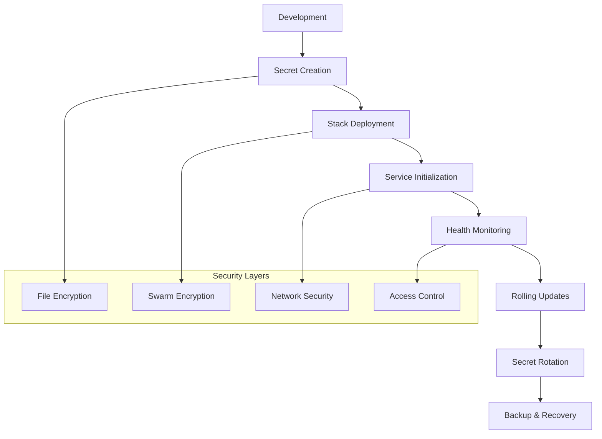

# Docker Swarm App Lifecycle - Secrets Sample 2

## Overview
Advanced secrets management demonstration within Docker Swarm application lifecycle, featuring PostgreSQL deployment with secure credential handling and production-ready patterns.

## Files
- `docker-compose.yml` - Production swarm stack with secrets
- `psql_password.txt` - Database password secret
- `psql_user.txt` - Database username secret

<details>
<summary>📋 Application Lifecycle</summary>

### Purpose
- Demonstrate production secrets management
- Show application lifecycle with security
- Practice rolling updates with secrets
- Implement secure database deployment

### Lifecycle Stages


</details>

<details>
<summary>🚀 Deployment Lifecycle</summary>

### Initial Deployment
```bash
# Create secrets
docker secret create psql_user psql_user.txt
docker secret create psql_password psql_password.txt

# Deploy stack
docker stack deploy -c docker-compose.yml postgres-app

# Verify deployment
docker stack services postgres-app
docker service logs postgres-app_db
```

### Health Monitoring
```bash
# Check service health
docker service inspect postgres-app_db --format='{{.Spec.TaskTemplate.ContainerSpec.Healthcheck}}'

# Monitor logs
docker service logs -f postgres-app_db

# Test database connectivity
docker exec $(docker ps -q -f name=postgres-app_db) pg_isready
```

</details>

<details>
<summary>🔄 Rolling Updates</summary>

### Application Updates
```bash
# Update service image
docker service update --image postgres:14 postgres-app_db

# Monitor update progress
watch docker service ps postgres-app_db

# Rollback if needed
docker service rollback postgres-app_db
```

### Secret Rotation
```bash
# Create new secret version
echo "new_secure_password" | docker secret create psql_password_v2 -

# Update service with new secret
docker service update \
  --secret-rm psql_password \
  --secret-add source=psql_password_v2,target=psql_password \
  postgres-app_db

# Verify secret update
docker service inspect postgres-app_db --format='{{.Spec.TaskTemplate.ContainerSpec.Secrets}}'

# Clean up old secret
docker secret rm psql_password
```

</details>

<details>
<summary>⚙️ Production Configuration</summary>

### Stack Configuration
```yaml
version: '3.8'
services:
  db:
    image: postgres:13
    secrets:
      - psql_user
      - psql_password
    environment:
      POSTGRES_USER_FILE: /run/secrets/psql_user
      POSTGRES_PASSWORD_FILE: /run/secrets/psql_password
      POSTGRES_DB: production_app
    deploy:
      replicas: 1
      placement:
        constraints: [node.role == manager]
      restart_policy:
        condition: on-failure
        delay: 5s
        max_attempts: 3
      update_config:
        parallelism: 1
        delay: 10s
        failure_action: rollback
    healthcheck:
      test: ["CMD-SHELL", "pg_isready -U $$(cat /run/secrets/psql_user)"]
      interval: 30s
      timeout: 10s
      retries: 3
    volumes:
      - postgres_data:/var/lib/postgresql/data
    networks:
      - backend

volumes:
  postgres_data:
    driver: local

networks:
  backend:
    driver: overlay
    encrypted: true

secrets:
  psql_user:
    file: ./psql_user.txt
  psql_password:
    file: ./psql_password.txt
```

### Security Features
- Encrypted overlay networks
- Secret file mounting
- Health check integration
- Placement constraints
- Restart policies

</details>

<details>
<summary>📊 Monitoring & Operations</summary>

### Operational Commands
```bash
# Scale service
docker service scale postgres-app_db=2

# Update configuration
docker service update --env-add NEW_CONFIG=value postgres-app_db

# Inspect service details
docker service inspect postgres-app_db --pretty

# Check resource usage
docker stats $(docker ps -q -f name=postgres-app_db)
```

### Backup Operations
```bash
# Database backup
docker exec $(docker ps -q -f name=postgres-app_db) \
  pg_dump -U $(cat psql_user.txt) production_app > backup.sql

# Volume backup
docker run --rm -v postgres-app_postgres_data:/data \
  -v $(pwd):/backup alpine tar czf /backup/postgres-data.tar.gz /data

# Secret backup (metadata only)
docker secret inspect psql_user > secret-metadata.json
```

</details>

<details>
<summary>🔒 Security Best Practices</summary>

### Secret Management
- Regular secret rotation
- Principle of least privilege
- Audit trail maintenance
- Secure secret distribution

### Network Security
- Encrypted overlay networks
- Service isolation
- Firewall configuration
- TLS termination

### Access Control
```bash
# Limit secret access
docker service update --secret-rm old_secret postgres-app_db

# Monitor secret usage
docker service logs postgres-app_db | grep -i secret

# Audit secret access
docker events --filter type=secret
```

</details>

<details>
<summary>🎯 Production Readiness</summary>

### High Availability
- Multi-replica deployment
- Cross-node distribution
- Automatic failover
- Data persistence

### Disaster Recovery
- Regular backups
- Point-in-time recovery
- Cross-region replication
- Recovery testing

### Compliance
- Data encryption
- Access logging
- Retention policies
- Regulatory compliance

</details>