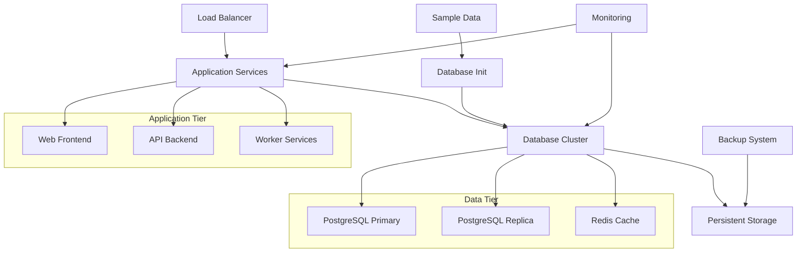

# Docker Swarm Stack 3 - Production Application Lifecycle

## Overview
Comprehensive production-grade Docker Swarm stack demonstrating complete application lifecycle management with PostgreSQL database, persistent storage, and advanced deployment patterns.

## Structure
- `docker-compose.yml` - Production swarm stack configuration
- `sample-data/` - PostgreSQL database sample data and initialization
- Configuration files for production deployment

<details>
<summary>📋 Production Stack Overview</summary>

### Purpose
- Demonstrate production application lifecycle
- Show database initialization and data management
- Practice advanced swarm orchestration
- Implement enterprise deployment patterns

### Architecture


</details>

<details>
<summary>🚀 Deployment Lifecycle</summary>

### Initial Setup
```bash
# Prepare sample data
ls -la sample-data/

# Deploy production stack
docker stack deploy -c docker-compose.yml production-app

# Monitor deployment
watch docker stack services production-app

# Verify database initialization
docker service logs production-app_db
```

### Database Initialization
```bash
# Check sample data loading
docker exec $(docker ps -q -f name=production-app_db) \
  psql -U postgres -c "\dt"

# Verify data integrity
docker exec $(docker ps -q -f name=production-app_db) \
  psql -U postgres -c "SELECT COUNT(*) FROM sample_table;"

# Monitor initialization logs
docker service logs -f production-app_db | grep -i init
```

</details>

<details>
<summary>⚙️ Production Configuration</summary>

### Stack Features
```yaml
version: '3.8'
services:
  app:
    image: production-app:latest
    deploy:
      replicas: 3
      update_config:
        parallelism: 1
        delay: 10s
        failure_action: rollback
      restart_policy:
        condition: on-failure
        delay: 5s
        max_attempts: 3
    healthcheck:
      test: ["CMD", "curl", "-f", "http://localhost:8080/health"]
      interval: 30s
      timeout: 10s
      retries: 3
    networks:
      - frontend
      - backend

  db:
    image: postgres:13
    environment:
      POSTGRES_DB: production
      POSTGRES_USER_FILE: /run/secrets/db_user
      POSTGRES_PASSWORD_FILE: /run/secrets/db_password
    volumes:
      - postgres_data:/var/lib/postgresql/data
      - ./sample-data:/docker-entrypoint-initdb.d:ro
    deploy:
      placement:
        constraints: [node.role == manager]
    secrets:
      - db_user
      - db_password
    networks:
      - backend

volumes:
  postgres_data:
    driver: local

networks:
  frontend:
    driver: overlay
  backend:
    driver: overlay
    encrypted: true

secrets:
  db_user:
    external: true
  db_password:
    external: true
```

### Advanced Features
- Rolling updates with rollback
- Health checks and monitoring
- Encrypted networks
- Persistent data volumes
- Secret management
- Placement constraints

</details>

<details>
<summary>📊 Sample Data Management</summary>

### Database Structure
```
sample-data/
├── base/
│   ├── 1/          # Database OID 1 files
│   ├── 13779/      # Template database
│   └── 13780/      # Application database
├── global/         # Cluster-wide data
├── pg_wal/         # Write-ahead logs
├── pg_stat/        # Statistics
└── postgresql.conf # Configuration
```

### Data Initialization
- **Base Templates**: PostgreSQL system databases
- **Application Data**: Custom schema and sample records
- **Configuration**: Production-tuned settings
- **WAL Files**: Transaction log management

### Data Operations
```bash
# Backup sample data
docker exec $(docker ps -q -f name=production-app_db) \
  pg_dump -U postgres production > sample-backup.sql

# Restore from backup
docker exec -i $(docker ps -q -f name=production-app_db) \
  psql -U postgres production < sample-backup.sql

# Monitor data directory
docker exec $(docker ps -q -f name=production-app_db) \
  du -sh /var/lib/postgresql/data
```

</details>

<details>
<summary>🔄 Application Lifecycle</summary>

### Development to Production
1. **Development**: Local development and testing
2. **Staging**: Pre-production validation
3. **Production**: Live deployment
4. **Monitoring**: Health and performance tracking
5. **Updates**: Rolling updates and rollbacks
6. **Maintenance**: Backup and recovery

### Update Strategies
```bash
# Blue-green deployment
docker service update --image app:v2.0 production-app_app

# Canary deployment
docker service update --replicas 4 production-app_app
docker service update --image app:v2.0 --update-parallelism 1 production-app_app

# Rollback if issues
docker service rollback production-app_app
```

### Monitoring and Alerting
```bash
# Service health
docker service ps production-app_app --filter desired-state=running

# Resource monitoring
docker stats $(docker ps -q --filter label=com.docker.swarm.service.name=production-app_app)

# Log aggregation
docker service logs production-app_app --since 1h | grep ERROR
```

</details>

<details>
<summary>🔒 Production Security</summary>

### Security Layers
- **Network Encryption**: Overlay network encryption
- **Secret Management**: External secret store integration
- **Access Control**: Role-based permissions
- **Data Encryption**: Database encryption at rest
- **Audit Logging**: Comprehensive audit trails

### Compliance Features
```bash
# Audit secret access
docker events --filter type=secret --since 24h

# Monitor network traffic
docker network inspect production-app_backend --format='{{.Options}}'

# Check security policies
docker service inspect production-app_db --format='{{.Spec.TaskTemplate.ContainerSpec.Secrets}}'
```

</details>

<details>
<summary>🎯 Enterprise Readiness</summary>

### High Availability
- Multi-node deployment
- Automatic failover
- Load balancing
- Data replication

### Disaster Recovery
- Regular automated backups
- Point-in-time recovery
- Cross-region replication
- Recovery testing procedures

### Performance Optimization
- Resource constraints and limits
- Connection pooling
- Query optimization
- Caching strategies

### Operational Excellence
- Infrastructure as code
- Automated deployment pipelines
- Comprehensive monitoring
- Incident response procedures

</details>