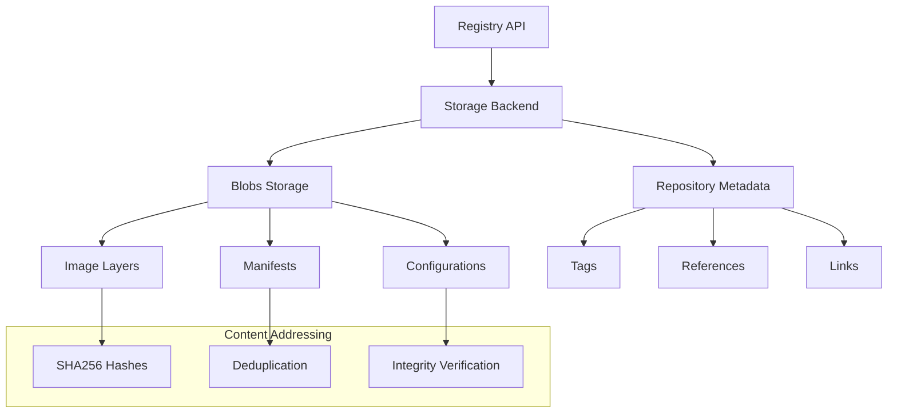

# Private Docker Registry Data

## Overview
Data directory for private Docker registry containing stored images, manifests, and repository metadata.

## Structure
- `docker/registry/v2/` - Registry v2 API storage structure
- `blobs/` - Image layer storage (content-addressable)
- `repositories/` - Repository metadata and manifests

<details>
<summary>📋 Registry Storage</summary>

### Purpose
- Store Docker images privately
- Manage image layers and manifests
- Provide content-addressable storage
- Enable secure image distribution

### Storage Architecture


</details>

<details>
<summary>🚀 Registry Operations</summary>

### Image Storage Process
```bash
# Push image to registry
docker tag hello-world localhost:5000/hello-world
docker push localhost:5000/hello-world

# Pull image from registry
docker pull localhost:5000/hello-world

# List registry contents
curl -X GET http://localhost:5000/v2/_catalog
curl -X GET http://localhost:5000/v2/hello-world/tags/list
```

### Storage Verification
```bash
# Check blob storage
ls -la docker/registry/v2/blobs/sha256/

# Verify repository structure
ls -la docker/registry/v2/repositories/

# Check manifest storage
find . -name "link" -exec cat {} \;
```

</details>

<details>
<summary>🔧 Storage Management</summary>

### Cleanup Operations
```bash
# Registry garbage collection
docker exec registry bin/registry garbage-collect /etc/docker/registry/config.yml

# Remove unused blobs
docker exec registry bin/registry garbage-collect --delete-untagged /etc/docker/registry/config.yml

# Verify storage after cleanup
du -sh docker/registry/v2/
```

### Backup Procedures
```bash
# Backup registry data
tar -czf registry-backup-$(date +%Y%m%d).tar.gz docker/

# Restore registry data
tar -xzf registry-backup-20231201.tar.gz

# Verify integrity
docker exec registry bin/registry check /etc/docker/registry/config.yml
```

</details>

<details>
<summary>📊 Storage Analysis</summary>

### Content Structure
- **Blobs**: Content-addressable storage by SHA256
- **Repositories**: Namespace organization
- **Manifests**: Image metadata and layer references
- **Tags**: Human-readable image versions

### Storage Efficiency
- **Deduplication**: Shared layers across images
- **Compression**: Layer compression for efficiency
- **Caching**: Local storage optimization
- **Cleanup**: Automated garbage collection

### Monitoring
```bash
# Storage usage
du -sh docker/registry/v2/blobs/
du -sh docker/registry/v2/repositories/

# Repository count
find docker/registry/v2/repositories/ -name "_manifests" | wc -l

# Blob analysis
find docker/registry/v2/blobs/ -name "data" | wc -l
```

</details>

<details>
<summary>🔒 Security Considerations</summary>

### Access Control
- File system permissions
- Registry authentication
- Network security
- SSL/TLS encryption

### Data Protection
- Regular backups
- Integrity verification
- Access logging
- Vulnerability scanning

### Compliance
- Data retention policies
- Audit trail maintenance
- Regulatory compliance
- Privacy protection

</details>