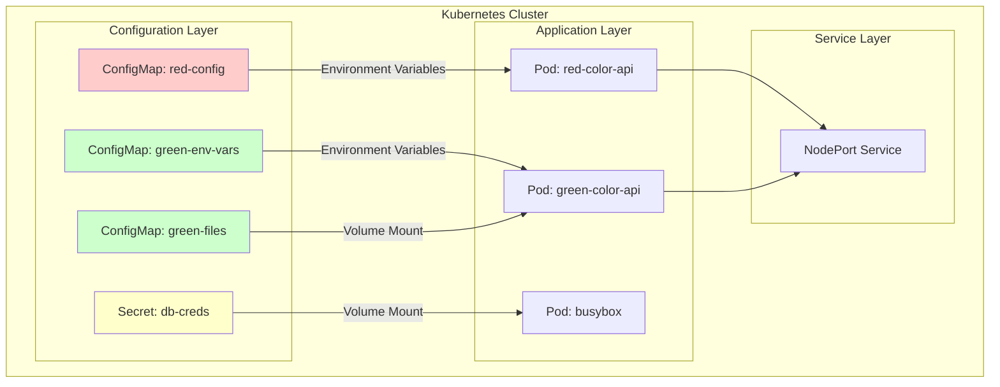
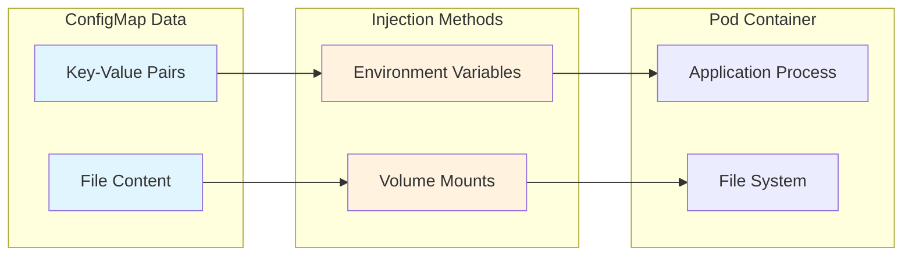
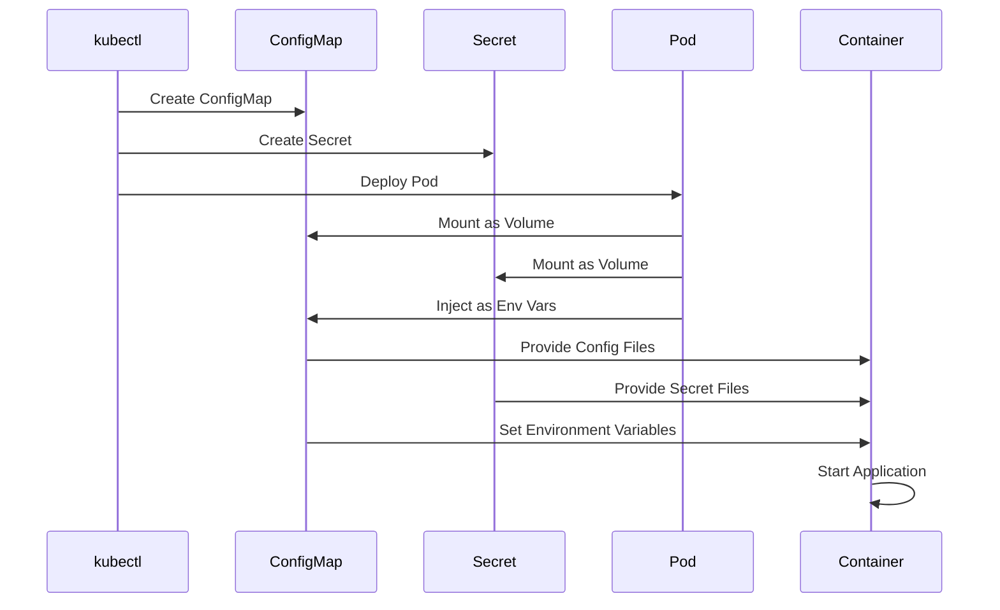

# Kubernetes Configuration Management

A comprehensive guide to managing application configuration in Kubernetes using ConfigMaps and Secrets. This project demonstrates various methods of injecting configuration data into containerized applications.

## 📋 Table of Contents

- [Overview](#overview)
- [Project Structure](#project-structure)
- [Architecture](#architecture)
- [Components](#components)
- [Getting Started](#getting-started)
- [Usage Examples](#usage-examples)
- [Best Practices](#best-practices)
- [Troubleshooting](#troubleshooting)

## 🎯 Overview

This project showcases Kubernetes configuration management patterns using:
- **ConfigMaps** for non-sensitive configuration data
- **Secrets** for sensitive information like credentials
- **Color API** as a demonstration application
- Multiple injection methods (environment variables and volume mounts)

## 📁 Project Structure

```
Kubernethes Configuration Mgmt/
├── Color Api/
│   ├── src/
│   │   └── index.js          # Node.js Express application
│   ├── Dockerfile            # Container image definition
│   ├── package.json          # Node.js dependencies
│   ├── Build.ipynb          # Build process notebook
│   └── implement.ipynb      # Implementation examples
├── Config Maps/
│   ├── configmap_env.ipynb   # Environment variable examples
│   ├── configmap_volume.ipynb # Volume mount examples
│   ├── green-config.yaml     # Green theme configuration
│   ├── green-color-api.yaml  # Green API pod definition
│   ├── red-config.yaml       # Red theme configuration
│   └── red-color-api.yaml    # Red API pod definition
├── Secrets/
│   ├── cmd.ipynb            # Secret management commands
│   └── demo-pod.yaml        # Secret consumption example
└── README.md                # This file
```

## 🏗️ Architecture



## 🧩 Components

### Color API Application

<details>
<summary>Click to expand Color API details</summary>

The Color API is a Node.js Express application that demonstrates configuration injection:

**Features:**
- Dynamic color theming based on configuration
- Health check endpoints (`/health`, `/ready`, `/up`)
- JSON and HTML response formats
- Environment variable and file-based configuration

**Configuration Sources:**
1. `DEFAULT_COLOR` environment variable
2. `COLOR_CONFIG_PATH` file path for color configuration
3. Health check behavior flags

**Endpoints:**
- `GET /` - HTML response with colored header
- `GET /api` - JSON/text API response
- `GET /health` - Liveness probe endpoint
- `GET /ready` - Readiness probe endpoint
- `GET /up` - Basic health check

</details>

### ConfigMaps

<details>
<summary>Click to expand ConfigMap configurations</summary>

#### Red Configuration
```yaml
apiVersion: v1
kind: ConfigMap
metadata:
  name: red-config
data:
  DEFAULT_COLOR: red
```

#### Green Configuration (Environment Variables)
```yaml
apiVersion: v1
kind: ConfigMap
metadata:
  name: green-env-vars
data:
  COLOR_CONFIG_PATH: /mnt/config/color.txt
```

#### Green Configuration (Files)
```yaml
apiVersion: v1
kind: ConfigMap
metadata:
  name: green-files
data:
  color.txt: green
  hello-from-green.js: |
    console.log("Hello from green");
    console.log("Hello from green config Map");
```

</details>

### Secrets

<details>
<summary>Click to expand Secret configurations</summary>

#### Database Credentials Secret
Created using kubectl command:
```bash
kubectl create secret generic db-creds \
  --from-literal=username=db_user \
  --from-literal=password=db_pass
```

#### Secret Consumption Methods
1. **Environment Variables**: Direct injection into container environment
2. **Volume Mounts**: Files mounted at specified paths
3. **Projected Volumes**: Custom file paths and permissions

</details>

## 🚀 Getting Started

### Prerequisites
- Kubernetes cluster (local or remote)
- kubectl configured
- Docker (for building custom images)

### Quick Start

1. **Clone and navigate to the project:**
   ```bash
   cd "Kubernethes Configuration Mgmt"
   ```

2. **Deploy Red Color API (Environment Variables):**
   ```bash
   kubectl apply -f "Config Maps/red-config.yaml"
   kubectl apply -f "Config Maps/red-color-api.yaml"
   ```

3. **Deploy Green Color API (Volume Mounts):**
   ```bash
   kubectl apply -f "Config Maps/green-config.yaml"
   kubectl apply -f "Config Maps/green-color-api.yaml"
   ```

4. **Create and test Secrets:**
   ```bash
   kubectl create secret generic db-creds \
     --from-literal=username=db_user \
     --from-literal=password=db_pass
   kubectl apply -f "Secrets/demo-pod.yaml"
   ```

## 💡 Usage Examples

### Configuration Injection Methods



### Environment Variable Injection

<details>
<summary>Click to expand environment variable examples</summary>

**Method 1: Direct Key Reference**
```yaml
env:
  - name: DEFAULT_COLOR
    valueFrom:
      configMapKeyRef:
        key: DEFAULT_COLOR
        name: red-config
```

**Method 2: Bulk Import**
```yaml
envFrom:
  - configMapRef:
      name: red-config
```

**Verification:**
```bash
kubectl exec red-color-api -- env | grep DEFAULT_COLOR
```

</details>

### Volume Mount Injection

<details>
<summary>Click to expand volume mount examples</summary>

**ConfigMap as Volume:**
```yaml
volumes:
  - name: color-config
    configMap:
      name: green-files
volumeMounts:
  - name: color-config
    mountPath: /mnt/config
```

**Secret as Volume with Custom Paths:**
```yaml
volumes:
  - name: db-secrets
    secret:
      secretName: db-creds
      items:
        - key: username
          path: dev/username
        - key: password
          path: dev/password
volumeMounts:
  - name: db-secrets
    mountPath: "/etc/db"
```

**File Access:**
```bash
kubectl exec green-color-api -- cat /mnt/config/color.txt
kubectl exec busybox -- cat /etc/db/dev/username
```

</details>

### Service Exposure

<details>
<summary>Click to expand service configuration</summary>

**Expose Pod as NodePort Service:**
```bash
kubectl expose pod red-color-api \
  --type=NodePort \
  --name=red-color-api-service \
  --port=80 \
  --target-port=80
```

**Access Application:**
```bash
# Get service details
kubectl get svc red-color-api-service

# Test the application
curl http://localhost:<NodePort>
curl http://localhost:<NodePort>/api?format=json
```

</details>

## 📊 Configuration Flow



## 🔧 Best Practices

### ConfigMap Best Practices

<details>
<summary>Click to expand ConfigMap best practices</summary>

1. **Naming Convention**: Use descriptive names with environment prefixes
   ```yaml
   metadata:
     name: myapp-prod-config
   ```

2. **Size Limitations**: Keep ConfigMaps under 1MB
3. **Immutability**: Consider using immutable ConfigMaps for better performance
   ```yaml
   immutable: true
   ```

4. **Versioning**: Include version information in names or labels
5. **Separation**: Separate configuration by environment and component

</details>

### Secret Best Practices

<details>
<summary>Click to expand Secret best practices</summary>

1. **Least Privilege**: Only mount secrets where needed
2. **Encryption**: Enable encryption at rest
3. **Rotation**: Implement regular secret rotation
4. **Access Control**: Use RBAC to limit secret access
5. **Avoid Logging**: Never log secret values

**Secret Creation Methods:**
```bash
# From literals
kubectl create secret generic mysecret --from-literal=key1=value1

# From files
kubectl create secret generic mysecret --from-file=path/to/file

# From environment file
kubectl create secret generic mysecret --from-env-file=.env
```

</details>

### Security Considerations

<details>
<summary>Click to expand security guidelines</summary>

1. **Resource Limits**: Always set resource limits
   ```yaml
   resources:
     limits:
       memory: "128Mi"
       cpu: "500m"
   ```

2. **Read-Only Mounts**: Use read-only volume mounts when possible
   ```yaml
   volumeMounts:
     - name: config-volume
       mountPath: /etc/config
       readOnly: true
   ```

3. **Non-Root User**: Run containers as non-root user
4. **Network Policies**: Implement network segmentation
5. **Pod Security Standards**: Apply appropriate security contexts

</details>

## 🔍 Troubleshooting

### Common Issues

<details>
<summary>Click to expand troubleshooting guide</summary>

#### ConfigMap Not Found
```bash
# Check if ConfigMap exists
kubectl get configmaps

# Describe ConfigMap
kubectl describe configmap <name>

# Check pod events
kubectl describe pod <pod-name>
```

#### Secret Access Issues
```bash
# Verify secret exists
kubectl get secrets

# Check secret data (base64 encoded)
kubectl get secret <name> -o yaml

# Decode secret value
echo "<base64-value>" | base64 -d
```

#### Pod Configuration Issues
```bash
# Check pod environment variables
kubectl exec <pod-name> -- env

# List mounted volumes
kubectl exec <pod-name> -- ls -la /path/to/mount

# Check file contents
kubectl exec <pod-name> -- cat /path/to/file
```

#### Application Not Starting
```bash
# Check pod logs
kubectl logs <pod-name>

# Check pod status
kubectl get pod <pod-name> -o yaml

# Debug with interactive shell
kubectl exec -it <pod-name> -- sh
```

</details>

### Debugging Commands

<details>
<summary>Click to expand debugging commands</summary>

```bash
# Resource inspection
kubectl get all
kubectl get configmaps,secrets
kubectl describe pod <pod-name>

# Configuration verification
kubectl exec <pod> -- env | grep <VAR_NAME>
kubectl exec <pod> -- ls -la /mount/path
kubectl exec <pod> -- cat /config/file

# Service testing
kubectl get svc
kubectl port-forward pod/<pod-name> 8080:80
curl http://localhost:8080

# Cleanup
kubectl delete -f .
kubectl delete configmap <name>
kubectl delete secret <name>
```

</details>

## 📚 Additional Resources

- [Kubernetes ConfigMaps Documentation](https://kubernetes.io/docs/concepts/configuration/configmap/)
- [Kubernetes Secrets Documentation](https://kubernetes.io/docs/concepts/configuration/secret/)
- [Configuration Best Practices](https://kubernetes.io/docs/concepts/configuration/overview/)
- [Security Contexts](https://kubernetes.io/docs/tasks/configure-pod-container/security-context/)

---

**Note**: This project is for educational purposes and demonstrates various Kubernetes configuration management patterns. Always follow security best practices in production environments.