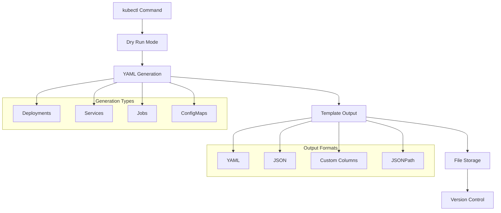
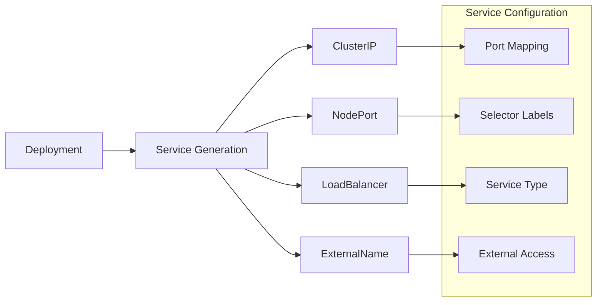
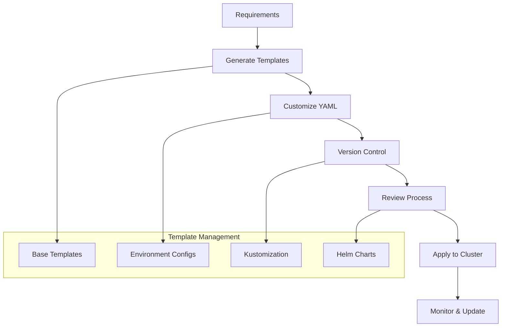

# Kubernetes Generator

## Overview
Learn Kubernetes YAML generation techniques using kubectl's dry-run and output options. Master declarative configuration creation, resource templating, and Infrastructure as Code practices.

## Files
- `Genrator.ipynb` - Jupyter notebook demonstrating kubectl YAML generation

<details>
<summary>📋 Generator Overview</summary>

### Purpose
- Learn kubectl YAML generation techniques
- Practice Infrastructure as Code (IaC) patterns
- Master dry-run and output formatting
- Understand Kubernetes resource templates

### Generation Workflow


</details>

<details>
<summary>🚀 Quick Start</summary>

### Prerequisites
- Kubernetes cluster access
- kubectl configured
- Basic understanding of Kubernetes resources

### Basic Generation Commands
```bash
# Generate deployment YAML
kubectl create deployment test --image nginx --dry-run=client -o yaml

# Generate service YAML
kubectl expose deployment/test --port 80 --dry-run=client -o yaml

# Generate job YAML
kubectl create job test --image nginx --dry-run=client -o yaml

# Save to file
kubectl create deployment test --image nginx --dry-run=client -o yaml > deployment.yaml
```

</details>

<details>
<summary>🔧 Deployment Generation</summary>

### Basic Deployment
```bash
# Simple deployment generation
kubectl create deployment test --image nginx --dry-run=client -o yaml
```

### Generated YAML Structure
```yaml
apiVersion: apps/v1
kind: Deployment
metadata:
  labels:
    app: test
  name: test
spec:
  replicas: 1
  selector:
    matchLabels:
      app: test
  template:
    metadata:
      labels:
        app: test
    spec:
      containers:
      - image: nginx
        name: nginx
```

### Advanced Deployment Options
```bash
# With replicas and resource limits
kubectl create deployment web --image nginx --replicas=3 --dry-run=client -o yaml

# With environment variables
kubectl create deployment app --image myapp:v1 --dry-run=client -o yaml -- --env="DB_HOST=localhost"
```

</details>

<details>
<summary>🌐 Service Generation</summary>

### Service Types


### Basic Service Generation
```bash
# ClusterIP service (default)
kubectl expose deployment/test --port 80 --dry-run=client -o yaml

# NodePort service
kubectl expose deployment/test --port 80 --type NodePort --dry-run=client -o yaml

# LoadBalancer service
kubectl expose deployment/test --port 80 --type LoadBalancer --dry-run=client -o yaml
```

### Generated Service YAML
```yaml
apiVersion: v1
kind: Service
metadata:
  labels:
    app: test
  name: test
spec:
  ports:
  - port: 80
    protocol: TCP
    targetPort: 80
  selector:
    app: test
```

</details>

<details>
<summary>⚙️ Job Generation</summary>

### Job Types and Patterns
```bash
# Simple job
kubectl create job test --image nginx --dry-run=client -o yaml

# CronJob generation
kubectl create cronjob backup --image backup:latest --schedule="0 2 * * *" --dry-run=client -o yaml
```

### Generated Job YAML
```yaml
apiVersion: batch/v1
kind: Job
metadata:
  name: test
spec:
  template:
    spec:
      containers:
      - image: nginx
        name: test
      restartPolicy: Never
```

### Job Configuration Options
```bash
# Job with completion count
kubectl create job process --image processor:v1 --dry-run=client -o yaml

# Job with parallelism
kubectl create job parallel-task --image worker:v1 --dry-run=client -o yaml
```

</details>

<details>
<summary>📄 Output Formats</summary>

### Format Options
```mermaid
graph TB
    A[kubectl Command] --> B[Output Format]
    B --> C[YAML (-o yaml)]
    B --> D[JSON (-o json)]
    B --> E[Custom Columns]
    B --> F[JSONPath]
    
    subgraph "Use Cases"
        G[Template Creation]
        H[Configuration Management]
        I[Automation Scripts]
        J[Documentation]
    end
    
    C --> G
    D --> H
    E --> I
    F --> J
```

### YAML Output
```bash
# Standard YAML format
kubectl create deployment app --image nginx --dry-run=client -o yaml

# Clean YAML (remove null fields)
kubectl create deployment app --image nginx --dry-run=client -o yaml | kubectl neat
```

### JSON Output
```bash
# JSON format for programmatic use
kubectl create deployment app --image nginx --dry-run=client -o json

# Pretty-printed JSON
kubectl create deployment app --image nginx --dry-run=client -o json | jq '.'
```

### Custom Columns
```bash
# Custom output format
kubectl get pods -o custom-columns=NAME:.metadata.name,STATUS:.status.phase,NODE:.spec.nodeName

# Wide output
kubectl get pods -o wide
```

</details>

<details>
<summary>🔄 Template Workflows</summary>

### Infrastructure as Code Pipeline


### Template Generation Workflow
```bash
# 1. Generate base template
kubectl create deployment myapp --image myapp:v1 --dry-run=client -o yaml > base-deployment.yaml

# 2. Generate service template
kubectl expose deployment/myapp --port 8080 --dry-run=client -o yaml > service.yaml

# 3. Customize templates
# Edit YAML files for specific requirements

# 4. Apply templates
kubectl apply -f base-deployment.yaml
kubectl apply -f service.yaml

# 5. Validate deployment
kubectl get all -l app=myapp
```

</details>

<details>
<summary>🛠️ Advanced Techniques</summary>

### Kustomization Integration
```bash
# Generate kustomization.yaml
kubectl create deployment app --image nginx --dry-run=client -o yaml > deployment.yaml
kubectl create service clusterip app --tcp=80:80 --dry-run=client -o yaml > service.yaml

# Create kustomization file
cat <<EOF > kustomization.yaml
resources:
- deployment.yaml
- service.yaml
EOF
```

### Helm Template Generation
```bash
# Generate Helm-compatible templates
kubectl create deployment {{ .Values.app.name }} --image {{ .Values.app.image }} --dry-run=client -o yaml

# Use with Helm template functions
helm template myapp . --dry-run
```

### GitOps Integration
```bash
# Generate manifests for GitOps
mkdir -p manifests/production
kubectl create deployment prod-app --image myapp:v1.0 --dry-run=client -o yaml > manifests/production/deployment.yaml
kubectl expose deployment/prod-app --port 8080 --dry-run=client -o yaml > manifests/production/service.yaml

# Commit to Git repository
git add manifests/
git commit -m "Add production manifests"
```

</details>

<details>
<summary>📚 Learning Outcomes</summary>

### Generator Skills
- kubectl dry-run techniques
- YAML template creation
- Output format mastery
- Resource configuration patterns

### IaC Concepts
- Declarative configuration
- Template management
- Version control integration
- Environment-specific configs

### Best Practices
- Template standardization
- Configuration validation
- Security considerations
- Automation integration

### Production Readiness
- CI/CD pipeline integration
- GitOps workflows
- Multi-environment management
- Configuration drift detection

</details>