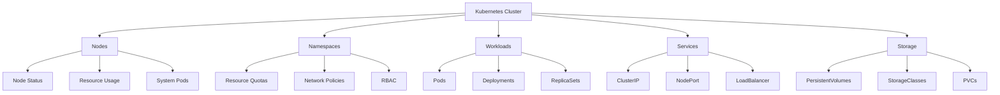

# Kubernetes Inspect

## Overview
Kubernetes resource inspection and debugging tools, focusing on cluster analysis, resource monitoring, and troubleshooting techniques.

## Files
- `Resource Inspecting.ipynb` - Jupyter notebook for Kubernetes resource inspection

<details>
<summary>📋 Inspection Overview</summary>

### Purpose
- Learn Kubernetes resource inspection techniques
- Practice cluster debugging and troubleshooting
- Understand resource relationships and dependencies
- Master kubectl inspection commands

### Inspection Scope


</details>

<details>
<summary>🚀 Quick Start</summary>

### Prerequisites
- Kubernetes cluster access
- kubectl configured
- Jupyter notebook environment
- Basic Kubernetes knowledge

### Running Inspections
```bash
# Start Jupyter notebook
jupyter notebook Resource\ Inspecting.ipynb

# Or run kubectl commands directly
kubectl get nodes -o wide
kubectl describe node <node-name>
kubectl top nodes
```

### Basic Inspection Commands
```bash
# Cluster overview
kubectl cluster-info
kubectl get all --all-namespaces

# Node inspection
kubectl get nodes
kubectl describe nodes
kubectl top nodes

# Pod inspection
kubectl get pods -o wide
kubectl describe pod <pod-name>
kubectl logs <pod-name>
```

</details>

<details>
<summary>🔍 Inspection Techniques</summary>

### Resource Analysis
```bash
# Detailed resource information
kubectl get <resource> -o yaml
kubectl get <resource> -o json
kubectl describe <resource> <name>

# Resource relationships
kubectl get pods --show-labels
kubectl get pods -l app=myapp
kubectl get events --sort-by=.metadata.creationTimestamp
```

### Performance Monitoring
```bash
# Resource usage
kubectl top nodes
kubectl top pods
kubectl top pods --containers

# Metrics and monitoring
kubectl get --raw /metrics
kubectl get componentstatuses
```

### Troubleshooting
```bash
# Pod debugging
kubectl logs <pod-name> --previous
kubectl exec -it <pod-name> -- /bin/bash
kubectl port-forward <pod-name> 8080:80

# Service debugging
kubectl get endpoints
kubectl describe service <service-name>
kubectl get ingress
```

</details>

<details>
<summary>📊 Advanced Inspection</summary>

### Custom Resource Queries
```bash
# JSONPath queries
kubectl get pods -o jsonpath='{.items[*].metadata.name}'
kubectl get nodes -o jsonpath='{.items[*].status.addresses[?(@.type=="InternalIP")].address}'

# Custom columns
kubectl get pods -o custom-columns=NAME:.metadata.name,STATUS:.status.phase,NODE:.spec.nodeName

# Field selectors
kubectl get pods --field-selector status.phase=Running
kubectl get events --field-selector involvedObject.kind=Pod
```

### Resource Relationships
```bash
# Owner references
kubectl get pods -o yaml | grep -A 5 ownerReferences

# Label selectors
kubectl get pods --show-labels
kubectl get pods -l environment=production

# Annotations
kubectl get pods -o jsonpath='{.items[*].metadata.annotations}'
```

</details>

<details>
<summary>🔧 Debugging Workflows</summary>

### Pod Troubleshooting
1. **Check Pod Status**: `kubectl get pods`
2. **Describe Pod**: `kubectl describe pod <name>`
3. **Check Logs**: `kubectl logs <name>`
4. **Exec into Pod**: `kubectl exec -it <name> -- /bin/bash`
5. **Check Events**: `kubectl get events`

### Service Debugging
1. **Check Service**: `kubectl get svc`
2. **Check Endpoints**: `kubectl get endpoints`
3. **Test Connectivity**: `kubectl run test-pod --image=busybox -it --rm`
4. **Port Forward**: `kubectl port-forward svc/<name> 8080:80`

### Network Troubleshooting
```bash
# DNS resolution
kubectl run -it --rm debug --image=busybox --restart=Never -- nslookup kubernetes.default

# Network connectivity
kubectl run -it --rm debug --image=nicolaka/netshoot --restart=Never

# Service mesh inspection
kubectl get virtualservices
kubectl get destinationrules
```

</details>

<details>
<summary>📚 Learning Outcomes</summary>

### Inspection Skills
- Resource querying and filtering
- Performance monitoring techniques
- Debugging methodologies
- Troubleshooting workflows

### Kubernetes Concepts
- Resource relationships and dependencies
- Cluster architecture understanding
- Networking and service discovery
- Storage and persistent volumes

### Operational Excellence
- Proactive monitoring strategies
- Incident response procedures
- Performance optimization
- Capacity planning

</details>