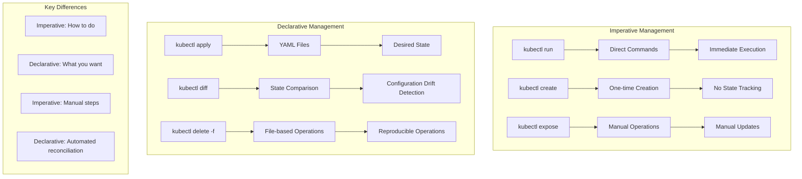
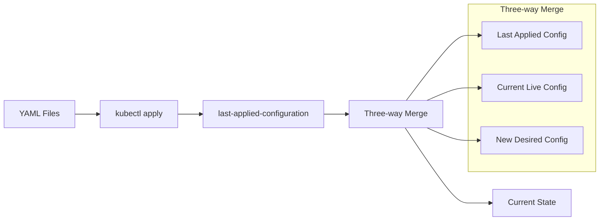
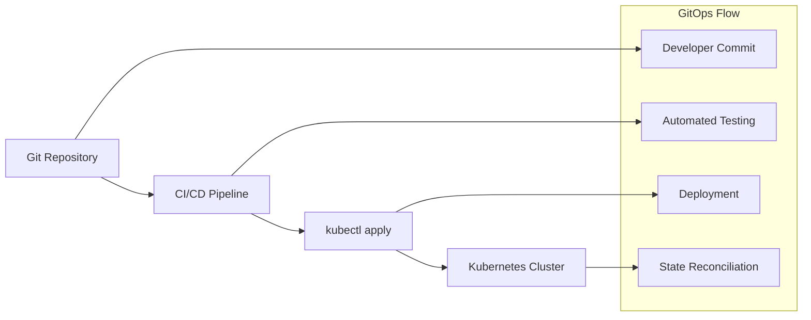

# Kubernetes Object Management

## Overview
Master Kubernetes object management approaches: Imperative vs Declarative methods. Learn the differences, limitations, and best practices for managing Kubernetes resources in production environments.

## Structure
- `imperative/` - Imperative management examples and limitations
- `declarative/` - Declarative management with kubectl apply

<details>
<summary>📋 Management Approaches Overview</summary>

### Purpose
- Understand imperative vs declarative management
- Learn kubectl create vs kubectl apply differences
- Practice resource lifecycle management
- Master production-ready deployment patterns

### Management Comparison


</details>

<details>
<summary>🚀 Imperative Management</summary>

### Command-Line Operations (From imperative/cmd.ipynb)

```bash
# Create pod imperatively
kubectl run nginx-pod --image nginx:1.27.0
# Output: pod/nginx-pod created

# Delete pod
kubectl delete pod nginx-pod
# Output: pod "nginx-pod" deleted

# Create from YAML file
kubectl create -f nginx-pod.yaml
# Output: pod/nginx-pod created

# Create service from YAML
kubectl create -f nginx-service.yaml
# Output: service/nginx-svc created
```

### Resource Inspection
```bash
# Get pod details
kubectl get pods
# Output: NAME        READY   STATUS    RESTARTS   AGE
#         nginx-pod   1/1     Running   0          8s

# Describe pod for detailed information
kubectl describe pod nginx-pod
# Shows: Labels, Annotations, IP, Events, etc.

# Test service connectivity
kubectl run curl --image=curlimages/curl:8.12.1 --restart=Never --attach --rm -- curl -sS http://10.99.213.87
# Returns nginx welcome page HTML
```

### YAML Generation
```bash
# Generate pod YAML
kubectl run color-api --image=anil1318/color-api:latest --dry-run=client -o yaml

# Generate service YAML
kubectl expose pod nginx-pod --type=NodePort --port=80 --dry-run=client -o yaml
```

</details>

<details>
<summary>⚠️ Imperative Limitations</summary>

### Update Restrictions (From imperative/limitation.ipynb)

```bash
# View current pod configuration
kubectl get pod nginx-pod -o yaml
# Shows complete pod specification with system-generated fields

# Attempt to replace pod configuration
kubectl replace -f nginx-pod.yaml
# Error: spec: Forbidden: pod updates may not change fields other than 
# `spec.containers[*].image`, `spec.initContainers[*].image`, etc.
```

### Key Limitations Demonstrated
1. **Immutable Fields**: Most pod spec fields cannot be updated
2. **Manual Tracking**: No automatic state management
3. **Configuration Drift**: Changes made outside of files aren't tracked
4. **Error-Prone**: Manual operations increase risk of mistakes

### Workaround Pattern
```bash
# Delete and recreate for updates
kubectl delete -f nginx-pod.yaml
kubectl create -f nginx-pod.yaml
# This causes downtime and loses runtime state
```

</details>

<details>
<summary>✅ Declarative Management</summary>

### kubectl apply Workflow (From declarative/cmd.ipynb)

```bash
# Apply single resource
kubectl apply -f nginx-pod.yaml
# Output: pod/nginx-pod created

# Apply entire directory
kubectl apply -f .
# Output: pod/nginx-pod created
#         service/nginx-svc created

# Check for configuration differences
kubectl diff -f .
# Shows differences between desired and current state

# Apply changes (image update example)
kubectl apply -f .
# Output: pod/nginx-pod configured
#         service/nginx-svc unchanged
```

### State Management Features


### Configuration Tracking
```bash
# View last-applied-configuration annotation
kubectl get pod nginx-pod -o yaml
# Shows: kubectl.kubernetes.io/last-applied-configuration annotation
# Contains: JSON representation of last applied configuration
```

</details>

<details>
<summary>🔄 Migration from Imperative to Declarative</summary>

### Migration Process (From migrating imperative to declarative.ipynb)

```bash
# Step 1: Create resource imperatively
kubectl create -f nginx-pod.yaml
# Output: pod/nginx-pod created

# Step 2: Attempt declarative management
kubectl apply -f .
# Warning: resource pods/nginx-pod is missing the 
# kubectl.kubernetes.io/last-applied-configuration annotation
# Output: pod/nginx-pod configured
#         service/nginx-svc created
```

### Annotation Addition
```bash
# After migration, check annotations
kubectl get pod nginx-pod -o yaml
# Now includes: kubectl.kubernetes.io/last-applied-configuration
```

### Best Practices for Migration
1. **Backup Current State**: Export existing resources
2. **Test in Non-Production**: Validate migration process
3. **Use kubectl apply**: Adds required annotations automatically
4. **Verify Functionality**: Ensure services work after migration

</details>

<details>
<summary>📊 Command Comparison</summary>

### kubectl create vs kubectl apply

| Aspect | kubectl create | kubectl apply |
|--------|----------------|---------------|
| **Purpose** | One-time creation | Continuous management |
| **Idempotency** | ❌ Fails if exists | ✅ Updates if exists |
| **State Tracking** | ❌ No tracking | ✅ Tracks last-applied-configuration |
| **Updates** | ❌ Manual delete/create | ✅ Automatic three-way merge |
| **Production Use** | ❌ Not recommended | ✅ Recommended |
| **Error Handling** | ❌ "AlreadyExists" errors | ✅ Graceful handling |

### Practical Examples
```bash
# create: Fails on second run
kubectl create -f nginx.yaml
kubectl create -f nginx.yaml  # Error: AlreadyExists

# apply: Succeeds on multiple runs
kubectl apply -f nginx.yaml
kubectl apply -f nginx.yaml   # Output: unchanged
```

</details>

<details>
<summary>🔧 Advanced Declarative Features</summary>

### Multi-Resource Management
```yaml
# nginx.yaml - Combined pod and service
apiVersion: v1
kind: Pod
metadata:
  name: nginx-pod
  labels:
    app: nginx
spec:
  containers:
    - name: nginx
      image: nginx:1.27.0-alpine
      ports:
        - containerPort: 80
---
apiVersion: v1
kind: Service
metadata:
  name: nginx-svc
spec:
  type: NodePort
  ports:
    - port: 80
      targetPort: 80
  selector:
    app: nginx
```

### Configuration Drift Detection
```bash
# Check for differences before applying
kubectl diff -f .
# Output shows exact changes that would be made:
# -  - image: nginx:1.27.0
# +  - image: nginx:1.27.0-alpine
```

### Rollback Capabilities
```bash
# Apply changes
kubectl apply -f nginx.yaml

# Rollback by applying previous version
git checkout HEAD~1 nginx.yaml
kubectl apply -f nginx.yaml
```

</details>

<details>
<summary>📁 File Structure Analysis</summary>

### Imperative Directory
```
imperative/
├── cmd.ipynb                    # Basic imperative commands
├── limitation.ipynb             # Demonstrates update limitations
├── nginx-pod.yaml              # Pod configuration
└── nginx-service.yaml          # Service configuration
```

### Declarative Directory
```
declarative/
├── cmd.ipynb                    # Declarative management commands
├── migrating imperative to declarative.ipynb  # Migration process
├── nginx-pod.yaml              # Individual pod file
├── nginx-service.yaml          # Individual service file
└── nginx.yaml                  # Combined multi-resource file
```

### Key Learning Files
- **imperative/cmd.ipynb**: Basic kubectl create/delete operations
- **imperative/limitation.ipynb**: Why imperative management fails for updates
- **declarative/cmd.ipynb**: kubectl apply workflow and benefits
- **declarative/migrating...ipynb**: How to migrate existing resources

</details>

<details>
<summary>🎯 Production Best Practices</summary>

### Declarative Management Guidelines
```bash
# 1. Always use kubectl apply for production
kubectl apply -f production/

# 2. Use version control for YAML files
git add *.yaml
git commit -m "Update nginx image version"

# 3. Test changes with diff before applying
kubectl diff -f production/
kubectl apply -f production/

# 4. Use directories for related resources
kubectl apply -f ./microservice-a/
kubectl apply -f ./microservice-b/
```

### GitOps Integration


### Monitoring and Observability
```bash
# Track resource changes
kubectl get events --sort-by=.metadata.creationTimestamp

# Monitor resource status
kubectl get pods -w

# Validate applied configuration
kubectl get pod nginx-pod -o yaml | grep last-applied-configuration
```

</details>

<details>
<summary>🔍 Troubleshooting Guide</summary>

### Common Issues and Solutions

#### Issue: "AlreadyExists" Error
```bash
# Problem: Using kubectl create on existing resource
kubectl create -f nginx.yaml
# Error: pods "nginx-pod" already exists

# Solution: Use kubectl apply instead
kubectl apply -f nginx.yaml
```

#### Issue: Missing Annotation Warning
```bash
# Problem: Migrating from imperative to declarative
kubectl apply -f nginx.yaml
# Warning: missing kubectl.kubernetes.io/last-applied-configuration

# Solution: Annotation is added automatically, warning is informational
```

#### Issue: Configuration Drift
```bash
# Problem: Manual changes not reflected in files
kubectl edit pod nginx-pod  # Manual change

# Detection: Use diff to see discrepancies
kubectl diff -f nginx.yaml

# Solution: Update YAML files and reapply
kubectl apply -f nginx.yaml
```

</details>

<details>
<summary>📚 Learning Progression</summary>

### Recommended Learning Path
1. **Start with Imperative** (imperative/cmd.ipynb)
   - Understand basic kubectl commands
   - Learn resource creation and deletion
   - Practice with simple examples

2. **Discover Limitations** (imperative/limitation.ipynb)
   - Experience update restrictions
   - Understand why imperative fails
   - Learn about immutable fields

3. **Master Declarative** (declarative/cmd.ipynb)
   - Learn kubectl apply workflow
   - Understand three-way merge
   - Practice with configuration updates

4. **Migration Skills** (declarative/migrating...ipynb)
   - Convert existing resources
   - Handle annotation warnings
   - Validate migration success

### Key Takeaways
- **Imperative**: Good for learning and quick tasks
- **Declarative**: Essential for production environments
- **Migration**: Possible but requires careful planning
- **Best Practice**: Always use declarative management in production

</details>

---

**Note**: This repository demonstrates the evolution from imperative to declarative Kubernetes management, emphasizing why declarative approaches are crucial for production environments and providing hands-on experience with both methodologies.