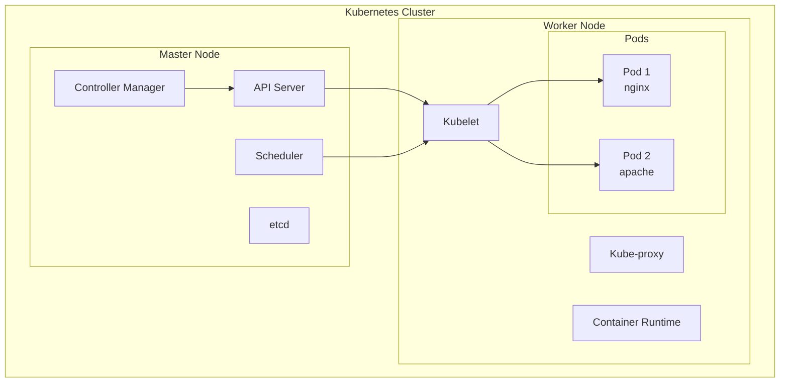
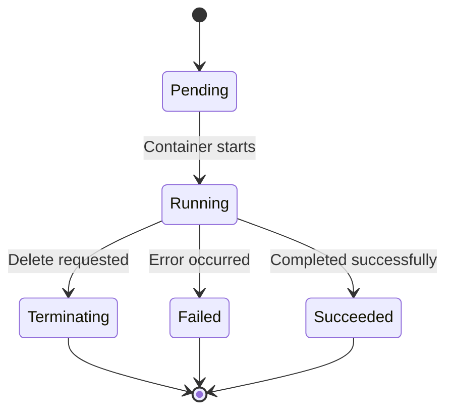
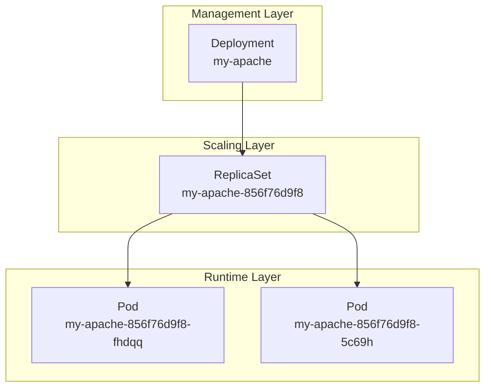
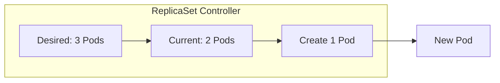
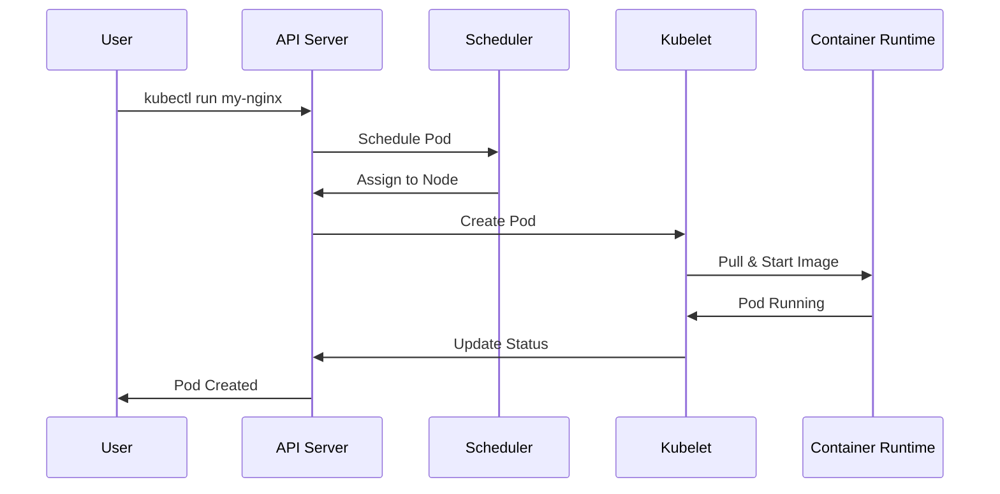
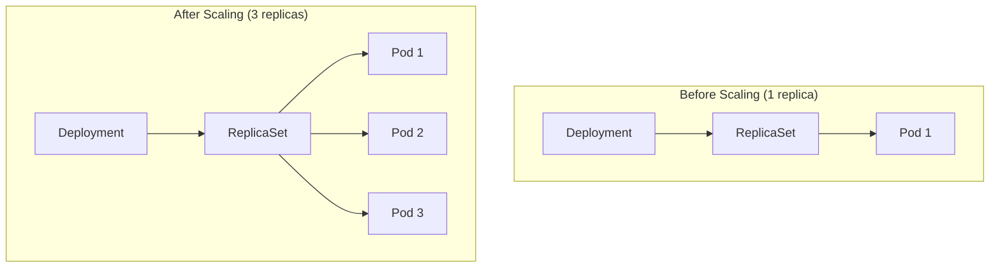
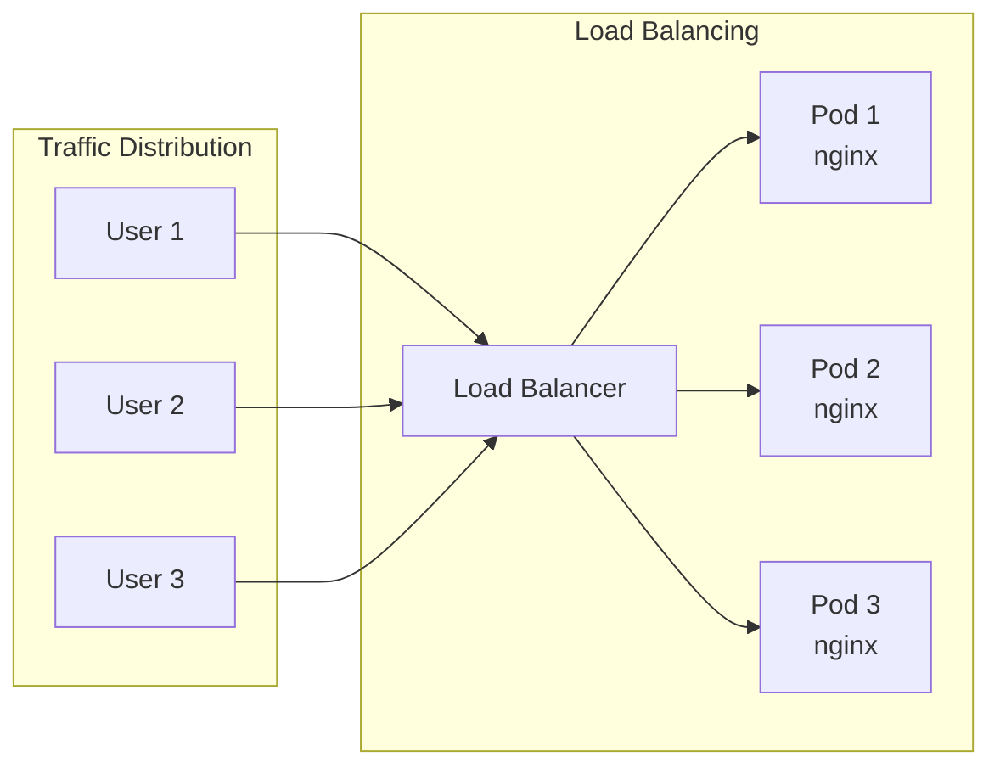
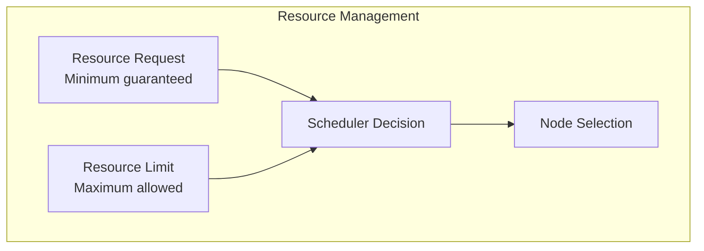
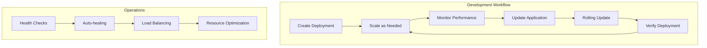
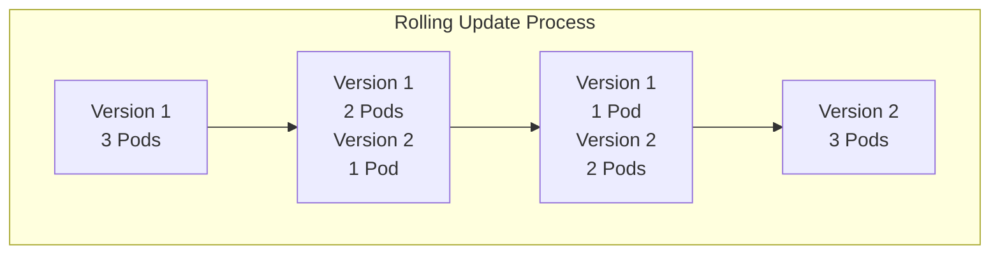

# Kubernetes Pods

A comprehensive guide to Kubernetes Pods, ReplicaSets, and Deployments. This repository demonstrates fundamental Kubernetes concepts including pod creation, scaling, and management through practical examples and hands-on exercises.

## 📋 Table of Contents

- [Overview](#overview)
- [Kubernetes Architecture](#kubernetes-architecture)
- [Pod Fundamentals](#pod-fundamentals)
- [Deployments & ReplicaSets](#deployments--replicasets)
- [Pod Lifecycle](#pod-lifecycle)
- [Scaling Operations](#scaling-operations)
- [Best Practices](#best-practices)
- [Troubleshooting](#troubleshooting)

## 🎯 Overview

This repository covers essential Kubernetes concepts for container orchestration:

- **Pod Creation and Management**
- **Deployment Strategies**
- **ReplicaSet Operations**
- **Scaling and Load Distribution**
- **Pod Lifecycle Management**

## 🏗️ Kubernetes Architecture



## 🚀 Pod Fundamentals

<details>
<summary><strong>Basic Pod Operations</strong></summary>

### Creating Pods (From Running Pods.ipynb)

```bash
# Check Kubernetes version
kubectl version
# Output: Client Version: v1.32.2, Server Version: v1.32.2

# Create a simple pod
kubectl run my-nginx --image nginx
# Output: pod/my-nginx created

# Check pod status
kubectl get pods
# Output: NAME       READY   STATUS    RESTARTS   AGE
#         my-nginx   1/1     Running   0          65s

# Get detailed information about all resources
kubectl get all
# Shows pods, services, deployments, and replicasets
```

### Pod vs Deployment Comparison

```bash
# Create deployment (managed pods)
kubectl create deployment my-nginx --image nginx
# Output: deployment.apps/my-nginx created

# Now you have both standalone pod and deployment-managed pod
kubectl get pods
# Output: NAME                        READY   STATUS    RESTARTS   AGE
#         my-nginx                    1/1     Running   0          11m
#         my-nginx-5b584c864b-hmln8   1/1     Running   0          9s
```

### Pod vs Deployment

```mermaid
graph LR
    subgraph "Direct Pod Creation"
        A[kubectl run] --> B[Single Pod]
        B --> C[No Auto-healing]
    end
    
    subgraph "Deployment Creation"
        D[kubectl create deployment] --> E[Deployment]
        E --> F[ReplicaSet]
        F --> G[Pod(s)]
        G --> H[Auto-healing]
    end
```

### Pod Lifecycle States



</details>

## 📦 Deployments & ReplicaSets

<details>
<summary><strong>Deployment Management</strong></summary>

### Creating Deployments (From Relicaset.ipynb)

```bash
# Create Apache deployment
kubectl create deployment my-apache --image httpd
# Output: deployment.apps/my-apache created

# Check pod creation
kubectl get pod
# Output: NAME                         READY   STATUS    RESTARTS   AGE
#         my-apache-856f76d9f8-fhdqq   1/1     Running   0          9s

# View all resources created by deployment
kubectl get all
# Shows:
# - pod/my-apache-856f76d9f8-fhdqq
# - deployment.apps/my-apache (1/1 ready)
# - replicaset.apps/my-apache-856f76d9f8 (1 desired, 1 current, 1 ready)
```

### Deployment Hierarchy



### Deployment Benefits

- **Declarative Updates**: Define desired state
- **Rolling Updates**: Zero-downtime deployments
- **Rollback Capability**: Revert to previous versions
- **Scaling**: Horizontal pod autoscaling
- **Self-healing**: Automatic pod replacement

</details>

<details>
<summary><strong>ReplicaSet Operations</strong></summary>

### ReplicaSet Functionality



### Scaling Operations (From Relicaset.ipynb)

```bash
# Scale Apache deployment to 2 replicas
kubectl scale deploy/my-apache --replicas 2
# Output: deployment.apps/my-apache scaled

# Verify scaling results
kubectl get all
# Output shows:
# pod/my-apache-856f76d9f8-5c69h   1/1     Running   0          59s
# pod/my-apache-856f76d9f8-fhdqq   1/1     Running   0          2m53s
# deployment.apps/my-apache   2/2     2            2           2m53s
# replicaset.apps/my-apache-856f76d9f8   2         2         2       2m53s

# ReplicaSet automatically maintains desired pod count
```

</details>

## 🔄 Pod Lifecycle

<details>
<summary><strong>Pod Creation Process</strong></summary>

### Pod Creation Flow



### Pod States and Transitions

| State | Description | Next States |
|-------|-------------|-------------|
| Pending | Pod accepted, not scheduled | Running, Failed |
| Running | Pod bound to node, containers running | Succeeded, Failed, Terminating |
| Succeeded | All containers terminated successfully | - |
| Failed | All containers terminated, at least one failed | - |
| Unknown | Pod state cannot be determined | Any |

</details>

## 📈 Scaling Operations

<details>
<summary><strong>Horizontal Scaling</strong></summary>

### Manual Scaling (Practical Examples)

```bash
# Scale up deployment (from notebook example)
kubectl scale deploy/my-apache --replicas 2
# Output: deployment.apps/my-apache scaled

# Scale down deployment
kubectl scale deploy/my-apache --replicas 1

# Check scaling status
kubectl get deployment
# Shows: my-apache   2/2     2            2           2m53s

kubectl get pods
# Shows both pods running:
# my-apache-856f76d9f8-5c69h   1/1     Running   0          59s
# my-apache-856f76d9f8-fhdqq   1/1     Running   0          2m53s
```

### Scaling Visualization



### Load Distribution



</details>

## 🛠️ Resource Management

<details>
<summary><strong>Pod Resource Specifications</strong></summary>

### Resource Requests and Limits

```yaml
apiVersion: v1
kind: Pod
metadata:
  name: resource-demo
spec:
  containers:
  - name: nginx
    image: nginx
    resources:
      requests:
        memory: "64Mi"
        cpu: "250m"
      limits:
        memory: "128Mi"
        cpu: "500m"
```

### Resource Management Flow



</details>

## 🎯 Best Practices

<details>
<summary><strong>🔧 Pod Management Best Practices</strong></summary>

- ✅ Use Deployments instead of bare Pods
- ✅ Set appropriate resource requests and limits
- ✅ Implement health checks (liveness/readiness probes)
- ✅ Use meaningful labels and selectors
- ✅ Follow the single responsibility principle per container

</details>

<details>
<summary><strong>🚀 Deployment Best Practices</strong></summary>

- ✅ Use rolling update strategy for zero-downtime deployments
- ✅ Set appropriate replica counts based on load
- ✅ Implement proper monitoring and logging
- ✅ Use namespaces for environment separation
- ✅ Regular backup of deployment configurations

</details>

<details>
<summary><strong>🔒 Security Best Practices</strong></summary>

- ✅ Run containers as non-root users
- ✅ Use security contexts and pod security policies
- ✅ Implement network policies for traffic control
- ✅ Regular security updates and image scanning
- ✅ Use secrets for sensitive data

</details>

## 📊 Monitoring and Observability

<details>
<summary><strong>Pod Monitoring Commands</strong></summary>

```bash
# Get pod status
kubectl get pods
kubectl get pods -o wide

# Describe pod details
kubectl describe pod <pod-name>

# View pod logs
kubectl logs <pod-name>

# Execute commands in pod
kubectl exec -it <pod-name> -- /bin/bash

# Monitor resource usage
kubectl top pods
```

</details>

<details>
<summary><strong>Deployment Monitoring</strong></summary>

```bash
# Check deployment status
kubectl get deployments
kubectl rollout status deployment/my-apache

# View deployment history
kubectl rollout history deployment/my-apache

# Monitor scaling events
kubectl get events --sort-by=.metadata.creationTimestamp
```

</details>

## 🔍 Troubleshooting

<details>
<summary><strong>Common Issues & Solutions</strong></summary>

### Pod Stuck in Pending State
```bash
# Check node resources
kubectl describe nodes

# Check pod events
kubectl describe pod <pod-name>

# Verify image availability
kubectl get events
```

### Pod CrashLoopBackOff
```bash
# Check pod logs
kubectl logs <pod-name> --previous

# Describe pod for events
kubectl describe pod <pod-name>

# Check resource limits
kubectl get pod <pod-name> -o yaml
```

### Deployment Not Scaling
```bash
# Check deployment status
kubectl get deployment <deployment-name>

# Verify ReplicaSet
kubectl get replicaset

# Check for resource constraints
kubectl describe nodes
```

</details>

## 📁 File Structure

```
Kubernethes Pods/
├── Running Pods.ipynb          # Pod creation, deployment comparison, cleanup
│                               # - kubectl run vs kubectl create deployment
│                               # - Pod lifecycle demonstration
│                               # - Resource cleanup (kubectl delete)
└── Relicaset.ipynb            # Deployment scaling and ReplicaSet management
                                # - Apache deployment creation
                                # - Scaling from 1 to 2 replicas
                                # - ReplicaSet automatic pod management
```

## 📝 Key Learning Points from Notebooks

<details>
<summary><strong>Running Pods.ipynb Insights</strong></summary>

### Pod Creation Methods
1. **Standalone Pod**: `kubectl run my-nginx --image nginx`
   - Creates single pod without management
   - No auto-healing or scaling
   - Manual lifecycle management

2. **Deployment-Managed Pod**: `kubectl create deployment my-nginx --image nginx`
   - Creates deployment → replicaset → pod hierarchy
   - Automatic healing and scaling capabilities
   - Declarative management

### Resource Hierarchy Observed
```
kubectl get all output shows:
├── pod/my-nginx (standalone)
├── pod/my-nginx-5b584c864b-hmln8 (managed)
├── service/kubernetes
├── deployment.apps/my-nginx
└── replicaset.apps/my-nginx-5b584c864b
```

</details>

<details>
<summary><strong>Relicaset.ipynb Insights</strong></summary>

### Scaling Demonstration
1. **Initial State**: 1 Apache pod running
2. **Scaling Command**: `kubectl scale deploy/my-apache --replicas 2`
3. **Result**: ReplicaSet creates additional pod automatically
4. **Final State**: 2 pods with same ReplicaSet hash (856f76d9f8)

### ReplicaSet Naming Convention
- **Deployment**: `my-apache`
- **ReplicaSet**: `my-apache-856f76d9f8` (deployment + hash)
- **Pods**: `my-apache-856f76d9f8-fhdqq`, `my-apache-856f76d9f8-5c69h`

### Scaling Verification
```bash
# Before scaling: 1/1 pods ready
deployment.apps/my-apache   1/1     1            1           19s

# After scaling: 2/2 pods ready  
deployment.apps/my-apache   2/2     2            2           2m53s
```

</details>

## 🎓 Learning Path (Based on Notebook Progression)

1. **Pod Basics** (`Running Pods.ipynb`): 
   - Kubernetes version verification
   - Single pod creation with `kubectl run`
   - Understanding pod states and lifecycle

2. **Deployments** (`Running Pods.ipynb`):
   - Deployment creation with `kubectl create deployment`
   - Comparing standalone vs managed pods
   - Resource hierarchy understanding

3. **Scaling** (`Relicaset.ipynb`):
   - ReplicaSet automatic management
   - Manual scaling with `kubectl scale`
   - Pod distribution and naming conventions

4. **Cleanup & Management**:
   - Resource deletion (`kubectl delete pod`, `kubectl delete deployment`)
   - State verification with `kubectl get all`
   - Best practices for resource management

## 📈 Pod Management Workflow



## 🔄 Deployment Strategies

<details>
<summary><strong>Rolling Update Strategy</strong></summary>



**Benefits:**
- Zero downtime deployment
- Gradual traffic shift
- Easy rollback capability
- Resource efficient

</details>

---

**Note**: This repository provides hands-on experience with Kubernetes pod management, from basic operations to advanced deployment strategies, emphasizing best practices for production environments.