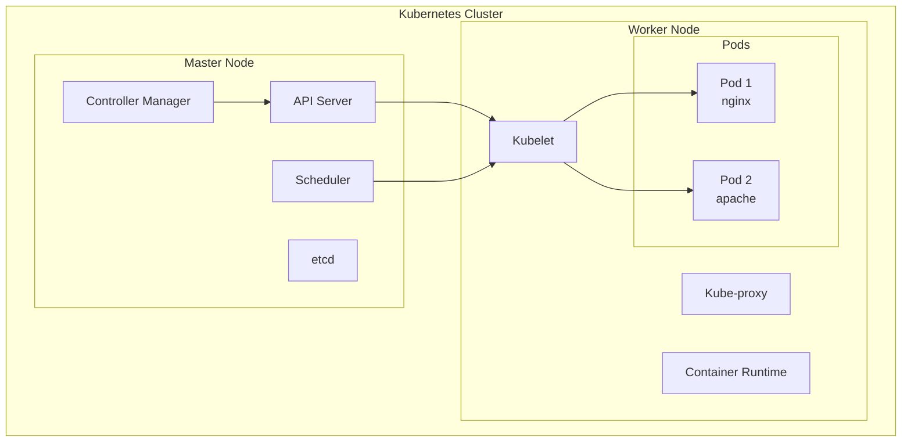
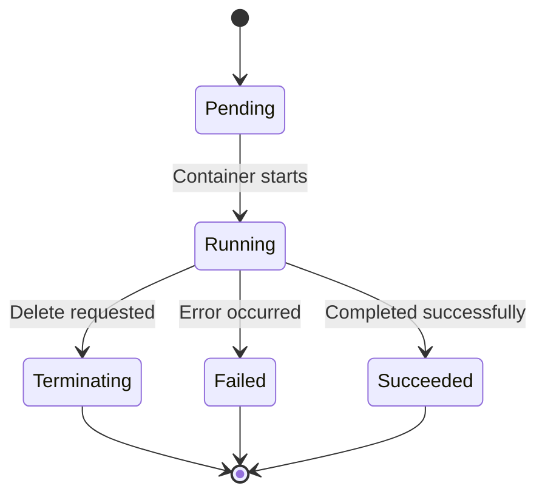
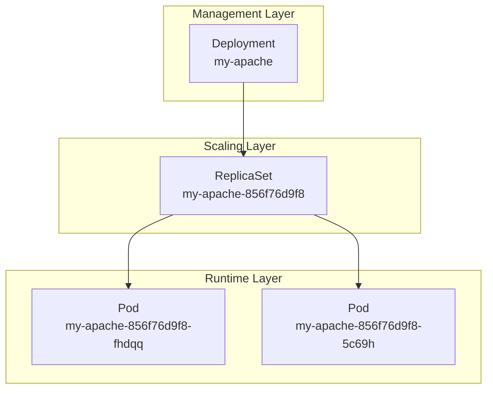
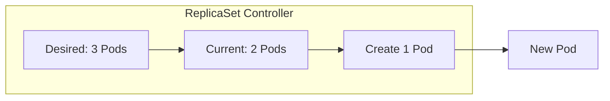
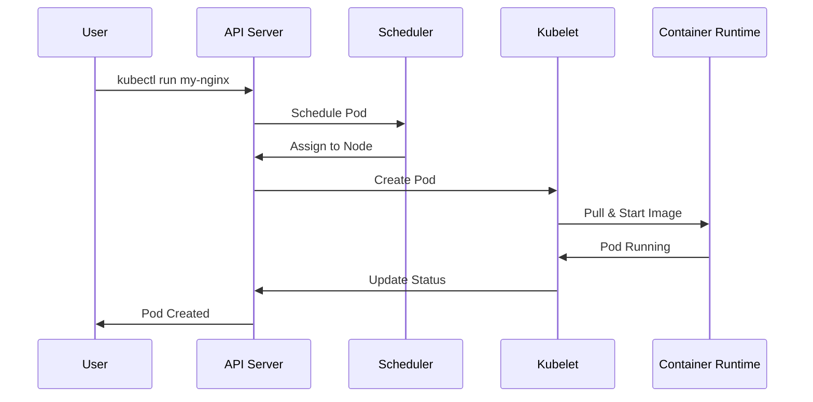
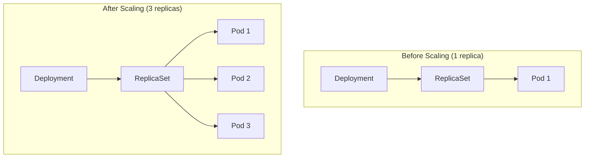
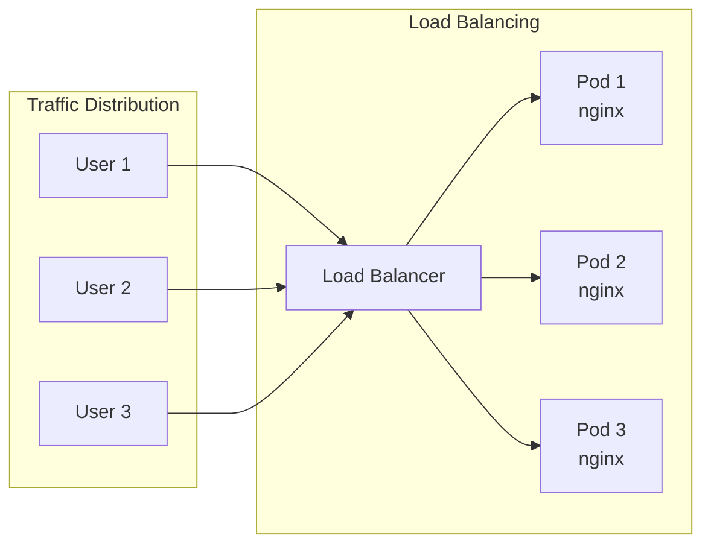
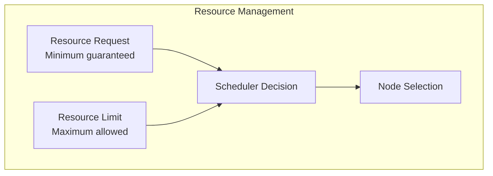
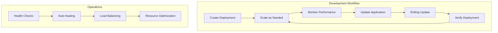
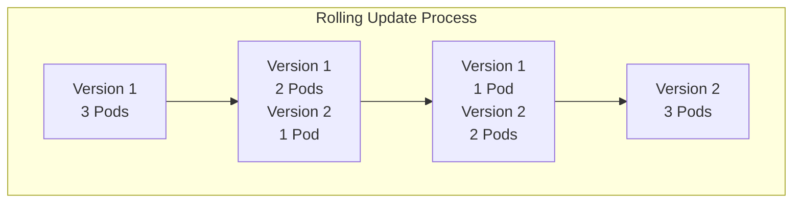

# Kubernetes Pods

A comprehensive guide to Kubernetes Pods, ReplicaSets, and Deployments. This repository demonstrates fundamental Kubernetes concepts including pod creation, scaling, and management through practical examples and hands-on exercises.

## 📋 Table of Contents

- [Overview](#overview)
- [Kubernetes Architecture](#kubernetes-architecture)
- [Pod Fundamentals](#pod-fundamentals)
- [Deployments & ReplicaSets](#deployments--replicasets)
- [Pod Lifecycle](#pod-lifecycle)
- [Scaling Operations](#scaling-operations)
- [Best Practices](#best-practices)
- [Troubleshooting](#troubleshooting)

## 🎯 Overview

This repository covers essential Kubernetes concepts for container orchestration:

- **Pod Creation and Management**
- **Deployment Strategies**
- **ReplicaSet Operations**
- **Scaling and Load Distribution**
- **Pod Lifecycle Management**

## 🏗️ Kubernetes Architecture



## 🚀 Pod Fundamentals

<details>
<summary><strong>Basic Pod Operations</strong></summary>

### Creating Pods

```bash
# Create a simple pod
kubectl run my-nginx --image nginx

# Check pod status
kubectl get pods

# Get detailed information
kubectl get all
```

### Pod vs Deployment

```mermaid
graph LR
    subgraph "Direct Pod Creation"
        A[kubectl run] --> B[Single Pod]
        B --> C[No Auto-healing]
    end
    
    subgraph "Deployment Creation"
        D[kubectl create deployment] --> E[Deployment]
        E --> F[ReplicaSet]
        F --> G[Pod(s)]
        G --> H[Auto-healing]
    end
```

### Pod Lifecycle States



</details>

## 📦 Deployments & ReplicaSets

<details>
<summary><strong>Deployment Management</strong></summary>

### Creating Deployments

```bash
# Create deployment
kubectl create deployment my-apache --image httpd

# View deployment details
kubectl get deployment
kubectl get replicaset
kubectl get pods
```

### Deployment Hierarchy



### Deployment Benefits

- **Declarative Updates**: Define desired state
- **Rolling Updates**: Zero-downtime deployments
- **Rollback Capability**: Revert to previous versions
- **Scaling**: Horizontal pod autoscaling
- **Self-healing**: Automatic pod replacement

</details>

<details>
<summary><strong>ReplicaSet Operations</strong></summary>

### ReplicaSet Functionality



### Scaling Operations

```bash
# Scale deployment
kubectl scale deploy/my-apache --replicas 2

# Verify scaling
kubectl get all

# Check pod distribution
kubectl get pods -o wide
```

</details>

## 🔄 Pod Lifecycle

<details>
<summary><strong>Pod Creation Process</strong></summary>

### Pod Creation Flow



### Pod States and Transitions

| State | Description | Next States |
|-------|-------------|-------------|
| Pending | Pod accepted, not scheduled | Running, Failed |
| Running | Pod bound to node, containers running | Succeeded, Failed, Terminating |
| Succeeded | All containers terminated successfully | - |
| Failed | All containers terminated, at least one failed | - |
| Unknown | Pod state cannot be determined | Any |

</details>

## 📈 Scaling Operations

<details>
<summary><strong>Horizontal Scaling</strong></summary>

### Manual Scaling

```bash
# Scale up deployment
kubectl scale deploy/my-apache --replicas 5

# Scale down deployment
kubectl scale deploy/my-apache --replicas 1

# Check scaling status
kubectl get deployment
kubectl get pods
```

### Scaling Visualization



### Load Distribution



</details>

## 🛠️ Resource Management

<details>
<summary><strong>Pod Resource Specifications</strong></summary>

### Resource Requests and Limits

```yaml
apiVersion: v1
kind: Pod
metadata:
  name: resource-demo
spec:
  containers:
  - name: nginx
    image: nginx
    resources:
      requests:
        memory: "64Mi"
        cpu: "250m"
      limits:
        memory: "128Mi"
        cpu: "500m"
```

### Resource Management Flow



</details>

## 🎯 Best Practices

<details>
<summary><strong>🔧 Pod Management Best Practices</strong></summary>

- ✅ Use Deployments instead of bare Pods
- ✅ Set appropriate resource requests and limits
- ✅ Implement health checks (liveness/readiness probes)
- ✅ Use meaningful labels and selectors
- ✅ Follow the single responsibility principle per container

</details>

<details>
<summary><strong>🚀 Deployment Best Practices</strong></summary>

- ✅ Use rolling update strategy for zero-downtime deployments
- ✅ Set appropriate replica counts based on load
- ✅ Implement proper monitoring and logging
- ✅ Use namespaces for environment separation
- ✅ Regular backup of deployment configurations

</details>

<details>
<summary><strong>🔒 Security Best Practices</strong></summary>

- ✅ Run containers as non-root users
- ✅ Use security contexts and pod security policies
- ✅ Implement network policies for traffic control
- ✅ Regular security updates and image scanning
- ✅ Use secrets for sensitive data

</details>

## 📊 Monitoring and Observability

<details>
<summary><strong>Pod Monitoring Commands</strong></summary>

```bash
# Get pod status
kubectl get pods
kubectl get pods -o wide

# Describe pod details
kubectl describe pod <pod-name>

# View pod logs
kubectl logs <pod-name>

# Execute commands in pod
kubectl exec -it <pod-name> -- /bin/bash

# Monitor resource usage
kubectl top pods
```

</details>

<details>
<summary><strong>Deployment Monitoring</strong></summary>

```bash
# Check deployment status
kubectl get deployments
kubectl rollout status deployment/my-apache

# View deployment history
kubectl rollout history deployment/my-apache

# Monitor scaling events
kubectl get events --sort-by=.metadata.creationTimestamp
```

</details>

## 🔍 Troubleshooting

<details>
<summary><strong>Common Issues & Solutions</strong></summary>

### Pod Stuck in Pending State
```bash
# Check node resources
kubectl describe nodes

# Check pod events
kubectl describe pod <pod-name>

# Verify image availability
kubectl get events
```

### Pod CrashLoopBackOff
```bash
# Check pod logs
kubectl logs <pod-name> --previous

# Describe pod for events
kubectl describe pod <pod-name>

# Check resource limits
kubectl get pod <pod-name> -o yaml
```

### Deployment Not Scaling
```bash
# Check deployment status
kubectl get deployment <deployment-name>

# Verify ReplicaSet
kubectl get replicaset

# Check for resource constraints
kubectl describe nodes
```

</details>

## 📁 File Structure

```
Kubernethes Pods/
├── Running Pods.ipynb          # Basic pod operations and lifecycle
└── Relicaset.ipynb            # Deployment and ReplicaSet management
```

## 🎓 Learning Path

1. **Pod Basics**: Understanding containers in Kubernetes
2. **Deployments**: Managing application lifecycle
3. **Scaling**: Horizontal pod autoscaling
4. **Monitoring**: Observability and troubleshooting
5. **Advanced**: Resource management and security

## 📈 Pod Management Workflow



## 🔄 Deployment Strategies

<details>
<summary><strong>Rolling Update Strategy</strong></summary>



**Benefits:**
- Zero downtime deployment
- Gradual traffic shift
- Easy rollback capability
- Resource efficient

</details>

---

**Note**: This repository provides hands-on experience with Kubernetes pod management, from basic operations to advanced deployment strategies, emphasizing best practices for production environments.