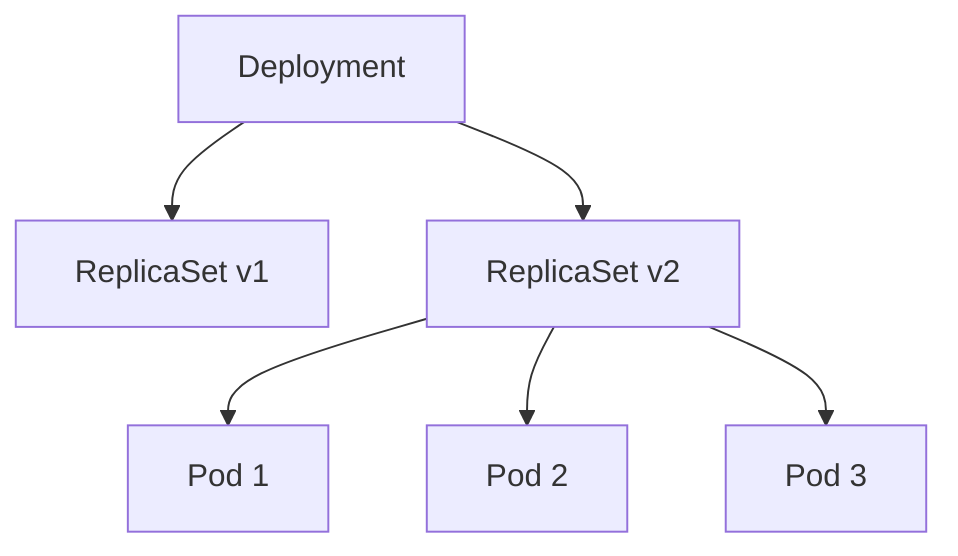
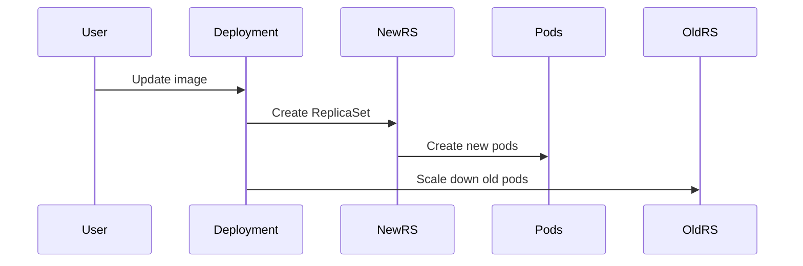

# Kubernetes ReplicaSets and Deployments

## Architecture



## ReplicaSet

<details>
<summary>Configuration</summary>

```yaml
apiVersion: apps/v1
kind: ReplicaSet
metadata:
  name: nginx-replicaset
spec:
  replicas: 3
  selector:
    matchLabels:
      app: nginx
  template:
    metadata:
      labels:
        app: nginx
    spec:
      containers:
      - name: nginx
        image: nginx:1.27.0-alpine
        ports:
        - containerPort: 80
```

</details>

<details>
<summary>Commands</summary>

```bash
kubectl apply -f nginx-rs.yaml
kubectl get rs
kubectl delete pod <pod-name>  # Self-healing test
```

</details>

## Deployment

<details>
<summary>Configuration</summary>

```yaml
apiVersion: apps/v1
kind: Deployment
metadata:
  name: nginx-deployment
  annotations:
    "kubernethes.io/change-cause": "update nginx to tag 1.27.0-alpine"
spec:
  replicas: 10
  selector:
    matchLabels:
      app: nginx
  template:
    metadata:
      labels:
        app: nginx
    spec:
      containers:
      - name: nginx
        image: nginx:1.27.0-alpine
        ports:
        - containerPort: 80
```

</details>

<details>
<summary>Rolling Updates</summary>



```bash
kubectl apply -f nginx-deployment.yaml
kubectl rollout status deployment/nginx-deployment
kubectl rollout history deployment/nginx-deployment
kubectl rollout undo deployment/nginx-deployment
```

</details>

<details>
<summary>Troubleshooting</summary>

```bash
# Check failed pods
kubectl describe pod <pod-name>

# ImagePullBackOff fix
kubectl rollout undo deployment/nginx-deployment

# Scale operations
kubectl scale deploy nginx-deployment --replicas=20
```

</details>

## Key Differences

| Feature | ReplicaSet | Deployment |
|---------|------------|------------|
| Rolling Updates | ❌ | ✅ |
| Rollback | ❌ | ✅ |
| History | ❌ | ✅ |

## Files

- `Replicaset/nginx-rs.yaml` - ReplicaSet config
- `Deployment/nginx-deployment.yaml` - Deployment config
- `*/cmd.ipynb` - Command examples