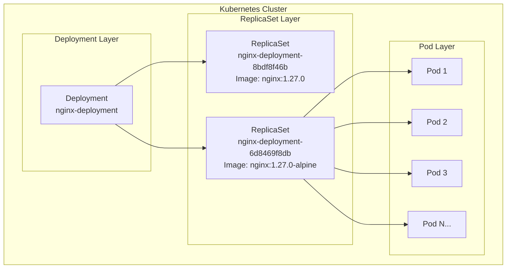
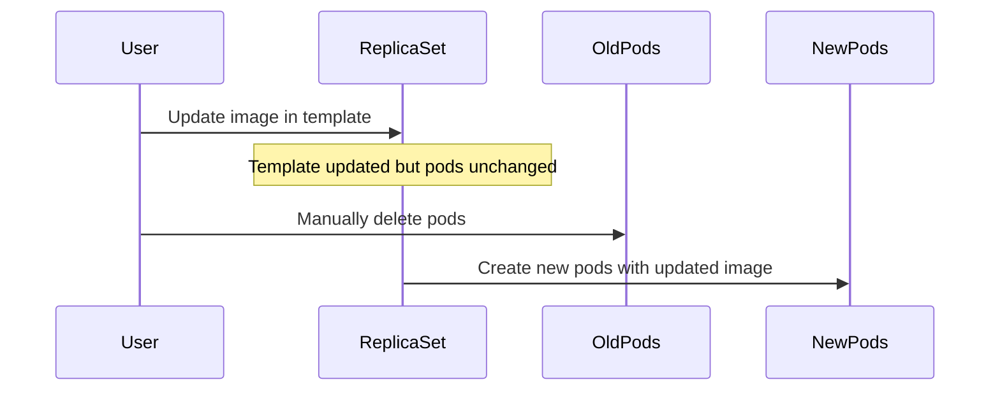
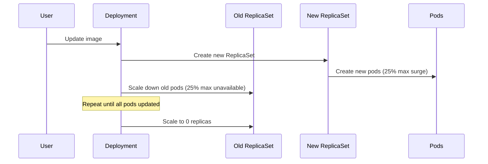
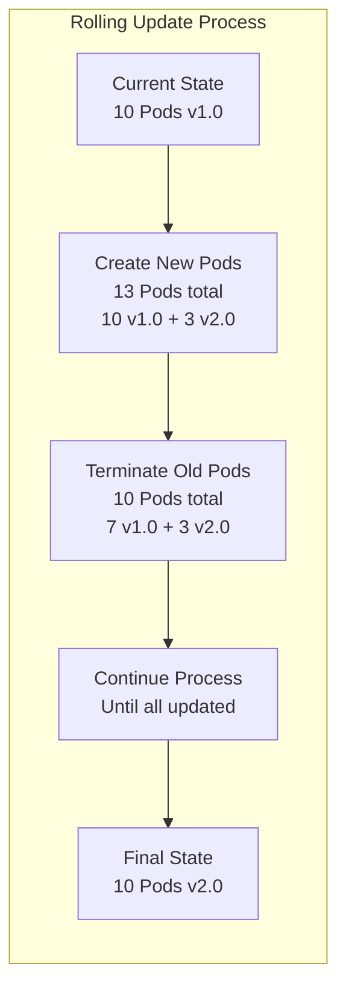
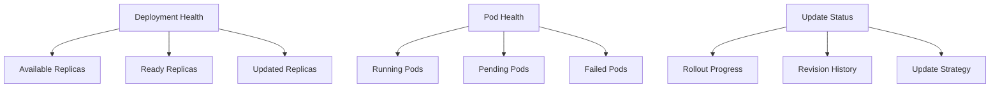

# Kubernetes ReplicaSets and Deployments

This repository demonstrates the concepts and practical usage of Kubernetes ReplicaSets and Deployments using NGINX as an example application.

## 📋 Table of Contents

- [Overview](#overview)
- [Architecture](#architecture)
- [ReplicaSets](#replicasets)
- [Deployments](#deployments)
- [Key Differences](#key-differences)
- [Getting Started](#getting-started)
- [Examples](#examples)
- [Troubleshooting](#troubleshooting)

## 🎯 Overview

This project contains practical examples of:
- **ReplicaSets**: Ensuring a specified number of pod replicas are running
- **Deployments**: Managing ReplicaSets with rolling updates and rollback capabilities

## 🏗️ Architecture



## 📦 ReplicaSets

<details>
<summary><strong>🔍 ReplicaSet Overview</strong></summary>

A ReplicaSet ensures that a specified number of pod replicas are running at any given time. It's a lower-level controller that maintains the desired state of pods.

### Key Features:
- **Self-healing**: Automatically replaces failed pods
- **Scaling**: Maintains desired replica count
- **Label-based selection**: Uses selectors to manage pods

### Configuration Example:
```yaml
apiVersion: apps/v1
kind: ReplicaSet
metadata:
  name: nginx-replicaset
spec:
  replicas: 3
  selector:
    matchLabels:
      app: nginx
  template:
    metadata:
      labels:
        app: nginx
    spec:
      containers:
      - name: nginx
        image: nginx:1.27.0-alpine
        ports:
        - containerPort: 80
```

</details>

<details>
<summary><strong>⚡ ReplicaSet Operations</strong></summary>

### Basic Commands:
```bash
# Create ReplicaSet
kubectl apply -f nginx-rs.yaml

# View ReplicaSets
kubectl get rs

# Describe ReplicaSet
kubectl describe rs nginx-replicaset

# Scale ReplicaSet
kubectl scale rs nginx-replicaset --replicas=5

# Delete ReplicaSet
kubectl delete -f nginx-rs.yaml
```

### Self-Healing Demonstration:
```bash
# Delete a pod - ReplicaSet will recreate it
kubectl delete pod <pod-name>

# Verify new pod creation
kubectl get pods
```

</details>

<details>
<summary><strong>⚠️ ReplicaSet Limitations</strong></summary>

### Key Limitations:
1. **No Rolling Updates**: Cannot update pod template without manual intervention
2. **Manual Pod Recreation**: Must delete pods manually to apply template changes
3. **No Rollback**: No built-in rollback mechanism

### Update Process:


</details>

## 🚀 Deployments

<details>
<summary><strong>🔍 Deployment Overview</strong></summary>

A Deployment provides declarative updates for Pods and ReplicaSets. It manages ReplicaSets and provides additional features like rolling updates and rollbacks.

### Key Features:
- **Rolling Updates**: Gradual replacement of old pods with new ones
- **Rollback**: Easy rollback to previous versions
- **Revision History**: Maintains deployment history
- **Pause/Resume**: Control over update process

### Configuration Example:
```yaml
apiVersion: apps/v1
kind: Deployment
metadata:
  name: nginx-deployment
  labels:
    app: nginx
  annotations:
    "kubernetes.io/change-cause": "update nginx to tag 1.27.0-alpine"
spec:
  replicas: 10
  selector:
    matchLabels:
      app: nginx
  template:
    metadata:
      labels:
        app: nginx
    spec:
      containers:
      - name: nginx
        image: nginx:1.27.0-alpine
        ports:
        - containerPort: 80
```

</details>

<details>
<summary><strong>🔄 Rolling Updates</strong></summary>

### Rolling Update Process:


### Rolling Update Commands:
```bash
# Apply updated deployment
kubectl apply -f nginx-deployment.yaml

# Check rollout status
kubectl rollout status deployment/nginx-deployment

# View rollout history
kubectl rollout history deployment/nginx-deployment

# Rollback to previous version
kubectl rollout undo deployment/nginx-deployment

# Rollback to specific revision
kubectl rollout undo deployment/nginx-deployment --to-revision=2
```

</details>

<details>
<summary><strong>📊 Deployment Strategies</strong></summary>

### Rolling Update Strategy:
```yaml
spec:
  strategy:
    type: RollingUpdate
    rollingUpdate:
      maxUnavailable: 25%  # Max pods that can be unavailable
      maxSurge: 25%        # Max pods above desired replica count
```

### Update Flow:


</details>

<details>
<summary><strong>🔧 Deployment Management</strong></summary>

### Scaling Operations:
```bash
# Scale deployment
kubectl scale deployment nginx-deployment --replicas=20

# Auto-scaling (if HPA is configured)
kubectl autoscale deployment nginx-deployment --min=5 --max=20 --cpu-percent=80
```

### Annotation Management:
```bash
# Add change-cause annotation
kubectl annotate deployment nginx-deployment \
  "kubernetes.io/change-cause=update nginx to tag 1.27.1-alpine" --overwrite
```

### Monitoring Commands:
```bash
# Watch deployment status
kubectl get deployment -w

# View detailed deployment info
kubectl describe deployment nginx-deployment

# Check ReplicaSets created by deployment
kubectl get rs
```

</details>

## ⚖️ Key Differences

| Feature | ReplicaSet | Deployment |
|---------|------------|------------|
| **Rolling Updates** | ❌ Manual process | ✅ Automated |
| **Rollback** | ❌ Not supported | ✅ Built-in |
| **Revision History** | ❌ No history | ✅ Maintains history |
| **Update Strategy** | ❌ Recreate only | ✅ Rolling/Recreate |
| **Pause/Resume** | ❌ Not available | ✅ Supported |
| **Use Case** | Low-level control | Production deployments |

## 🚀 Getting Started

<details>
<summary><strong>📋 Prerequisites</strong></summary>

- Kubernetes cluster (local or cloud)
- kubectl configured
- Docker (for image management)

### Verify Setup:
```bash
kubectl cluster-info
kubectl get nodes
```

</details>

<details>
<summary><strong>🏃‍♂️ Quick Start</strong></summary>

### 1. Deploy ReplicaSet:
```bash
cd Replicaset/
kubectl apply -f nginx-rs.yaml
kubectl get rs
kubectl get pods
```

### 2. Deploy with Deployment:
```bash
cd ../Deployment/
kubectl apply -f nginx-deployment.yaml
kubectl get deployment
kubectl get pods
```

### 3. Test Rolling Update:
```bash
# Edit nginx-deployment.yaml to change image version
kubectl apply -f nginx-deployment.yaml
kubectl rollout status deployment/nginx-deployment
```

</details>

## 📚 Examples

<details>
<summary><strong>🧪 ReplicaSet Self-Healing Test</strong></summary>

### Scenario: Test ReplicaSet self-healing capability

```bash
# Create ReplicaSet with 3 replicas
kubectl apply -f nginx-rs.yaml
kubectl get rs
# NAME               DESIRED   CURRENT   READY   AGE
# nginx-replicaset   3         3         3       2s

# Delete one pod to test self-healing
kubectl delete pod nginx-replicaset-7pbf4

# Verify ReplicaSet creates new pod
kubectl get pods
# NAME                     READY   STATUS    RESTARTS   AGE
# nginx-replicaset-qj5v2   1/1     Running   0          53s
# nginx-replicaset-tc8fh   1/1     Running   0          16s  # New pod created
# nginx-replicaset-xvrxd   1/1     Running   0          53s
```

</details>

<details>
<summary><strong>⚠️ ReplicaSet Update Limitation Demo</strong></summary>

### Scenario: Update ReplicaSet image and observe limitation

```bash
# Update image in nginx-rs.yaml from nginx:1.27.0 to nginx:1.27.0-alpine
kubectl apply -f nginx-rs.yaml

# Check pods - still running old image
kubectl describe pods nginx-replicaset-qj5v2 | findstr Image
# Image: nginx:1.27.0  # Old image still running

# Check ReplicaSet template - shows new image
kubectl describe rs nginx-replicaset | findstr Image
# Image: nginx:1.27.0-alpine  # Template updated

# Delete pod to get new image
kubectl delete pods nginx-replicaset-qj5v2

# New pod uses updated image
kubectl describe pods nginx-replicaset-xbczl | findstr Image
# Image: nginx:1.27.0-alpine  # New pod with updated image
```

</details>

<details>
<summary><strong>🔄 Rolling Update Example</strong></summary>

### Scenario: Update NGINX from 1.27.0 to 1.27.0-alpine

```bash
# Initial deployment
kubectl apply -f nginx-deployment.yaml

# Check current image
kubectl describe deployment nginx-deployment | grep Image

# Update image in nginx-deployment.yaml
# Change: nginx:1.27.0 → nginx:1.27.0-alpine

# Apply update
kubectl apply -f nginx-deployment.yaml

# Monitor rolling update
kubectl rollout status deployment/nginx-deployment

# Verify update
kubectl get pods
kubectl describe pod <pod-name> | grep Image
```

### Update Process Visualization:

```mermaid
gantt
    title Rolling Update Timeline
    dateFormat X
    axisFormat %s
    
    section Old ReplicaSet
    10 Pods Running    :active, old1, 0, 30
    8 Pods Running     :old2, 30, 45
    5 Pods Running     :old3, 45, 60
    0 Pods Running     :old4, 60, 75
    
    section New ReplicaSet
    3 Pods Creating    :new1, 30, 45
    5 Pods Running     :new2, 45, 60
    10 Pods Running    :active, new3, 60, 90
```


</details>

<details>
<summary><strong>🔙 Rollback Example</strong></summary>

### Scenario: Rollback failed deployment

```bash
# Check rollout history
kubectl rollout history deployment/nginx-deployment

# Rollback to previous version
kubectl rollout undo deployment/nginx-deployment

# Rollback to specific revision
kubectl rollout undo deployment/nginx-deployment --to-revision=1

# Verify rollback
kubectl rollout status deployment/nginx-deployment
```

</details>

<details>
<summary><strong>🔄 Deployment Scaling Demo</strong></summary>

### Scenario: Scale deployment and test rollback

```bash
# Initial deployment with 10 replicas
kubectl get deploy
# NAME               READY   UP-TO-DATE   AVAILABLE   AGE
# nginx-deployment   10/10   10           10          12m

# Scale up to 20 replicas
kubectl scale deploy nginx-deployment --replicas=20
kubectl get deploy
# NAME               READY   UP-TO-DATE   AVAILABLE   AGE
# nginx-deployment   20/20   20           20          32m

# Scale back to 10 via YAML
kubectl apply -f nginx-deployment.yaml
kubectl get deploy
# NAME               READY   UP-TO-DATE   AVAILABLE   AGE
# nginx-deployment   10/10   10           10          33m
```

</details>

<details>
<summary><strong>🏷️ Pod Adoption by ReplicaSet</strong></summary>

### Scenario: ReplicaSet adopts matching pods

```bash
# Create standalone pod with matching labels
kubectl apply -f nginx-pod.yaml

# Create ReplicaSet - it adopts the existing pod
kubectl apply -f nginx-rs.yaml
kubectl get rs
# NAME               DESIRED   CURRENT   READY   AGE
# nginx-replicaset   3         3         3       23s

# ReplicaSet only creates 2 new pods (adopts 1 existing)
kubectl get pods
# NAME                     READY   STATUS    RESTARTS   AGE
# nginx-replicaset-2t6b6   1/1     Running   0          4s
# nginx-replicaset-xwj8h   1/1     Running   0          4s
# sole-nginx               1/1     Running   0          24s  # Adopted pod

# Delete standalone pod - ReplicaSet creates replacement
kubectl delete -f nginx-pod.yaml
kubectl get pods
# NAME                     READY   STATUS    RESTARTS   AGE
# nginx-replicaset-2t6b6   1/1     Running   0          106s
# nginx-replicaset-d77rw   1/1     Running   0          11s   # New replacement
# nginx-replicaset-xwj8h   1/1     Running   0          106s
```

</details>

## 🔧 Troubleshooting

<details>
<summary><strong>❌ Common Issues</strong></summary>

### 1. ImagePullBackOff Error:
```bash
# Symptoms
kubectl get pods
# NAME                               READY   STATUS             RESTARTS   AGE
# nginx-deployment-668b588f8b-blvmr   0/1     ImagePullBackOff   0          2m

# Diagnosis
kubectl describe pod nginx-deployment-668b588f8b-blvmr
# Events:
# Failed to pull image "nginx:1.27.01111-alpine": not found

# Check deployment status during failed rollout
kubectl get deploy
# NAME               READY   UP-TO-DATE   AVAILABLE   AGE
# nginx-deployment   8/10    5            8           38m

# Solution: Rollback to working version
kubectl rollout undo deployment/nginx-deployment
```

### 2. Rolling Update Stuck:
```bash
# Check deployment status
kubectl describe deployment nginx-deployment

# Check ReplicaSets
kubectl get rs

# Force rollback if needed
kubectl rollout undo deployment/nginx-deployment
```

### 3. Pod Not Starting:
```bash
# Check pod events
kubectl describe pod <pod-name>

# Check logs
kubectl logs <pod-name>

# Check resource constraints
kubectl top pods
```

</details>

<details>
<summary><strong>🔍 Debugging Commands</strong></summary>

```bash
# Deployment debugging
kubectl get deployment -o wide
kubectl describe deployment <deployment-name>
kubectl rollout status deployment/<deployment-name>

# ReplicaSet debugging
kubectl get rs -o wide
kubectl describe rs <replicaset-name>

# Pod debugging
kubectl get pods -o wide
kubectl describe pod <pod-name>
kubectl logs <pod-name>
kubectl exec -it <pod-name> -- /bin/bash
```

</details>

<details>
<summary><strong>📊 Monitoring Dashboard</strong></summary>

### Key Metrics to Monitor:


### Monitoring Commands:
```bash
# Watch resources
kubectl get deployment -w
kubectl get pods -w

# Resource usage
kubectl top pods
kubectl top nodes

# Events
kubectl get events --sort-by=.metadata.creationTimestamp
```

</details>

## 📁 Repository Structure

```
Kubernethes Replicaset and Deployments/
├── README.md
├── Deployment/
│   ├── nginx-deployment.yaml    # Deployment with 10 replicas, nginx:1.27.0-alpine
│   └── cmd.ipynb               # 96 cells with deployment lifecycle demos
└── Replicaset/
    ├── nginx-rs.yaml           # ReplicaSet with 3 replicas, nginx:1.27.0-alpine
    ├── nginx-pod.yaml          # Standalone pod (sole-nginx) for adoption testing
    └── cmd.ipynb               # 64 cells with ReplicaSet operations and limitations
```

## 🎯 Key Learnings from Code

<details>
<summary><strong>📝 ReplicaSet Insights</strong></summary>

- **Self-healing works**: Deleting pods triggers immediate recreation
- **Template updates don't affect existing pods**: Must manually delete pods
- **Pod adoption**: ReplicaSets adopt existing pods with matching labels
- **Image versions**: Template shows new image, but pods keep old until recreated

</details>

<details>
<summary><strong>📝 Deployment Insights</strong></summary>

- **Rolling updates are automatic**: 25% max unavailable, 25% max surge by default
- **Revision history**: Tracks deployment changes with annotations
- **Rollback capability**: Can undo to previous or specific revision
- **Scaling flexibility**: Can scale via kubectl or YAML reapplication
- **Error recovery**: Failed deployments can be rolled back automatically

</details>

## 🎯 Best Practices

1. **Use Deployments** for production workloads instead of ReplicaSets
2. **Add change-cause annotations** for rollout tracking:
   ```bash
   kubectl annotate deployment nginx-deployment \
     "kubernetes.io/change-cause=update nginx to tag 1.27.1-alpine" --overwrite
   ```
3. **Test image validity** before deployment to avoid ImagePullBackOff
4. **Monitor rollout status** during updates:
   ```bash
   kubectl rollout status deployment/nginx-deployment
   ```
5. **Use meaningful labels** for pod selection and organization
6. **Keep rollout history** for quick rollbacks when issues occur
7. **Scale gradually** and monitor resource usage during scaling operations

## 🔗 Related Resources

- [Kubernetes Deployments Documentation](https://kubernetes.io/docs/concepts/workloads/controllers/deployment/)
- [ReplicaSet Documentation](https://kubernetes.io/docs/concepts/workloads/controllers/replicaset/)
- [Rolling Updates Guide](https://kubernetes.io/docs/tutorials/kubernetes-basics/update/update-intro/)

---

*This README provides comprehensive examples and explanations for understanding Kubernetes ReplicaSets and Deployments. Use the expandable sections to dive deeper into specific topics.*