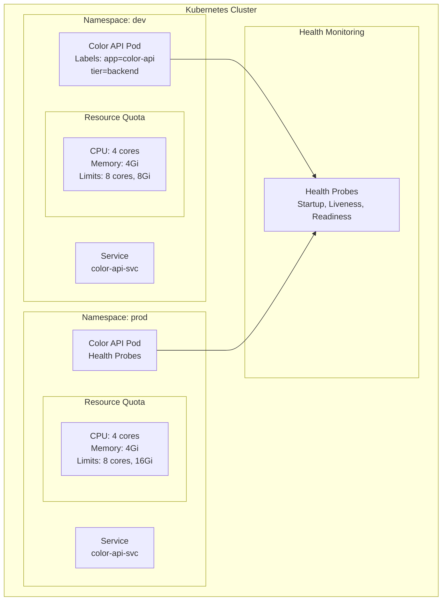
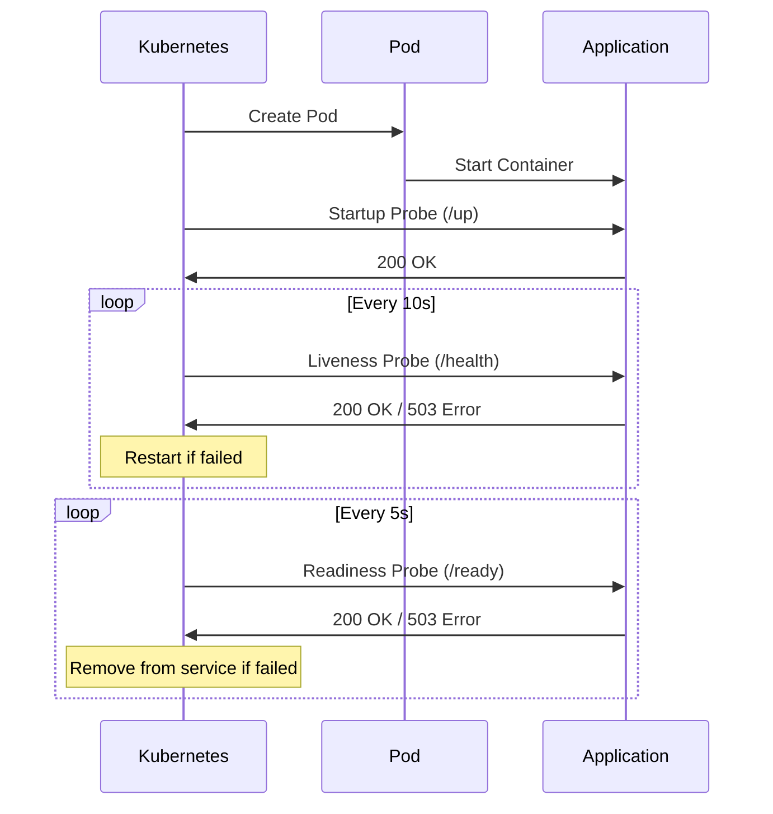
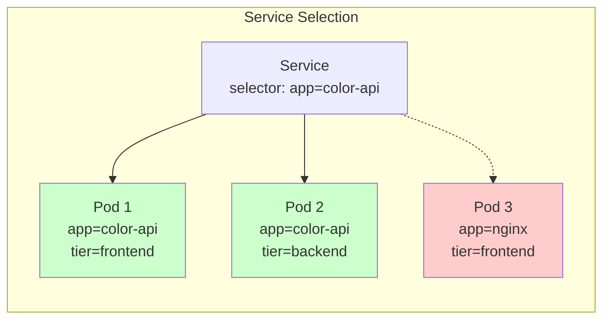
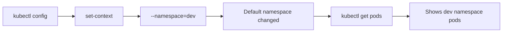
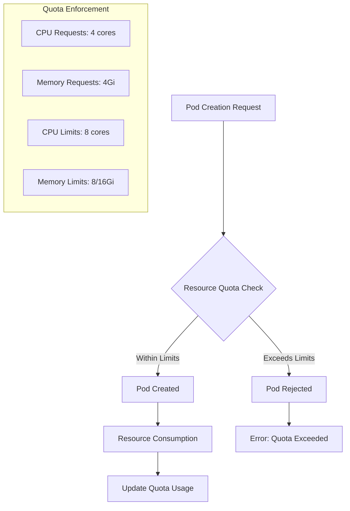

# Kubernetes Resource Management

Comprehensive guide to Kubernetes resource management covering health probes, namespaces, labels & selectors, and resource quotas.

## 🏗️ Architecture Overview



## 🏥 Health Probes

<details>
<summary><strong>Health Probe Types</strong></summary>

### Startup Probe
Determines when container has started successfully.

```yaml
startupProbe:
  httpGet:
    path: /up
    port: 80
  failureThreshold: 2
  periodSeconds: 3
```

### Liveness Probe
Determines if container is running and healthy.

```yaml
livenessProbe:
  httpGet:
    path: /health
    port: 80
  failureThreshold: 3
  periodSeconds: 10
```

### Readiness Probe
Determines if container is ready to serve traffic.

```yaml
readinessProbe:
  httpGet:
    path: /ready
    port: 80
  failureThreshold: 2
  periodSeconds: 5
```

</details>

<details>
<summary><strong>Enhanced Color API with Health Endpoints</strong></summary>

**Application Features:**
```javascript
// Environment-controlled behavior
const delay_startup = process.env.DELAY_STARTUP === 'true';
const fail_liveness = process.env.FAIL_LIVENESS === 'true';
const fail_readiness = process.env.FAIL_READINESS === 'true';

// Health endpoints
app.get('/up', (req, res) => res.send('ok'));           // Startup probe
app.get('/health', (req, res) => {                      // Liveness probe
    if (fail_liveness) return res.sendStatus(503);
    return res.send('ok');
});
app.get('/ready', (req, res) => {                       // Readiness probe
    if (fail_readiness) return res.sendStatus(503);
    return res.send('ok');
});
```

**Pod Configuration:**
```yaml
apiVersion: v1
kind: Pod
metadata:
  name: color-api-pod
spec:
  containers:
  - name: color-api-pod
    image: anil1318/color-api:1.2.1
    resources:
      limits:
        cpu: '500m'
        memory: '512Mi'
    env:
      - name: DELAY_STARTUP
        value: 'false'
      - name: FAIL_LIVENESS
        value: 'false'
```

</details>

<details>
<summary><strong>Probe Lifecycle</strong></summary>



**Probe Results:**
```bash
kubectl get pods
# NAME            READY   STATUS    RESTARTS      AGE
# color-api-pod   1/1     Running   1 (10s ago)   41s
```

</details>

## 🏷️ Labels and Selectors

<details>
<summary><strong>Label Organization</strong></summary>

**Multi-tier Application Labels:**
```yaml
# Backend Pod
metadata:
  name: color-backend
  labels:
    app: color-backend
    environment: local
    tier: backend

# Frontend Pod  
metadata:
  name: color-frontend
  labels:
    app: color-api
    environment: local
    tier: frontend
```

**Label Queries:**
```bash
# Select by single label
kubectl get pods -l app=color-api

# Select by multiple labels
kubectl get pods -l environment=local,tier=backend

# Select by label existence
kubectl get pods -l tier

# Select by label inequality
kubectl get pods -l tier!=frontend
```

</details>

<details>
<summary><strong>Service Selectors</strong></summary>



**Deployment with Label Matching:**
```yaml
apiVersion: apps/v1
kind: Deployment
spec:
  selector:
    matchLabels:
      app: color-api
  template:
    metadata:
      labels:
        app: color-api
        version: v1.0
```

</details>

## 🏠 Namespaces

<details>
<summary><strong>Namespace Management</strong></summary>

**Creating Namespaces:**
```yaml
apiVersion: v1
kind: Namespace
metadata:
  name: dev
---
apiVersion: v1
kind: Namespace
metadata:
  name: prod
```

**Namespace Operations:**
```bash
# Create namespaces
kubectl apply -f namespace.yaml

# List namespaces
kubectl get namespace
# NAME              STATUS   AGE
# default           Active   46h
# dev               Active   6s
# prod              Active   6s
# kube-system       Active   46h

# Deploy to specific namespace
kubectl apply -f color-api.yaml -n dev

# View resources in namespace
kubectl get pods -n dev
kubectl get pods --all-namespaces
```

</details>

<details>
<summary><strong>Cross-Namespace Communication</strong></summary>

**FQDN Service Discovery:**
```yaml
# Traffic generator in dev namespace
apiVersion: v1
kind: Pod
metadata:
  name: traffic-genrator
  namespace: dev
spec:
  containers:
  - name: traffic-gen
    image: anil1318/traffic-gen:1.0.0
    args:
      - 'color-api-svc.prod.svc.cluster.local/api'  # FQDN
      - '0.5'
```

**Service FQDN Format:**
```
<service-name>.<namespace>.svc.cluster.local
```

**Cross-Namespace Test Results:**
```bash
kubectl logs traffic-genrator -n dev
# Sending request to color-api-svc.prod.svc.cluster.local/api every 0.5 seconds..
# 2025-08-30 22:47:08 COLOR : blue, HOSTNAME : color-api
# 2025-08-30 22:47:09 COLOR : blue, HOSTNAME : color-api
```

</details>

<details>
<summary><strong>Context Management</strong></summary>



**Context Commands:**
```bash
# Set default namespace
kubectl config set-context --current --namespace=dev

# Verify current context
kubectl config current-context

# View context configuration
kubectl config view
# contexts:
# - context:
#     cluster: docker-desktop
#     namespace: dev
#     user: docker-desktop

# Reset to default
kubectl config set-context --current --namespace=default
```

</details>

## 📊 Resource Quotas

<details>
<summary><strong>Resource Quota Configuration</strong></summary>

**Development Environment:**
```yaml
apiVersion: v1
kind: ResourceQuota
metadata:
  namespace: dev
  name: dev-quota
spec:
  hard:
    requests.cpu: '4'
    requests.memory: '4Gi'
    limits.cpu: '8'
    limits.memory: '8Gi'
```

**Production Environment:**
```yaml
apiVersion: v1
kind: ResourceQuota
metadata:
  namespace: prod
  name: prod-quota
spec:
  hard:
    requests.cpu: '4'
    requests.memory: '4Gi'
    limits.cpu: '8'
    limits.memory: '16Gi'    # Higher memory limit
```

</details>

<details>
<summary><strong>Resource Management Flow</strong></summary>



**Pod with Resource Specifications:**
```yaml
apiVersion: v1
kind: Pod
metadata:
  name: color-api-pod
spec:
  containers:
  - name: color-api
    image: anil1318/color-api:1.2.1
    resources:
      requests:
        cpu: '100m'
        memory: '128Mi'
      limits:
        cpu: '500m'
        memory: '512Mi'
```

</details>

<details>
<summary><strong>QoS Classes</strong></summary>

**Quality of Service Classes:**

| QoS Class | Condition | Example |
|-----------|-----------|---------|
| **Guaranteed** | requests = limits | CPU: 500m/500m, Memory: 512Mi/512Mi |
| **Burstable** | requests < limits | CPU: 100m/500m, Memory: 128Mi/512Mi |
| **BestEffort** | No requests/limits | No resource specifications |

**QoS Impact:**
```bash
kubectl describe pod color-api-pod
# QoS Class: Guaranteed
# Node-Selectors: <none>
# Tolerations: node.kubernetes.io/not-ready:NoExecute op=Exists for 300s
```

</details>

## 🔧 Resource Management Commands

<details>
<summary><strong>Essential Commands</strong></summary>

**Health Probes:**
```bash
# Deploy pod with health probes
kubectl apply -f color-api-pod-liveness.yaml

# Check pod status and restarts
kubectl get pods
kubectl describe pod color-api-pod

# View probe configuration
kubectl get pod color-api-pod -o yaml | grep -A 10 livenessProbe
```

**Labels and Selectors:**
```bash
# Apply labels
kubectl label pod color-api environment=production

# Query by labels
kubectl get pods -l app=color-api
kubectl get pods -l tier=backend,environment=local

# Show labels
kubectl get pods --show-labels
```

**Namespaces:**
```bash
# Create and manage namespaces
kubectl create namespace staging
kubectl get namespaces
kubectl delete namespace staging

# Cross-namespace operations
kubectl get pods -n dev
kubectl get pods --all-namespaces
kubectl get svc -A
```

**Resource Quotas:**
```bash
# View resource quotas
kubectl get resourcequota -n dev
kubectl describe resourcequota dev-quota -n dev

# Check resource usage
kubectl top pods -n dev
kubectl top nodes
```

</details>

## 📁 Repository Structure

```
Kubernethes Resource Mgmt/
├── README.md
├── Health Probes/
│   ├── Color Api/
│   │   ├── src/index.js              # Enhanced app with health endpoints
│   │   ├── Dockerfile                # Multi-stage build
│   │   └── package.json              # Dependencies
│   ├── color-api-pod-liveness.yaml   # Pod with all probe types
│   ├── readiness-probe/
│   │   ├── color-api-depl.yaml       # Deployment with readiness probe
│   │   └── color-api-svc.yaml        # Service configuration
│   └── *.ipynb                       # Probe demonstrations
├── Labels and Selectors/
│   ├── Labels-Selector/
│   │   ├── color-api.yaml            # Multi-tier pod labels
│   │   └── color-depl.yaml           # Deployment with selectors
│   └── cmd.ipynb                     # Label query examples
├── Namespaces/
│   ├── namespace.yaml                # Dev and prod namespaces
│   ├── color-api.yaml                # Namespaced pod deployment
│   ├── traffic-genrator.yaml         # Cross-namespace communication
│   └── cmd.ipynb                     # Namespace operations
└── Resource Quotas/
    ├── dev-ns.yaml                   # Dev namespace with quota
    ├── prod-ns.yaml                  # Prod namespace with quota
    ├── color-api-pod.yaml            # Pod with resource specs
    └── cmd.ipynb                     # Quota management
```

## 🎯 Best Practices

1. **Health Probes**
   - Always implement startup, liveness, and readiness probes
   - Use appropriate failure thresholds and periods
   - Test probe endpoints independently

2. **Labels and Selectors**
   - Use consistent labeling conventions
   - Include environment, version, and component labels
   - Avoid overly complex selectors

3. **Namespaces**
   - Separate environments (dev, staging, prod)
   - Use FQDN for cross-namespace communication
   - Set appropriate RBAC policies per namespace

4. **Resource Quotas**
   - Set realistic limits based on workload requirements
   - Monitor resource usage regularly
   - Use different quotas for different environments

## 🔗 Key Concepts

- **Health Probes**: Ensure application reliability and proper traffic routing
- **Labels**: Organize and select resources efficiently
- **Namespaces**: Provide logical separation and multi-tenancy
- **Resource Quotas**: Control resource consumption and prevent resource exhaustion
- **QoS Classes**: Determine pod scheduling and eviction priority

---

*This comprehensive guide demonstrates practical Kubernetes resource management using real-world examples and best practices.*