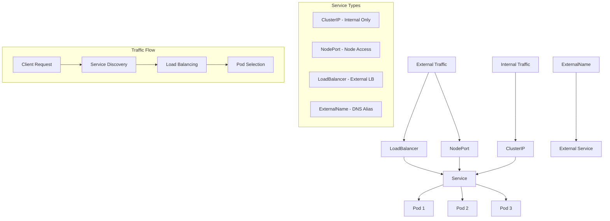
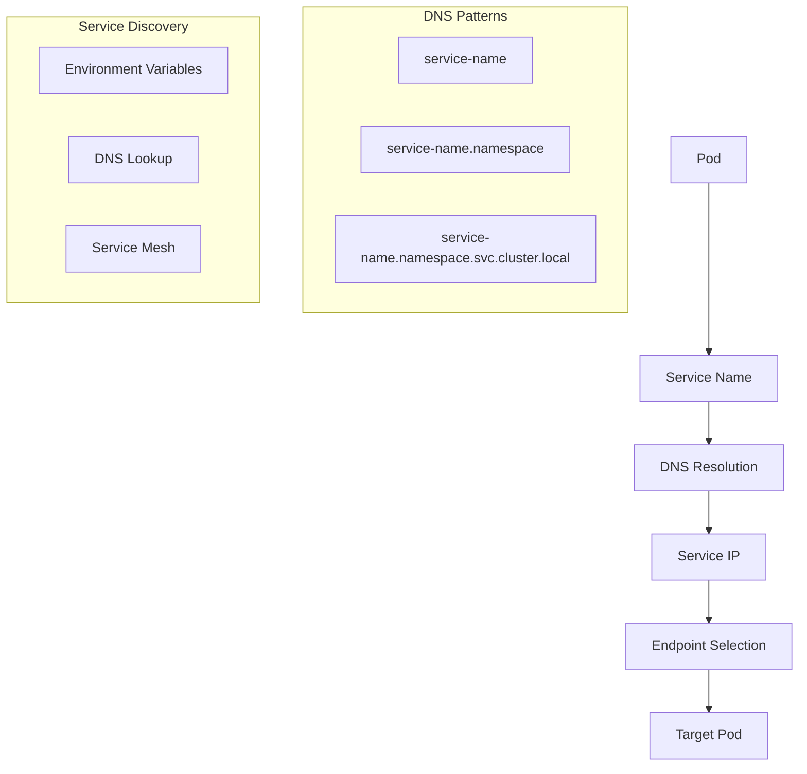

# Kubernetes Services

## Overview
Comprehensive guide to Kubernetes Services covering all service types: ClusterIP, NodePort, LoadBalancer, and ExternalName. Learn service discovery, networking, and external access patterns.

## Files
- `cluster ip.ipynb` - ClusterIP service demonstration
- `Nodeport.ipynb` - NodePort service configuration
- `Loadbalancer.ipynb` - LoadBalancer service setup
- `Kubernethes Service Dns.ipynb` - DNS and ExternalName services

<details>
<summary>📋 Service Types Overview</summary>

### Purpose
- Learn Kubernetes service networking
- Understand service discovery mechanisms
- Practice external access patterns
- Master load balancing and traffic routing

### Service Architecture


</details>

<details>
<summary>🚀 Quick Start</summary>

### Prerequisites
- Kubernetes cluster running
- kubectl configured
- Basic understanding of pods and deployments

### Setup Test Application
```bash
# Create deployment
kubectl create deployment httpenv --image=bretfisher/httpenv

# Scale to multiple replicas
kubectl scale deployment/httpenv --replicas=10

# Verify pods
kubectl get pods
```

### Service Creation Examples
```bash
# ClusterIP (default)
kubectl expose deployment/httpenv --port 8888

# NodePort
kubectl expose deployment/httpenv --port 8888 --name httpenv-np --type NodePort

# LoadBalancer
kubectl expose deployment/httpenv --port 8888 --name httpenv-lb --type LoadBalancer

# ExternalName
kubectl create service externalname httpenv-external --external-name=host.docker.internal --tcp=8888:8888
```

</details>

<details>
<summary>🔧 ClusterIP Service</summary>

### Characteristics
- **Default service type**
- **Internal cluster access only**
- **Stable internal IP address**
- **DNS-based service discovery**

### Use Cases
- Internal microservice communication
- Database access from applications
- API backends
- Internal load balancing

### Configuration
```yaml
apiVersion: v1
kind: Service
metadata:
  name: httpenv
spec:
  selector:
    app: httpenv
  ports:
    - port: 8888
      targetPort: 8888
  type: ClusterIP
```

### Testing ClusterIP
```bash
# Create test pod for internal access
kubectl run tmp-shell --restart=Never --image=bretfisher/netshoot -- curl httpenv:8888

# Check logs
kubectl logs tmp-shell

# Verify service discovery
kubectl run -it --rm debug --image=busybox --restart=Never -- nslookup httpenv
```

</details>

<details>
<summary>🌐 NodePort Service</summary>

### Characteristics
- **Exposes service on each node's IP**
- **Accessible from outside cluster**
- **Port range: 30000-32767**
- **Includes ClusterIP functionality**

### Use Cases
- Development and testing
- Simple external access
- Legacy application integration
- Direct node access requirements

### Configuration
```yaml
apiVersion: v1
kind: Service
metadata:
  name: httpenv-np
spec:
  selector:
    app: httpenv
  ports:
    - port: 8888
      targetPort: 8888
      nodePort: 32318
  type: NodePort
```

### Access Patterns
```bash
# Access via node IP and port
curl <node-ip>:32318

# Access via localhost (if running locally)
curl localhost:32318

# Get assigned port
kubectl get services httpenv-np
```

</details>

<details>
<summary>⚖️ LoadBalancer Service</summary>

### Characteristics
- **Cloud provider integration**
- **External IP assignment**
- **Automatic load balancer provisioning**
- **Production-ready external access**

### Use Cases
- Production web applications
- Public API endpoints
- High availability services
- Cloud-native applications

### Configuration
```yaml
apiVersion: v1
kind: Service
metadata:
  name: httpenv-lb
spec:
  selector:
    app: httpenv
  ports:
    - port: 8888
      targetPort: 8888
  type: LoadBalancer
```

### Cloud Provider Support
```bash
# AWS - Creates ELB/ALB
# GCP - Creates Cloud Load Balancer
# Azure - Creates Azure Load Balancer
# Local (Docker Desktop) - Uses localhost

# Check external IP
kubectl get services httpenv-lb

# Access via external IP
curl <external-ip>:8888
```

</details>

<details>
<summary>🔗 ExternalName Service</summary>

### Characteristics
- **DNS alias for external services**
- **No proxy or load balancing**
- **CNAME record creation**
- **External service integration**

### Use Cases
- External database connections
- Third-party API integration
- Legacy system migration
- Service abstraction

### Configuration
```yaml
apiVersion: v1
kind: Service
metadata:
  name: httpenv-external
spec:
  type: ExternalName
  externalName: host.docker.internal
  ports:
    - port: 8888
```

### DNS Resolution
```bash
# Service acts as DNS alias
kubectl run -it --rm debug --image=busybox --restart=Never -- nslookup httpenv-external

# Direct external access
curl host.docker.internal:8888
```

</details>

<details>
<summary>📊 Service Discovery & DNS</summary>

### Kubernetes DNS


### DNS Naming Conventions
```bash
# Same namespace
curl httpenv:8888

# Different namespace
curl httpenv.default:8888

# Fully qualified
curl httpenv.default.svc.cluster.local:8888
```

### Environment Variables
```bash
# Kubernetes injects service info
echo $HTTPENV_SERVICE_HOST
echo $HTTPENV_SERVICE_PORT

# List all service variables
env | grep HTTPENV
```

</details>

<details>
<summary>🔍 Troubleshooting Services</summary>

### Common Issues
1. **Service not accessible**
2. **Wrong port configuration**
3. **Selector mismatch**
4. **DNS resolution problems**

### Debugging Commands
```bash
# Check service details
kubectl describe service httpenv
kubectl get endpoints httpenv

# Verify pod labels
kubectl get pods --show-labels
kubectl get pods -l app=httpenv

# Test connectivity
kubectl run -it --rm debug --image=nicolaka/netshoot --restart=Never

# Check DNS
kubectl run -it --rm debug --image=busybox --restart=Never -- nslookup kubernetes.default
```

### Service Validation
```bash
# Check service endpoints
kubectl get endpoints

# Verify service selector
kubectl describe service httpenv | grep Selector

# Test port forwarding
kubectl port-forward service/httpenv 8080:8888
curl localhost:8080
```

</details>

<details>
<summary>📚 Learning Outcomes</summary>

### Service Concepts
- Service types and use cases
- Load balancing mechanisms
- Service discovery patterns
- External access strategies

### Networking Skills
- Kubernetes DNS understanding
- Port mapping and forwarding
- Network troubleshooting
- Service mesh basics

### Production Readiness
- High availability patterns
- Security considerations
- Performance optimization
- Monitoring and observability

### Best Practices
- Appropriate service type selection
- Proper labeling and selectors
- Health checks and readiness probes
- Resource management

</details>