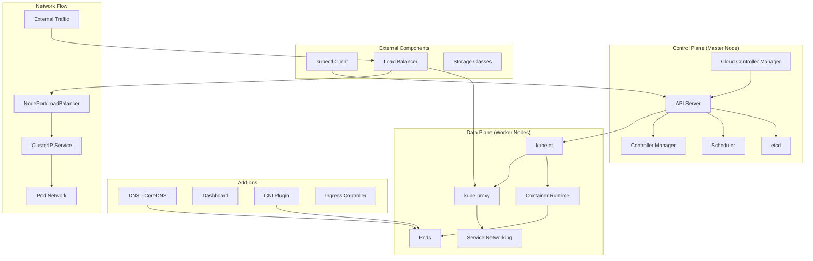
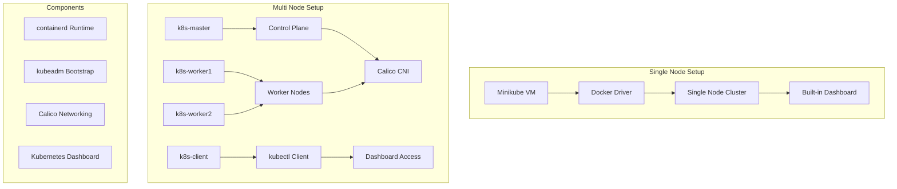
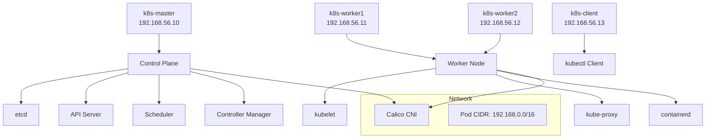
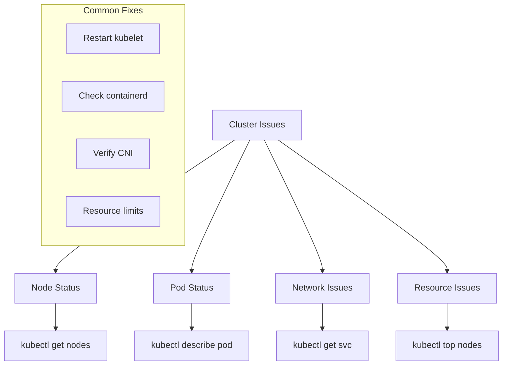

# Kubernetes Setup

## Overview
Complete Kubernetes cluster setup environments using Vagrant and VirtualBox. Includes both single-node (Minikube) and multi-node (kubeadm) cluster configurations for learning and development.

## Structure
- `Single Node/` - Minikube-based single-node cluster setup
- `Multi Node/` - Full multi-node cluster with kubeadm, containerd, and Calico CNI

<details>
<summary>📋 Setup Overview</summary>

### Purpose
- Learn Kubernetes cluster architecture
- Practice cluster deployment and management
- Understand networking and CNI configuration
- Explore dashboard and monitoring setup

### Kubernetes Architecture


### Control Plane Components
- **API Server**: Central management component, REST API endpoint
- **etcd**: Distributed key-value store for cluster state
- **Scheduler**: Assigns pods to nodes based on resource requirements
- **Controller Manager**: Runs controller processes (ReplicaSet, Deployment, etc.)
- **Cloud Controller Manager**: Integrates with cloud provider APIs

### Data Plane Components
- **kubelet**: Node agent that manages pods and containers
- **Container Runtime**: Runs containers (containerd, Docker, CRI-O)
- **kube-proxy**: Network proxy for service discovery and load balancing

### Architecture Comparison


</details>

<details>
<summary>🚀 Single Node Setup</summary>

### Minikube Configuration
- **VM**: Ubuntu 20.04 (focal64)
- **Resources**: 4 CPU, 6GB RAM
- **Driver**: Docker
- **Kubernetes**: Latest stable version

### Quick Start
```bash
# Navigate to Single Node directory
cd "Single Node"

# Start the VM
vagrant up

# Check status
vagrant status

# SSH into VM
vagrant ssh

# Verify cluster
kubectl get nodes
```

### Features
- **Minikube**: Single-node Kubernetes cluster
- **Docker Driver**: Container runtime
- **Dashboard**: Built-in web UI
- **Metrics Server**: Resource monitoring
- **Addons**: Easy extension management

### Cluster Operations
```bash
# Inside the VM
minikube status
minikube addons list
minikube addons enable dashboard
minikube addons enable metrics-server

# Access dashboard
minikube dashboard --url

# Resource monitoring
kubectl top nodes
kubectl top pods
```

</details>

<details>
<summary>🏗️ Multi Node Setup</summary>

### Cluster Architecture


### VM Configuration
- **Base Image**: Ubuntu 20.04 (focal64)
- **Resources**: 4 CPU, 6GB RAM per node
- **Network**: Private network (192.168.56.x)
- **Runtime**: containerd with CRI enabled

### Automated Setup Process
1. **Common Setup**: All nodes get containerd, kubeadm, kubectl
2. **Master Init**: Control plane initialization with Calico CNI
3. **Worker Join**: Automatic cluster joining using shared tokens
4. **Client Config**: kubectl configuration for cluster access

</details>

<details>
<summary>⚙️ Installation Components</summary>

### Container Runtime (containerd)
```yaml
# containerd configuration
version = 2
[plugins."io.containerd.grpc.v1.cri"]
  sandbox_image = "registry.k8s.io/pause:3.9"
  [plugins."io.containerd.grpc.v1.cri".containerd.runtimes.runc.options]
    SystemdCgroup = true
```

### Kubernetes Components
- **kubeadm**: Cluster bootstrapping tool
- **kubelet**: Node agent
- **kubectl**: Command-line interface
- **Version**: Kubernetes 1.30 stable

### Network Configuration
```bash
# Kernel modules for networking
overlay
br_netfilter

# Sysctl settings
net.bridge.bridge-nf-call-iptables = 1
net.bridge.bridge-nf-call-ip6tables = 1
net.ipv4.ip_forward = 1
```

### CNI Setup (Multi-node)
- **Calico**: Network policy and connectivity
- **Pod CIDR**: 192.168.0.0/16
- **Version**: v3.27.3

</details>

<details>
<summary>🚀 Deployment Guide</summary>

### Single Node Deployment
```bash
# Clone and navigate
cd "Kubernethes Setup/Single Node"

# Start VM
vagrant up

# Verify installation
vagrant ssh -c "kubectl get nodes"
vagrant ssh -c "minikube status"

# Enable dashboard
vagrant ssh -c "minikube addons enable dashboard"
vagrant ssh -c "minikube addons enable metrics-server"
```

### Multi Node Deployment
```bash
# Navigate to Multi Node directory
cd "Kubernethes Setup/Multi Node"

# Start all VMs (order matters)
vagrant up k8s-master
vagrant up k8s-worker1
vagrant up k8s-worker2
vagrant up k8s-client

# Verify cluster
vagrant ssh k8s-client -c "kubectl get nodes -o wide"

# Check pod distribution
vagrant ssh k8s-client -c "kubectl get pods -o wide"
```

### Dashboard Access (Multi-node)
```bash
# Install dashboard
vagrant ssh k8s-client -c "kubectl apply -f https://raw.githubusercontent.com/kubernetes/dashboard/v2.7.0/aio/deploy/recommended.yaml"

# Create admin user and get token
vagrant ssh k8s-client -c "kubectl -n kubernetes-dashboard create token admin-user"

# Start proxy
vagrant ssh k8s-client -c "kubectl proxy --address=0.0.0.0 --disable-filter=true"

# Access at: http://192.168.56.13:8001/api/v1/namespaces/kubernetes-dashboard/services/https:kubernetes-dashboard:/proxy/
```

</details>

<details>
<summary>🔧 Cluster Operations</summary>

### Basic Operations
```bash
# Check cluster status
kubectl get nodes
kubectl get pods --all-namespaces
kubectl cluster-info

# Deploy test application
kubectl create deployment nginx --image=nginx:latest --replicas=3
kubectl expose deployment nginx --port=80 --type=NodePort

# Scale deployment
kubectl scale deployment nginx --replicas=10

# Check pod distribution
kubectl get pods -o wide
```

### Troubleshooting


### Monitoring Commands
```bash
# Resource usage
kubectl top nodes
kubectl top pods

# Cluster events
kubectl get events --sort-by=.metadata.creationTimestamp

# Component status
kubectl get componentstatuses

# Detailed node info
kubectl describe nodes
```

</details>

<details>
<summary>🔒 Security & Best Practices</summary>

### Security Features
- **RBAC**: Role-based access control enabled
- **Network Policies**: Calico network segmentation
- **Service Accounts**: Proper authentication
- **TLS**: Encrypted communication

### Production Considerations
- **High Availability**: Multiple master nodes
- **Backup Strategy**: etcd backup procedures
- **Monitoring**: Prometheus and Grafana integration
- **Logging**: Centralized log aggregation

### Resource Management
```yaml
# Example resource limits
resources:
  requests:
    memory: "64Mi"
    cpu: "250m"
  limits:
    memory: "128Mi"
    cpu: "500m"
```

</details>

<details>
<summary>📚 Learning Outcomes</summary>

### Cluster Architecture
- Kubernetes component understanding
- Container runtime configuration
- Network plugin integration
- Service discovery mechanisms

### Operational Skills
- Cluster deployment automation
- Node management and scaling
- Application deployment patterns
- Troubleshooting techniques

### Advanced Topics
- CNI plugin configuration
- RBAC and security policies
- Resource quotas and limits
- Monitoring and observability

### Production Readiness
- High availability patterns
- Backup and recovery procedures
- Performance optimization
- Security hardening

</details>