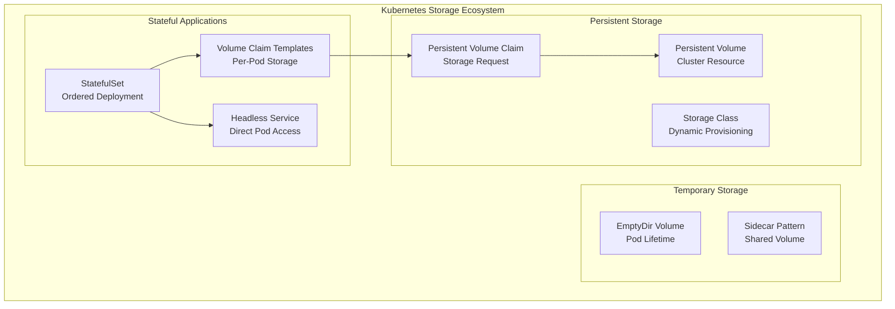
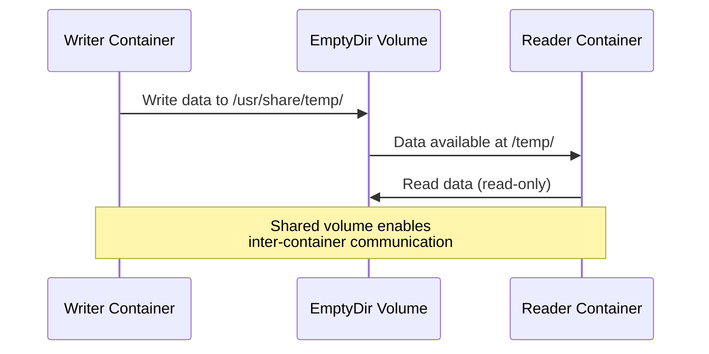
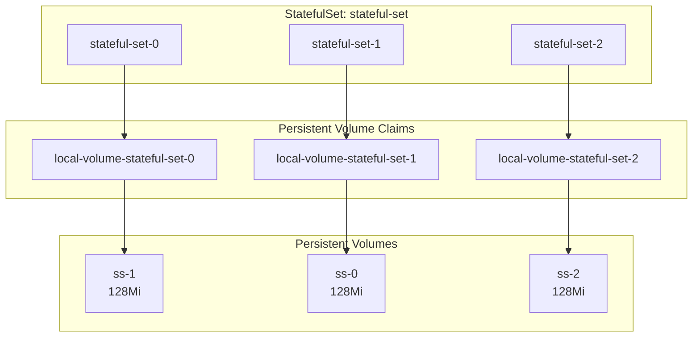
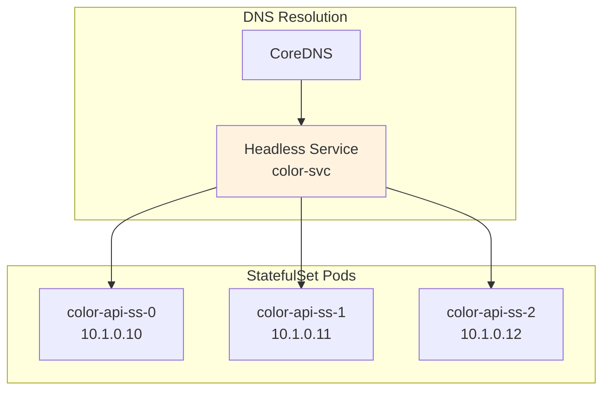
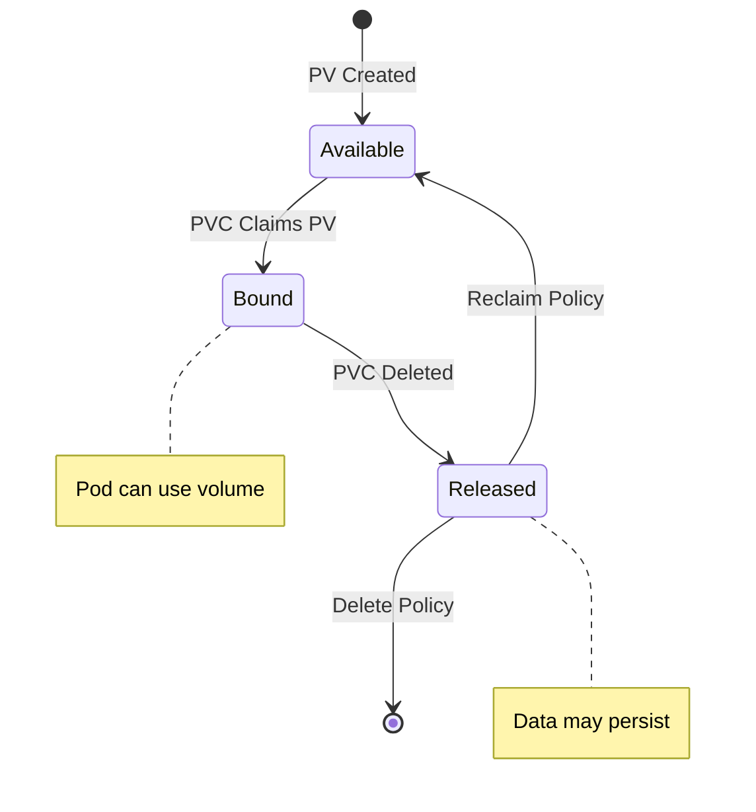

# Kubernetes Storage and Persistence

Comprehensive guide to Kubernetes storage solutions covering EmptyDir volumes, Persistent Volumes, StatefulSets, and Headless Services.

## 🏗️ Storage Architecture Overview



## 📁 EmptyDir Volumes

<details>
<summary><strong>EmptyDir Basics</strong></summary>

EmptyDir volumes provide temporary storage that shares a pod's lifetime.

**Single Container Configuration:**
```yaml
apiVersion: v1
kind: Pod
metadata:
  name: empty-dir
spec:
  containers:
  - name: empty-dir
    image: busybox:1.36.1
    command: ['sh', '-c', 'sleep 3600']
    volumeMounts:
      - name: temporary-storage
        mountPath: /usr/share/temp
  volumes:
    - name: temporary-storage
      emptyDir: {}
        # sizeLimit: 256Mi
        # medium: Memory
```

**Volume Properties:**
- **Lifetime**: Tied to pod lifecycle
- **Sharing**: Accessible by all containers in pod
- **Location**: Node's local storage (or memory if specified)
- **Persistence**: Data lost when pod terminates

</details>

<details>
<summary><strong>Sidecar Pattern with EmptyDir</strong></summary>

**Multi-Container Shared Storage:**
```yaml
apiVersion: v1
kind: Pod
metadata:
  name: empty-dir
spec:
  containers:
  - name: empty-dir-writer
    image: busybox:1.36.1
    volumeMounts:
      - name: temporary-storage
        mountPath: /usr/share/temp
  - name: empty-dir-reader
    image: busybox:1.36.1
    volumeMounts:
      - name: temporary-storage
        mountPath: /temp
        readOnly: true
  volumes:
    - name: temporary-storage
      emptyDir: {}
```

**Sidecar Communication Flow:**


**Practical Example:**
```bash
# Write data from writer container
kubectl exec empty-dir -c empty-dir-writer -- sh -c "echo 'hello from writer' > /usr/share/temp/hello.txt"

# Read data from reader container
kubectl exec empty-dir -c empty-dir-reader -- sh -c "cat /temp/hello.txt"
# Output: hello from writer

# Attempt to write from reader (fails - read-only)
kubectl exec empty-dir -c empty-dir-reader -- sh -c "echo 'test' > /temp/test.txt"
# Error: Read-only file system
```

</details>

## 💾 Persistent Volumes and Claims

<details>
<summary><strong>Local Persistent Volume</strong></summary>

**PV, PVC, and Pod Configuration:**
```yaml
# Persistent Volume
apiVersion: v1
kind: PersistentVolume
metadata:
  name: local-volume
spec:
  capacity:
    storage: 1Gi
  volumeMode: Filesystem
  accessModes:
    - ReadWriteOnce
  persistentVolumeReclaimPolicy: Retain
  storageClassName: local-storage
  local:
    path: /run/desktop/mnt/host/c/Users/celia/OneDrive/Desktop/Anil/k8
  nodeAffinity:
    required:
      nodeSelectorTerms:
      - matchExpressions:
        - key: kubernetes.io/hostname
          operator: In
          values: ['docker-desktop']

---
# Persistent Volume Claim
apiVersion: v1
kind: PersistentVolumeClaim
metadata:
  name: local-volume-claim
spec:
  resources:
    requests:
      storage: 1Gi
  volumeMode: Filesystem
  accessModes:
    - ReadWriteOnce
  storageClassName: local-storage

---
# Pod using PVC
apiVersion: v1
kind: Pod
metadata:
  name: local-volume-pod
spec:
  containers:
    - name: local-volume
      image: busybox:1.36.1
      volumeMounts:
        - name: local-volume
          mountPath: /mnt/local
  volumes:
    - name: local-volume
      persistentVolumeClaim:
        claimName: local-volume-claim
```

</details>

<details>
<summary><strong>Dynamic Provisioning</strong></summary>

**Dynamic PVC Configuration:**
```yaml
apiVersion: v1
kind: PersistentVolumeClaim
metadata:
  name: dynamic-volume-claim
spec:
  resources:
    requests:
      storage: 1Gi
  volumeMode: Filesystem
  storageClassName: hostpath    # Uses default storage class
  accessModes:
    - ReadWriteOnce
```

**Storage Provisioning Flow:**


**Access Modes:**
| Mode | Description | Use Case |
|------|-------------|----------|
| **ReadWriteOnce (RWO)** | Single node read-write | Database storage |
| **ReadOnlyMany (ROX)** | Multiple nodes read-only | Static content |
| **ReadWriteMany (RWX)** | Multiple nodes read-write | Shared file systems |

</details>

## 🔄 StatefulSets

<details>
<summary><strong>StatefulSet Configuration</strong></summary>

**StatefulSet with Volume Claim Templates:**
```yaml
apiVersion: apps/v1
kind: StatefulSet
metadata:
  name: stateful-set
spec:
  serviceName: busy-box
  replicas: 3
  selector:
    matchLabels:
      app: busybox
  template:
    metadata:
      labels:
        app: busybox
    spec:
      containers:
        - name: busybox
          image: busybox:1.36.1
          command: ['sh', '-c', 'sleep 3600']
          volumeMounts:
            - name: local-volume
              mountPath: /mnt/local
  volumeClaimTemplates:
    - metadata:
        name: local-volume
      spec:
        resources:
          requests:
            storage: 128Mi
        accessModes:
          - ReadWriteOnce
        storageClassName: local-storage
```

**StatefulSet Characteristics:**
- **Ordered Deployment**: Pods created sequentially (0, 1, 2...)
- **Stable Network Identity**: Predictable pod names
- **Persistent Storage**: Each pod gets dedicated storage
- **Ordered Scaling**: Scale up/down maintains order

</details>

<details>
<summary><strong>StatefulSet Storage Behavior</strong></summary>

**Pod and Storage Relationship:**


**Storage Persistence Demo:**
```bash
# Create file in stateful-set-0
kubectl exec stateful-set-0 -- sh -c "echo 'hello from stateful-set-0' > /mnt/local/file1.txt"

# Verify file exists
kubectl exec stateful-set-0 -- sh -c "cat /mnt/local/file1.txt"
# Output: hello from stateful-set-0

# File not accessible from other pods
kubectl exec stateful-set-1 -- sh -c "cat /mnt/local/file1.txt"
# Error: No such file or directory

# Delete pod and verify data persistence
kubectl delete pod stateful-set-0 --force
kubectl exec stateful-set-0 -- sh -c "cat /mnt/local/file1.txt"
# Output: hello from stateful-set-0 (data persisted!)
```

</details>

## 🔗 Headless Services

<details>
<summary><strong>Headless Service Configuration</strong></summary>

**Headless Service for StatefulSet:**
```yaml
apiVersion: v1
kind: Service
metadata:
  name: color-svc
spec:
  clusterIP: None    # Makes service headless
  ports:
  - port: 80
    targetPort: 80
  selector:
    app: color-api
```

**StatefulSet with Headless Service:**
```yaml
apiVersion: apps/v1
kind: StatefulSet
metadata:
  name: color-api-ss
spec:
  selector:
    matchLabels:
      app: color-api
  serviceName: color-svc    # References headless service
  replicas: 5
  template:
    metadata:
      labels:
        app: color-api
    spec:
      containers:
      - name: color-api
        image: anil1318/color-api:1.2.1
        ports:
        - containerPort: 80
          name: web
        volumeMounts:
        - name: dummy-data
          mountPath: /tmp/data
  volumeClaimTemplates:
  - metadata:
      name: dummy-data
    spec:
      accessModes: ["ReadWriteOnce"]
      storageClassName: hostpath
      resources:
        requests:
          storage: 1Gi
```

</details>

<details>
<summary><strong>Headless Service DNS Resolution</strong></summary>

**DNS Resolution Pattern:**


**Service Discovery:**
- **Regular Service**: Returns single ClusterIP
- **Headless Service**: Returns all pod IPs directly
- **Pod FQDN**: `pod-name.service-name.namespace.svc.cluster.local`

**Example DNS Queries:**
```bash
# Query headless service (returns all pod IPs)
nslookup color-svc.default.svc.cluster.local

# Query specific pod
nslookup color-api-ss-0.color-svc.default.svc.cluster.local
```

</details>

## 📊 Storage Comparison

<details>
<summary><strong>Storage Types Comparison</strong></summary>

| Storage Type | Persistence | Sharing | Use Case |
|--------------|-------------|---------|----------|
| **EmptyDir** | Pod lifetime | Within pod | Temporary data, caching |
| **PV/PVC** | Beyond pod | Single/Multiple pods | Databases, file storage |
| **StatefulSet + PVC** | Beyond pod | Per-pod dedicated | Stateful applications |

**Volume Lifecycle:**


</details>

## 🛠️ Storage Management Commands

<details>
<summary><strong>Essential Commands</strong></summary>

**EmptyDir Operations:**
```bash
# Deploy pod with EmptyDir
kubectl apply -f exmpty-dir.yaml

# Access container and create files
kubectl exec empty-dir -- sh -c "echo 'test data' > /usr/share/temp/test.txt"
kubectl exec empty-dir -- sh -c "cat /usr/share/temp/test.txt"

# Multi-container operations
kubectl exec empty-dir -c empty-dir-writer -- sh -c "echo 'data' > /usr/share/temp/file.txt"
kubectl exec empty-dir -c empty-dir-reader -- sh -c "cat /temp/file.txt"
```

**Persistent Volume Operations:**
```bash
# View storage resources
kubectl get pv,pvc
kubectl get storageclass

# Create PV and PVC
kubectl apply -f local-volume.yaml

# Check binding status
kubectl describe pv local-volume
kubectl describe pvc local-volume-claim
```

**StatefulSet Operations:**
```bash
# Deploy StatefulSet
kubectl apply -f statefull-set.yaml

# Monitor ordered deployment
kubectl get pods -w

# Check StatefulSet status
kubectl get statefulset
kubectl describe statefulset stateful-set

# Verify persistent storage
kubectl exec stateful-set-0 -- sh -c "echo 'persistent data' > /mnt/local/data.txt"
kubectl delete pod stateful-set-0 --force
kubectl exec stateful-set-0 -- sh -c "cat /mnt/local/data.txt"
```

</details>

## 📁 Repository Structure

```
Kubernethes Storage and Persistence/
├── README.md
├── Empty Dir/
│   ├── exmpty-dir.yaml           # Single container EmptyDir
│   ├── sidecar.yaml              # Multi-container shared volume
│   └── emptydir.ipynb            # EmptyDir demonstrations
├── Persistent Volume and claims/
│   ├── local-volume.yaml         # Local PV with node affinity
│   ├── dynamic.yaml              # Dynamic provisioning PVC
│   ├── local.ipynb               # Local volume operations
│   └── Dynamic Provosion.ipynb   # Dynamic provisioning demo
├── Statefullset/
│   ├── statefull-set.yaml        # StatefulSet with volume templates
│   ├── pv.yaml                   # Pre-created PVs for StatefulSet
│   ├── statefull-set-dynamic.yaml # StatefulSet with dynamic storage
│   ├── cmd.ipynb                 # StatefulSet operations
│   └── statefullset.ipynb        # StatefulSet lifecycle demo
└── Headless Services/
    ├── color-api-ss.yaml        # StatefulSet with Color API
    ├── svc.yaml                  # Headless service configuration
    ├── debug.yaml                # Debug pod for DNS testing
    └── cmd.ipynb                 # Headless service demonstrations
```

## 🎯 Best Practices

1. **EmptyDir Volumes**
   - Use for temporary data and inter-container communication
   - Set size limits to prevent disk exhaustion
   - Consider memory-backed EmptyDir for performance

2. **Persistent Volumes**
   - Use appropriate access modes for your use case
   - Set proper reclaim policies (Retain/Delete)
   - Implement backup strategies for critical data

3. **StatefulSets**
   - Use for applications requiring stable network identity
   - Implement proper readiness/liveness probes
   - Plan for ordered scaling and updates

4. **Headless Services**
   - Use with StatefulSets for direct pod access
   - Implement service discovery patterns
   - Consider DNS caching implications

## 🔑 Key Concepts

- **EmptyDir**: Temporary storage sharing pod lifetime
- **PV/PVC**: Persistent storage abstraction and claims
- **StatefulSet**: Ordered, stateful application deployment
- **Headless Service**: Direct pod access without load balancing
- **Volume Claim Templates**: Per-pod storage provisioning
- **Storage Classes**: Dynamic provisioning configuration

---

*This comprehensive guide demonstrates practical Kubernetes storage and persistence patterns using real-world examples and best practices.*