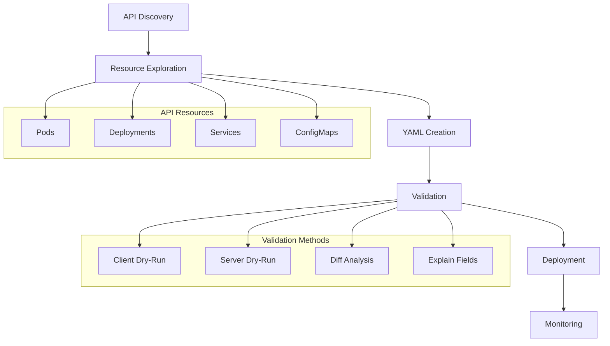
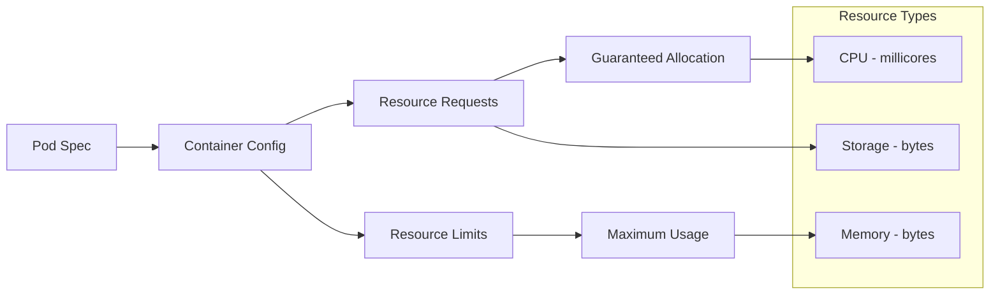
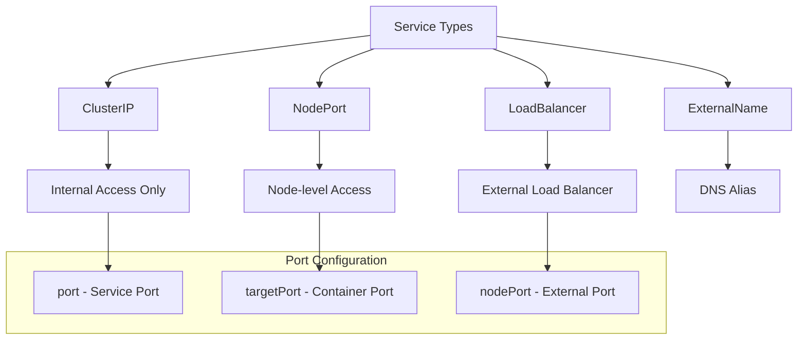
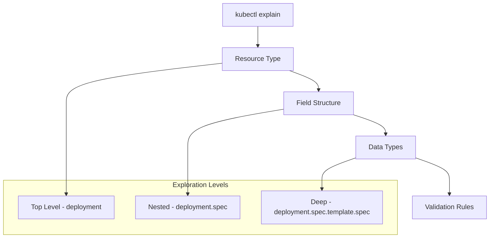
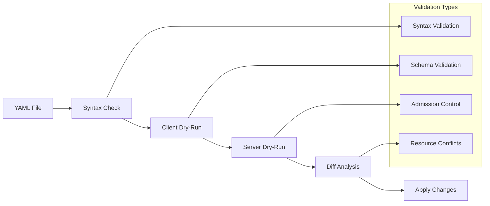

# Kubernetes YAML

## Overview
Master Kubernetes YAML configuration files, API resources, and declarative deployment patterns. Learn kubectl explain, dry-run validation, and YAML best practices.

## Files
- `building Yaml.ipynb` - Jupyter notebook for YAML building techniques
- `k8s-yaml/` - Directory containing Kubernetes YAML manifests
  - `pod.yml` - Pod configuration with resource limits
  - `deployment.yml` - Deployment manifest
  - `app.yml` - Multi-resource application stack

<details>
<summary>📋 YAML Overview</summary>

### Purpose
- Learn Kubernetes YAML structure and syntax
- Master API resource definitions
- Practice declarative configuration
- Understand resource relationships

### YAML Workflow


</details>

<details>
<summary>🚀 Quick Start</summary>

### Prerequisites
- Kubernetes cluster access
- kubectl configured
- Basic YAML syntax knowledge

### API Discovery Commands
```bash
# List all API resources
kubectl api-resources

# List API versions
kubectl api-versions

# Explain resource structure
kubectl explain services --recursive
kubectl explain deployment.spec
kubectl explain pod.spec.containers
```

### YAML Validation
```bash
# Client-side dry run
kubectl apply -f app.yml --dry-run=client

# Server-side dry run
kubectl apply -f app.yml --dry-run=server

# Show differences
kubectl diff -f app.yml
```

</details>

<details>
<summary>📄 Pod Configuration</summary>

### Basic Pod Structure
```yaml
apiVersion: v1
kind: Pod
metadata:
  name: nginx
spec:
  containers:
    - name: nginx
      image: nginx:latest
      ports:
        - containerPort: 80
      resources:
        requests:
          memory: "64Mi"
          cpu: "250m"
        limits:
          memory: "128Mi"
          cpu: "500m"
```

### Resource Management


### Best Practices
- Always define resource requests and limits
- Use specific image tags, avoid `latest`
- Include health checks and probes
- Set appropriate security contexts

</details>

<details>
<summary>🚀 Deployment Configuration</summary>

### Deployment Structure
```yaml
apiVersion: apps/v1
kind: Deployment
metadata:
  name: nginx-deployment
  labels:
    app: nginx
spec:
  replicas: 2
  selector:
    matchLabels:
      app: nginx
  template:
    metadata:
      labels:
        app: nginx
    spec:
      containers:
        - name: nginx
          image: nginx:latest
          ports:
            - containerPort: 80
```

### Deployment Features
- **Replica Management**: Desired state maintenance
- **Rolling Updates**: Zero-downtime deployments
- **Rollback Capability**: Version history management
- **Label Selectors**: Pod targeting mechanism

### Update Strategies
```bash
# Rolling update (default)
kubectl set image deployment/nginx-deployment nginx=nginx:1.21

# Check rollout status
kubectl rollout status deployment/nginx-deployment

# Rollback to previous version
kubectl rollout undo deployment/nginx-deployment
```

</details>

<details>
<summary>🌐 Service Configuration</summary>

### Service Types and Usage


### Multi-Resource Application
```yaml
apiVersion: v1
kind: Service
metadata:
  name: app-nginx-service
spec:
  type: NodePort
  ports:
    - port: 80
  selector:
    app: app-nginx
---
apiVersion: apps/v1
kind: Deployment
metadata:
  name: app-nginx-deployment
  labels:
    server: dmz
spec:
  replicas: 2
  selector:
    matchLabels:
      app: app-nginx
  template:
    metadata:
      labels:
        app: app-nginx
    spec:
      containers:
        - name: nginx
          image: nginx:latest
          ports:
            - containerPort: 80
```

</details>

<details>
<summary>🔍 API Resource Exploration</summary>

### Resource Discovery
```bash
# Get all available resources
kubectl api-resources

# Filter by API group
kubectl api-resources --api-group=apps

# Show resource details
kubectl explain deployment
kubectl explain service.spec.type
kubectl explain pod.spec.containers.resources
```

### Field Exploration


### Advanced Exploration
```bash
# Recursive field listing
kubectl explain services --recursive

# Specific field details
kubectl explain deployment.spec.template.spec.volumes.nfs.server

# API version information
kubectl api-versions | grep apps
```

</details>

<details>
<summary>✅ YAML Validation & Testing</summary>

### Validation Pipeline


### Validation Commands
```bash
# Client-side validation (syntax and schema)
kubectl apply -f app.yml --dry-run=client

# Server-side validation (admission controllers)
kubectl apply -f app.yml --dry-run=server

# Show what would change
kubectl diff -f app.yml

# Validate without applying
kubectl apply -f app.yml --validate=true --dry-run=client
```

### Error Handling
```bash
# Check resource status
kubectl get events --sort-by=.metadata.creationTimestamp

# Describe resource for details
kubectl describe deployment nginx-deployment

# View logs for troubleshooting
kubectl logs deployment/nginx-deployment
```

</details>

<details>
<summary>🔧 YAML Best Practices</summary>

### Structure Guidelines
- Use consistent indentation (2 spaces)
- Include meaningful metadata labels
- Define resource requests and limits
- Use specific image versions
- Include health checks

### Security Considerations
```yaml
spec:
  template:
    spec:
      securityContext:
        runAsNonRoot: true
        runAsUser: 1000
      containers:
        - name: app
          securityContext:
            allowPrivilegeEscalation: false
            readOnlyRootFilesystem: true
            capabilities:
              drop:
                - ALL
```

### Resource Management
```yaml
resources:
  requests:
    memory: "64Mi"
    cpu: "250m"
  limits:
    memory: "128Mi"
    cpu: "500m"
```

### Multi-Document Files
```yaml
# Use --- to separate resources
apiVersion: v1
kind: Service
# ... service config
---
apiVersion: apps/v1
kind: Deployment
# ... deployment config
```

</details>

<details>
<summary>📚 Learning Outcomes</summary>

### YAML Skills
- Kubernetes resource structure understanding
- API field exploration techniques
- Validation and testing methods
- Multi-resource configuration

### Deployment Patterns
- Declarative configuration management
- Resource relationship modeling
- Update and rollback strategies
- Environment-specific configurations

### Production Readiness
- Resource optimization
- Security hardening
- Monitoring integration
- GitOps compatibility

### Advanced Concepts
- Custom Resource Definitions (CRDs)
- Admission controllers
- Resource quotas and limits
- Network policies and security

</details>