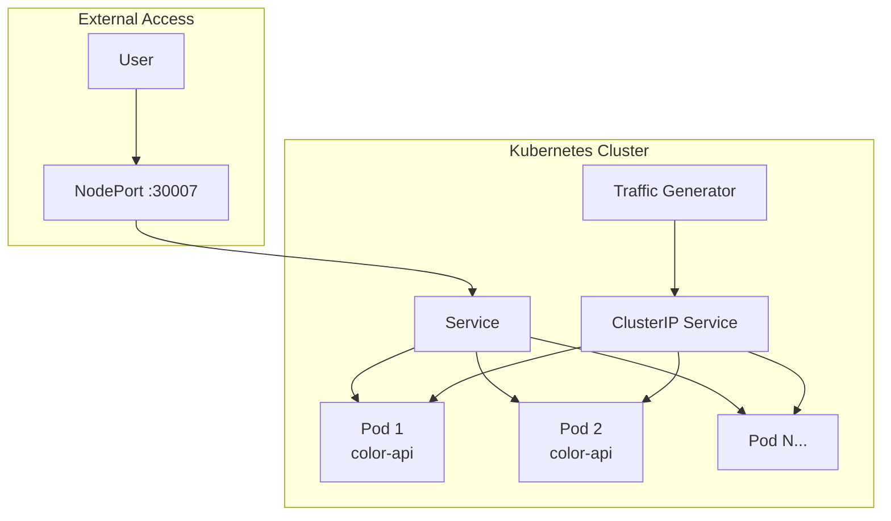
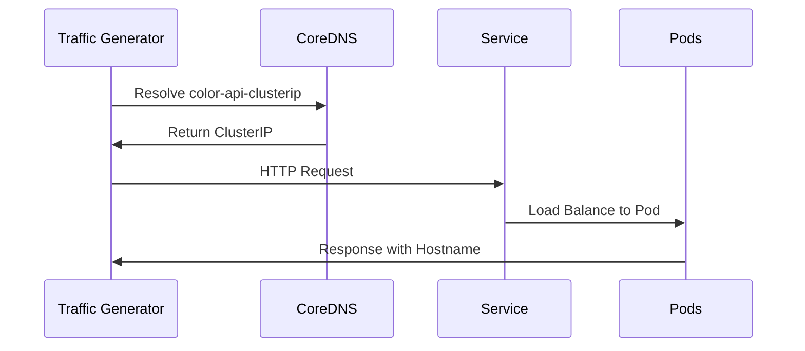

# Kubernetes Services V2

## Architecture



## Color API Application

<details>
<summary>Application Details</summary>

**Node.js Express App:**
```javascript
const color = 'blue';
const hostname = os.hostname();

app.get('/', (req, res) => {
    res.send(`<h1 style="color:${color};">Hello from Color-API!</h1>
            <h2>Hostname: ${hostname}</h2>`);
});

app.get('/api', (req, res) => {
    return res.send(`COLOR : ${color}, HOSTNAME : ${hostname}`);
});
```

**Docker Image:** `anil1318/color-api:1.1.0`

</details>

## Service Types

<details>
<summary>ClusterIP Service</summary>

```yaml
apiVersion: v1
kind: Service
metadata:
  name: color-api-clusterip
spec:
  type: ClusterIP
  selector:
    app: color-api
  ports:
    - port: 80
      targetPort: 80
```

**Usage:**
```bash
kubectl apply -f color-api-clusterip.yaml
kubectl apply -f traffic-genrator.yaml
kubectl logs traffic-generator
```

**Load Balancing Demo:**
```
2025-08-30 19:52:59 COLOR : blue, HOSTNAME : color-api-deployment-5b5b5c88fd-9ntrt
2025-08-30 19:53:00 COLOR : blue, HOSTNAME : color-api-deployment-5b5b5c88fd-z9tl9
2025-08-30 19:53:01 COLOR : blue, HOSTNAME : color-api-deployment-5b5b5c88fd-sb8mp
```

</details>

<details>
<summary>NodePort Service</summary>

```yaml
apiVersion: v1
kind: Service
metadata:
  name: color-api-nodeport
spec:
  type: NodePort
  selector:
    app: color-api
  ports:
    - port: 80
      targetPort: 80
      nodePort: 30007
```

**External Access:**
```bash
curl localhost:30007
# <h1 style="color:blue;">Hello from Color-API!</h1>
# <h2>Hostname: color-api-deployment-5b5b5c88fd-9hqmw</h2>
```

</details>

<details>
<summary>ExternalName Service</summary>

```yaml
apiVersion: v1
kind: Service
metadata:
  name: my-external-service
spec:
  type: ExternalName
  externalName: www.google.com
```

**Purpose:** DNS alias for external services

</details>

## Traffic Generator

<details>
<summary>Load Testing Tool</summary>

```yaml
apiVersion: v1
kind: Pod
metadata:
  name: traffic-generator
spec:
  containers:
  - name: traffic-generator
    image: anil1318/traffic-gen:1.0.0
    args:
      - 'color-api-clusterip/api'
      - '0.5'
```

**Functionality:**
- Sends requests every 0.5 seconds
- Demonstrates service load balancing
- Shows different pod hostnames in responses

</details>

## Service Discovery

<details>
<summary>DNS Resolution</summary>



**Service Endpoints:**
```bash
kubectl describe svc color-api-clusterip
# Endpoints: 10.1.0.211:80,10.1.0.218:80,10.1.0.219:80 + 7 more...
```

</details>

## Key Differences

| Service Type | Access | Use Case |
|--------------|--------|----------|
| **ClusterIP** | Internal only | Inter-service communication |
| **NodePort** | External via Node IP:Port | Development/Testing |
| **ExternalName** | DNS alias | External service integration |

## Commands

<details>
<summary>Essential Commands</summary>

```bash
# Deploy application
kubectl apply -f color-api-depl.yaml

# Create services
kubectl apply -f color-api-clusterip.yaml
kubectl apply -f color-api-nodeport.yaml

# Test internal connectivity
kubectl apply -f traffic-genrator.yaml
kubectl logs traffic-generator

# Test external access
curl localhost:30007

# View services
kubectl get svc
kubectl describe svc color-api-nodeport
```

</details>

## Files

- `color-api-depl.yaml` - Deployment with 10 replicas
- `color-api-clusterip.yaml` - Internal service
- `color-api-nodeport.yaml` - External service (port 30007)
- `traffic-genrator.yaml` - Load testing pod
- `external-name.yaml` - DNS alias service