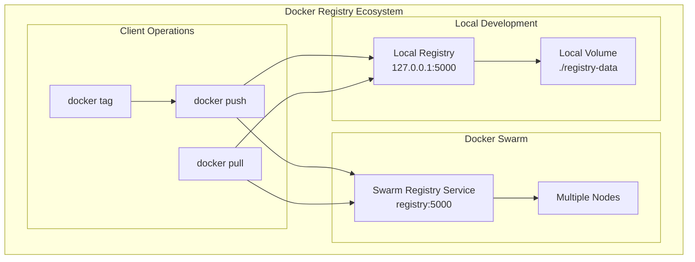
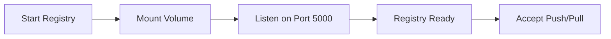
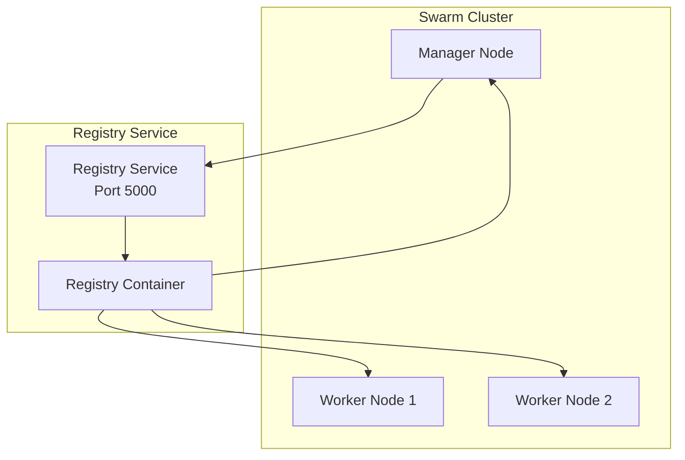
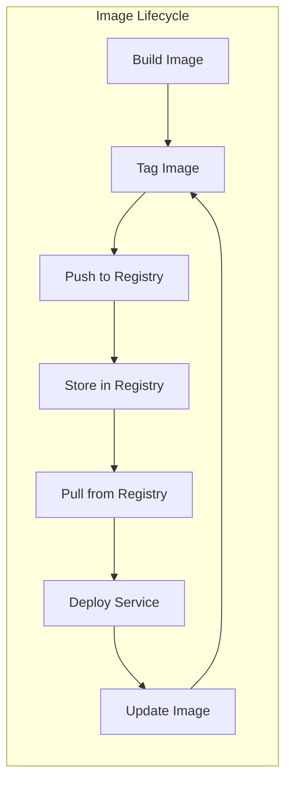
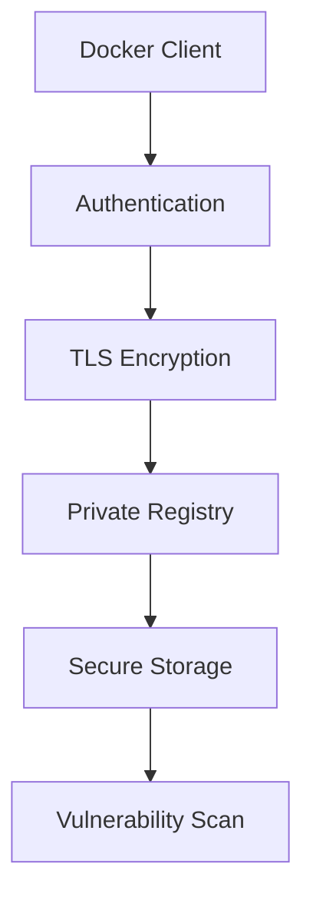
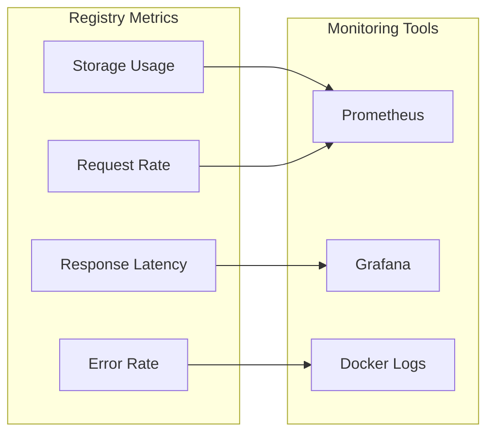

# Private Docker Registry

A comprehensive guide to setting up and managing private Docker registries for both local development and Docker Swarm environments. This repository demonstrates how to create, configure, and use private registries for secure image distribution and management.

## 📋 Table of Contents

- [Overview](#overview)
- [Registry Architecture](#registry-architecture)
- [Local Registry Setup](#local-registry-setup)
- [Swarm Registry Setup](#swarm-registry-setup)
- [Image Management](#image-management)
- [Security Considerations](#security-considerations)
- [Best Practices](#best-practices)
- [Troubleshooting](#troubleshooting)

## 🎯 Overview

Private Docker registries provide secure, controlled environments for storing and distributing Docker images within organizations. This repository covers:

- **Local registry deployment** for development environments
- **Swarm-based registry** for production clusters
- **Image lifecycle management** (push, pull, tag, remove)
- **Persistent storage configuration**
- **Security and access control**

## 🏗️ Registry Architecture



## 🖥️ Local Registry Setup

<details>
<summary><strong>Basic Local Registry</strong></summary>

### Simple Registry Deployment
```bash
# Run basic registry
docker container run -d -p 5000:5000 --name registry registry:latest

# Verify registry is running
docker container ls
```

### Registry with Persistent Storage
```bash
# Run registry with volume mounting
docker container run -d -p 5000:5000 \
  --name registry \
  -v ./registry-data:/var/lib/registry \
  registry:latest
```

### Registry Configuration Flow


</details>

<details>
<summary><strong>Image Operations</strong></summary>

### Push Images to Local Registry
```bash
# Pull image from Docker Hub
docker pull hello-world

# Tag for local registry
docker tag hello-world 127.0.0.1:5000/hello-world

# Push to local registry
docker push 127.0.0.1:5000/hello-world
```

### Pull Images from Local Registry
```bash
# Remove local image
docker image remove hello-world
docker image remove 127.0.0.1:5000/hello-world

# Pull from local registry
docker pull 127.0.0.1:5000/hello-world
```

</details>

## 🐝 Swarm Registry Setup

<details>
<summary><strong>Registry as Swarm Service</strong></summary>

### Deploy Registry Service
```bash
# Initialize swarm (if not already done)
docker swarm init

# Create registry service
docker service create --name registry -p 5000:5000 registry

# Verify service deployment
docker service ps registry
```

### Service Configuration


</details>

<details>
<summary><strong>Multi-Service Deployment</strong></summary>

### Deploy Applications Using Private Registry
```bash
# Push nginx to private registry
docker pull nginx
docker tag nginx 127.0.0.1:5000/nginx
docker push 127.0.0.1:5000/nginx

# Deploy service using private registry image
docker service create --name nginx \
  -p 80:80 \
  --replicas 10 \
  127.0.0.1:5000/nginx
```

### Service Scaling with Private Images
```bash
# Check service status
docker service ls
docker service ps nginx

# Scale service
docker service scale nginx=15
```

</details>

## 📦 Image Management

<details>
<summary><strong>Image Lifecycle Management</strong></summary>

### Image Workflow


### Tagging Strategies
```bash
# Version-based tagging
docker tag myapp:latest 127.0.0.1:5000/myapp:v1.0.0
docker tag myapp:latest 127.0.0.1:5000/myapp:latest

# Environment-based tagging
docker tag myapp:latest 127.0.0.1:5000/myapp:dev
docker tag myapp:latest 127.0.0.1:5000/myapp:staging
docker tag myapp:latest 127.0.0.1:5000/myapp:prod
```

### Image Cleanup
```bash
# Remove local images
docker image remove hello-world
docker image remove 127.0.0.1:5000/hello-world

# Clean up unused images
docker image prune -f

# Remove specific tagged images
docker image remove 127.0.0.1:5000/nginx:latest
```

</details>

## 🔒 Security Considerations

<details>
<summary><strong>Registry Security</strong></summary>

### Basic Security Measures
- **Network Isolation**: Use private networks for registry communication
- **Access Control**: Implement authentication and authorization
- **TLS Encryption**: Enable HTTPS for secure communication
- **Image Scanning**: Scan images for vulnerabilities

### Secure Registry Configuration
```yaml
# docker-compose.yml for secure registry
version: '3.8'
services:
  registry:
    image: registry:2
    ports:
      - "5000:5000"
    environment:
      REGISTRY_AUTH: htpasswd
      REGISTRY_AUTH_HTPASSWD_PATH: /auth/htpasswd
      REGISTRY_AUTH_HTPASSWD_REALM: Registry Realm
    volumes:
      - ./auth:/auth
      - ./registry-data:/var/lib/registry
```

### Security Flow


</details>

## 🎯 Best Practices

<details>
<summary><strong>🔧 Development Best Practices</strong></summary>

- ✅ Use persistent volumes for registry data
- ✅ Implement proper image tagging strategies
- ✅ Regular cleanup of unused images
- ✅ Monitor registry storage usage
- ✅ Backup registry data regularly

</details>

<details>
<summary><strong>🚀 Production Best Practices</strong></summary>

- ✅ Deploy registry as a service in Swarm
- ✅ Use external storage for high availability
- ✅ Implement authentication and authorization
- ✅ Enable TLS/SSL encryption
- ✅ Set up monitoring and logging
- ✅ Configure resource limits

</details>

<details>
<summary><strong>🔒 Security Best Practices</strong></summary>

- ✅ Never expose registry without authentication
- ✅ Use HTTPS in production environments
- ✅ Implement role-based access control
- ✅ Regular security updates
- ✅ Scan images for vulnerabilities
- ✅ Audit registry access logs

</details>

## 📊 Registry Operations

### Registry Management Commands

<details>
<summary><strong>Local Registry Operations</strong></summary>

```bash
# Start registry with persistent storage
docker container run -d -p 5000:5000 \
  --name registry \
  -v ./registry-data:/var/lib/registry \
  registry:latest

# Stop and remove registry
docker container kill registry
docker container rm registry

# Restart registry
docker container start registry
```

</details>

<details>
<summary><strong>Swarm Registry Operations</strong></summary>

```bash
# Create registry service
docker service create --name registry -p 5000:5000 registry

# Update registry service
docker service update --image registry:2 registry

# Scale registry service (not recommended for stateful services)
docker service scale registry=1

# Remove registry service
docker service rm registry
```

</details>

### Image Operations Workflow

```mermaid
graph TB
    subgraph "Image Push Workflow"
        A[Pull from Docker Hub] --> B[Tag for Private Registry]
        B --> C[Push to Private Registry]
        C --> D[Verify Push Success]
    end
    
    subgraph "Image Pull Workflow"
        E[Remove Local Image] --> F[Pull from Private Registry]
        F --> G[Verify Image Available]
        G --> H[Deploy/Run Container]
    end
    
    subgraph "Service Deployment"
        I[Create Service] --> J[Pull from Registry]
        J --> K[Deploy Containers]
        K --> L[Service Running]
    end
```



## 🔍 Troubleshooting

<details>
<summary><strong>Common Issues & Solutions</strong></summary>

### Registry Connection Issues
```bash
# Check if registry is running
docker container ls | grep registry

# Test registry connectivity
curl http://127.0.0.1:5000/v2/

# Check registry logs
docker container logs registry
```

### Push/Pull Failures
```bash
# Verify image tagging
docker image ls | grep 127.0.0.1:5000

# Check network connectivity
ping 127.0.0.1

# Verify registry service in swarm
docker service ps registry
```

### Storage Issues
```bash
# Check registry storage usage
docker exec registry du -sh /var/lib/registry

# Verify volume mounting
docker container inspect registry | grep Mounts

# Check disk space
df -h ./registry-data
```

</details>

## 📁 File Structure

```
Private Docker Registry/
├── docker local registry.ipynb          # Local registry setup and operations
├── docker swarm registry.ipynb          # Swarm-based registry deployment
└── registry-data/                       # Persistent storage directory
    └── docker/
        └── registry/
            └── v2/
                ├── repositories/         # Image repositories
                └── blobs/               # Image layers and manifests
```

## 🎓 Learning Path

1. **Local Setup**: Basic registry deployment and image operations
2. **Swarm Integration**: Registry as a service in Docker Swarm
3. **Image Management**: Tagging, pushing, and pulling strategies
4. **Security**: Authentication, authorization, and encryption
5. **Production**: High availability and monitoring

## 📈 Registry Monitoring

### Health Check Commands
```bash
# Check registry health
curl http://127.0.0.1:5000/v2/

# List repositories
curl http://127.0.0.1:5000/v2/_catalog

# Check specific image tags
curl http://127.0.0.1:5000/v2/hello-world/tags/list
```

### Performance Monitoring


---

**Note**: This repository demonstrates both local and production-ready private Docker registry setups with emphasis on security, scalability, and best practices for container image management.